# IPC: Interprocess Communication

Per implementare la comunicazione e quindi anche la sincronizzazione tra processi, abbiamo bisogno che questi comunichino mediante un mezzo; tale mezzo é definito come **risorse IPC**.

Utilizzeremo **meccanismi di comunicazione** introdotti originariamente nel sistema operativo **UNIX System V**. In particolare **System V IPC** fornisce tre principali tipi di risorse gestite dal kernel:
- **Shared memory (SHM)** → memoria condivisa tra piú processi;
- **Semaphores (SEM)** → strutture per la sincronizzazione e mutua esclusione;
- **Message queue (MSG)** → code di messaggi per lo scambio asincrono di dati.

Quindi Linux/UNIX permette la **comunicazione tra processi** mediante primitive e strutture dati fornite dal kernel.

Alla base dei meccanismi di comunicazione é presente una *shared memory*; per implementare semafori e code di messaggi, necessari a gestire rispettivamente mutua  escluzione (competizione) e sincronizzazione (cooperazione), sono necessarie delle porzioni di memoria condivise tra i processi.

## Primitive GET e CTL

Ogni risorsa **IPC** é gestita con l'utilizzo di due primitive **get** e **ctl**.

La primitiva **get** utilizza una "chiave" (IPC key), ed opportuni parametri, per restituire al processo un **descrittore della risorsa**.

La primitiva **ctl** (control) permette, dato un descrittore, di:
- verificare lo stato di una risorsa;
- cambiare lo stato di una risorsa;
- rimuovere una risorsa

La rimozione peró non nel senso stretto, in realtá la risorsa vine **solamente etichettata** come eliminabile al kernel: infatti questa viene eliminata se non sono presenti processi che la stanno utilizzando; ovvero processi `attached` alla risorsa.

```mermaid
flowchart TB
  %% TB = top-bottom layout

  subgraph K["Kernel space"]
    R["🧠 Risorsa UNIX IPC<br/>(es. Shared Memory)<br/>Tabella risorse / permessi"]
  end

  subgraph U1["User space"]
    direction LR
    P1["⚙️ Processo P1<br/>id = shmget(key, ...)<br/>ptr = shmat(id, ...)<br/>usa *ptr"]
    P2["⚙️ Processo P2<br/>id = shmget(key, ...)<br/>ptr = shmat(id, ...)<br/>usa *ptr"]
  end

  %% Separazione visiva
  P1 --- P2

  %% Connessioni P1 <-> Kernel
  P1 -->|"get(key)<br/>(shmget)"| R
  P1 -.->|"attach<br/>(shmat)"| R
  P1 -->|"usa *ptr"| R
  P1 -->|"ctl(id,<br/>IPC_RMID/SET/STAT)"| R

  %% Connessioni P2 <-> Kernel
  P2 -->|"get(key)<br/>(shmget)"| R
  P2 -.->|"attach<br/>(shmat)"| R
  P2 -->|"usa *ptr"| R
  P2 -->|"ctl(id,<br/>IPC_RMID/SET/STAT)"| R

```




---
Le risorse IPC sono **permanenti**: se un processo termina o si stacca dalla risorsa questa non si elimina automaticamente. É necessario una chiamata eplicita alla primitiva `clt`.

```mermaid
  flowchart TB
  %% Imposta il layout top-down
  classDef proc fill:#d0d8ff,stroke:#000,color:#000,stroke-width:1px;
  classDef kernel fill:#b6f5b0,stroke:#007f00,color:#000,font-weight:bold,stroke-width:1px;
  classDef dead fill:#ff0000,color:#ff0000,font-weight:bold;
  classDef label color:#ff0000,font-weight:bold;

  %% User space
  subgraph U["User space"]
    direction LR
    P1["Processo P1<br/><span class='dead'>✖ TERMINATO</span>"]
    P2["Processo P2<br/><span class='dead'>✖ TERMINATO</span>"]
  end
  class P1,P2 proc;

  %% Kernel space
  subgraph K["Kernel space"]
    IPC["Risorsa Unix IPC<br/><span class='label'>PERSISTE</span><br/><span class='label'>(se non cancellata tramite ctl)</span>"]
  end
  class IPC kernel;

```

## Primitiva `get`

La primitiva `get` ha la seguente firma:
```c
  int ...get(key_t key, ..., int flag);
```
- **key** é la chiave dell'oggetto IPC. 
  
  Tale chiave é un valore intero arbitrario che puó essere:
  - cablato nel codice;
  - generato da `ftok()`;
  - impostato con la macro `IPC_PRIVATE`.
- **flag**: indica la modalitá di acquisizione della risorsa e i permessi di accesso.
  
  Corrisponde ad una o piú costanti, passate insieme in "or logico" (carattere di pipe `|` ). Tali costanti sono:
  - macro `IPC_CREAT` definita in `sys/ipc.h`: impone di creare una nuova risorsa se non ne esiste giá una con la stessa chiave indicata. Se la risorsa é giá esistente allora il flag é ininfluente.
  - macro `IPC_EXCL` definita in `sys/ipc.h`: utilizzabile con `IPC_CREAT` per imporre di ritornare un errore se la risorsa é giá esistente. Questa modalitá é utile per evitare di inizializzare la risorsa IPC piú volte.
  - **Permessi di accesso**: sono specificati con la notazione ottale. Per esempio, il valore `0664` indica i permessi di lettura e scrittura per `user` e `group`, e di sola lettura per `others`.

La primitiva `get` infine restituisce come risultato il **descrittore della risorsa IPC**, ovvero un valore intero che identifica la risorsa.

## Primitiva `ctl`
La primitiva `ctl` ha la seguente firma:

```c
  int ...ctl(int desc, ..., int cmd, ...);
```
- `desc`: indica il descrittore della risorsa ( ottenuto dalla chiamata `get()`).
- `cmd`: specifica il comando da eseguire, É possibile scegliere tra:
  - `IPC_RMID`: rimozione della risorsa indicata;
  - `IPC_STAT`: richiede informazioni statistiche sulla risorsa indicata;
  - `IPC_SET`: richiede al sistema la modifica di un sottoinsieme degli attributi della risorsa (es. i permessi di accesso).

Il parametro di ritorno di `ctl()` é pari ad `-1` nel caso di un errore, `0` nel caso di operazione riuscita.

### IPC keys

