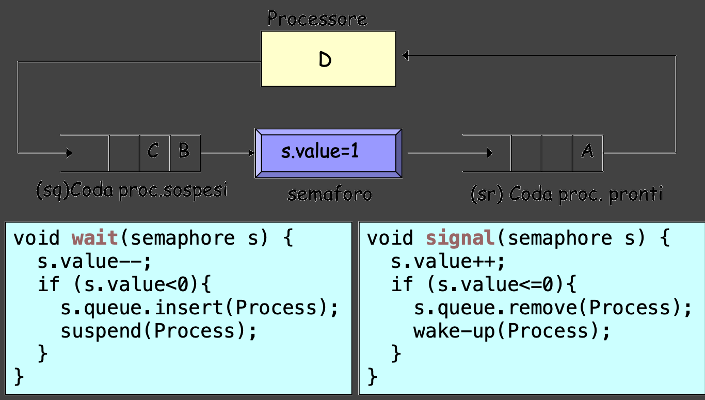

# Semaphor

I semafori sono delle risorse IPC, ma il loro valore interno si comporta come una variabile condivisa gestita dal kernel.

Vengono utilizzati per la **cooperazione** e la **competizione** tra processi. Due o più processi possono cooperare o competere nell'esecuzione di una **sezione critica** attraverso l'uso dei semafori affinché non ci siano problemi di *sincronizzazione* o *interferenze*.

I processi condividono tra loro una **istanza di semaforo** `s`. Tramite questa variabile i processi possono sincronizzarsi sull'utilizzo di una **risorsa critica**, ovvero una risorsa condivisa.

Un processo più fare generalmente due operazioni su un semaforo `s`:
- `signal(s)`: può inviare un segnale al semaforo e in certe condizioni risvegliare i processi in attesa.
- `wait(s)`: primitiva che permette ad un processo di assicurarsi la risorsa. Nel caso la risorsa non sia disponibile perché il processo che la possiede non ha ancora inviato un segnale `signal(s)`, il processo che la richiede si sospende fino a che non riceverà il segnale `signal(s)`.

#### MODELLO CONCETTUALE SEMAFORICO:



L'uso classico di un semaforo è per implementare un meccanismo di **locking** che grantisca la **mutua esclusione** tra processi.

Possiamo implementare la `wait()` e la `signal()` sfruttando quelle che sono le primitive offerte offerte dalla libreria `sys/sem.h`.

Queste due procedure ci serviranno per delimitare la sezione critica.

## Strutture semaforiche nel kernel

Il kernel Linux mantiene due strutture per implementare un semaforo: `sem` e `semid_ds`.

In particolare ogni volta che cerchiamo di istanziare un semaforo in realtà stiamo istanziando un *array* di semafori; puntatore a tale *array* è contenuto nella struttura `semid_ds`. Ogni elemento di questo array è a sua volta una struttura `sem` che descrive il singolo semaforo.

La struttura `sem` è definita in `linux/sem.h`:

```c
struct sem {
	short   sempid;         /* pid of last operation */
   	ushort  semval;         /* current value */
   	ushort  semncnt;        /* num procs awaiting increase in semval */
   	ushort  semzcnt;        /* num procs awaiting semval = 0 */
};
```

dove: 
- `sempid` è il PID del processo che ha eseguito l'ultima operazione su `s`;
- `semval` è il valore corrente del semaforo;
- `semncnt` è il numero di processi che sono in attesa che una data risorsa diventi disponibile;

    (numero di processi che attendono l'incremento del semaforo)
- `semzcnt` è il numero di processi che sono in attesa che il valore del semaforo sia pari a `0`

Invece la struttura che contiene l'array di semafori all'interno del sistema è `semid_ds`.

```c
/* One semid data structure for each set of semaphores in the system. */
struct semid_ds {
	struct ipc_perm sem_perm;       /* permissions .. see ipc.h */
   	time_t          sem_otime;      /* last semop time */
   	time_t          sem_ctime;      /* last change time */
   	struct sem      *sem_base;      /* ptr to first semaphore in array */
   	struct wait_queue *eventn;
   	struct wait_queue *eventz;
   	struct sem_undo  *undo;         /* undo requests on this array */
   	ushort          sem_nsems;      /* no. of semaphores in array */
};
```
dove: 
- `sem_perm` è un'istanza della struttura `ipc_perm` che è definita in `linux/ipc.h`.
  
  Questa struttura mantiene le informazioni sui permessi impostati per il semaforo.
- `sem_otime` è il tempo dell'ultima operazione `semop()`;
- `sem_ctime` è il tempo dell'ultima modifica fatta alla struttura in esame;
- `sem_base` è il puntatore al primo semaforo nell'array;
- `sem_undo` è il puntatore ad un lista di strutture, una per ogni processo che ha richiesto una *undo* durante una `semop()` sul set di semafori `sem_base`;
  
  Ovvero il numero di richieste al kernel di sistemare le situazioni in cui un processo muore prima di effettuare una `signal()` e quindi riportare il valore di `sem_val` a quello iniziale.

  Quindi il kernel, nel caso in cui un processo muore prima di poter effettuare la `signal()` e l'operazione che ha fatto utilizza il flag `SEM_UNDO`, annulla automaticamente tale operazione sul semaforo, riportandolo al valore iniziale;

  Evita situazioni di *deadlock*
- `sem_nsems` è il numero di semafori nell'array di semafori (*semaphor set*).
  
## Semaphores' workflow

Per implementare un semaforo mediante i meccanismi offerti dallo **standard systemV** è necessario l'utilizzo di alcune primitive implementate in: 
```c
#include <sys/types.h>
#include <sys/ipc.h>
#include <sys/sem.h>
```

### Creazione: `semget()`

La primitiva che permette di creare un nuovo set di semafori è la system call `semget()`: 
```c
int semget(key_t key, int nsems, int semflg);
```
Tale funzione restituisce il **descrittore** del *semaphor set* associato alla chiave specificata in `key`.

Il valore della chiave è ottenibile cablando un valore, con `IPC_PRIVATE`, o con `ftok()` a seconda degli utilizzi sul semaphor set.

I flag inseribili in `semflg` sono: 
- `IPC_CREAT`;
- `IPC_EXCL`;
- Permessi di accesso in ottale.

Si possono inserire più di uno per un singolo semaphor set utilizzando l'operatore or logico `|`.

In caso di successo, la `semget()`, restituisce il descrittore del semaphor set; in caso di fallimento viene restituito `-1`.

Il numero massimo di semafori in un singolo semaphor set è definito in `linux/sem.h` come:
```c
#define SEMMSL  250
```
Questo valore dipende dalla propria architettura, per ottenere tali informazioni è necessario utilizzare il comando `ipcs -l` che restituisce diverse informazioni anche per le altre IPC.

Per creare un array semaforico di 2 semafori **con chiave** nulla (quindi i semafori saranno accessibili unicamente al processo padre e agli eventualli figli):
```c
key_t sem_key = IPC_PRIVATE;
int sem_ds = semget(key, 2, IPC_CREATE | 0644);
```


### Inizializzazione e rimozione: `semctl()`

Per poter inizializzare e rimuovere un semafor si utilizza la system call `semctl()`.

```c
int semctl(int semid, int semnum, int cmd, ...);
```

La system call esegue l'operazione specificata in `cmd` sul *semaphor set* indentificato da `semid` e sull'`semnum`-esimo semaforo dell'array.

Alcuni possibili valori da usare per `cmd` sono:
- `SETVAL`: imposta il valore, specificato come quarto parametro, di uno specifico semaforo indentificato da `semnum` all'interno del *semaphor set* `semid`;
- `IPC_RMID`: rimuove il *semaphor set* `semid` dal kernel.

In definitiva per poter un array semaforico, a due valori `val1` e `val2`:

```c
semctl(semid, 0, SETVAL, val1);
semctl(semid, 1, SETVAL, val2);
```

Per poter rimuovere un array semaforico (in questo caso la variabile `semnum` viene ignorata):
```c
semctl(semid, semnum, IPC_RMID);
```

### Semaphor operations: `semop()`

Per eseguire operazioni sulla struttura identificativa di un semaforo (`sem`) è necessario utilizzare la system call `semop()`:

```c
int semop(int semid, struct sembuf *sops, size_t nsops);
```

In particolare `semop()` esegue operazioni sui semafori nell'array identificato da `semid`. `sops` è un array di operazioni definite da un struttura `sembuf`, mentre `nsops` è il numero di elementi all'interno dell'array `sops`.

Ogni singola operazione è descritta da `sembuf`, una struttura contenente i seguenti campo:
```c
struct sembuf{
	unsigned short sem_num;  /* semaphore number */
   	short          sem_op;   /* semaphore operation */
   	short          sem_flg;  /* operation flags */
}
```

Due sono i valori che puó assumere `sem_flg`: `IPC_NOWAIT` e `IPC_UNDO`.

Se si specifica `IPC_UNDO`, l'operazione sará annullata nel momento in cui il processo termina inaspettatamente o volontariamente.

L'insieme delle operazioni specificate da `sops`, array di `sembuf` passato per parametro alla chiamata di sistema `semop()`, sono eseguite in maniera **atomica**, ossia tutte le operazioni indicate devono poter essere effettuate simultaneamente, altrimenti la `semop()` si blocca o ritorna immediatamente.

Si blocca nel caso default, ovvero un'operazione dell'array non puó esser effettuata in maniera atomica e nessuna operazione ha specificato il flag `IPC_NOWAIT`. Quando avviene ció il processo che vuole effettuare queste operazioni viene **sospeso** finché le condizioni per eseguire tutte le operazioni sui semafori non diventano soddisfatte.

Invece ritorna immediatamente un errore nel caso in **c'é una operazione non atomica**, e almeno una operazione dell'array ha specificato il flag `IPC_NOWAIT`. Questo perché prevale la **proprietá di atomicitá della `semop()`**

Ogni operazione é eseguita sul semaforo individuato da `sem_num` (in `sembuf`). In altre parole `sem_num` indica su quale semaforo, tra quelli presenti nel *semaphor set*, dovrá esser eseguita l'operazione.

Ovviamente specificando un valore di `sem_num` con un indice non valido, la chiamata `semop()` fallisce e ritorna `-1`, impostando `errno` a `EINVAL`.

`errno` é una **variabile globale** usata dalle funzioni di sistema in C per indicare il tipo di errore avvenuto. Quando una chiamata di sistema fallisce (ritorna `-1`), imposta `errno` a un **codice numerico** che rappresenta la causa dell'errore.

Nel caso analizzato: `EINVAL` è una costante simbolica (definita in `<errno.h>`) che significa "invalid argument", cioè **argomento non valido**.

### Implementazione delle primitive `wait()` e `signal()` tramite la struttura semaforica

Prendendo in considerazione la system call `semop()`:
```c
int semop(int semid, struct sembuf *sops, size_t nsops);
```
I valori che puó assumere il campo `sem_op` specificano tre possibili tipologie di operazioni che si possono compiere sul semaforo.

Utilizzando queste tre tipi di operazioni, é possibile implementare le primitive *wait* (`sem_op < 0`), *wait for zero* (`sem_op == 0`) e *signal* (`sem_op > 0`).

#### Implementazione di `signal()`: `sem_op > 0`

Se `sem_op > 0`, l'operazione consisterá nell'addizionare il valore di `sem_op` al valore `semval` del semaforo.
```c
semval += sem_op;
```

Per implementare l'operazione di `signal()` é necessario che il processo chiamante dovrá avere i permessi per modificare i valori del semaforo.

Questa operazione **non** causa in alcun caso il blocco del processo.

Nel caso in cui sia specificato il flag `SEM_UNDO`, il kernel sottrae il valore `sem_op` dal valore del *semaphor adjustment* (`semadj`), il quale identifica un contatore delle operazioni *undo*.

Tale contatore `semadj` è mantenuto all'interno di una struttura dati chiamata **semaphor undo list** che il kernel mantiene per **processo**.

Il campo `semadj` indica **quanto bisogna correggere** il valore del semaforo se il processo muore prima di "bilanciare" le sue operazioni.

Quindi per implementere l'operazione di `signal()` dobbiamo prima costruire e modificare i campo della struttura `sembuf` (definisce il tipo di operazione), impostando `sem_op` maggiore di zero.

```c
void Signal_Sem (int id_sem,int numsem){
	struct sembuf sem_buf;
	sem_buf.sem_num = numsem;
	sem_buf.sem_flg = 0;
	sem_buf.sem_op = 1;
	semop(id_sem, &sem_buf, 1);   //semaforo verde
}
```
#### Implementazione di `wait()`

Il comportamento della primitiva `semop()` nel momento in cui `sem_op < 0` dipende dal valore corrente di `semval`.

- Se `semval >= |sem_op|` l'operazione procede immediatamente e il valore assoluto di `sem_op` é sottratto a `semval`.
  
  Se specificato il flag `SEM_UNDO` il kernel addiziona il valore `sem_op` al valore del *semaphor adjustmnt* (`semadj`) corrispondente, il quale identifica un contatore delle operazioni *undo*.
- Se `semval < |sem_op|`, se specificato il flag `IPC_NOWAIT` la system call fallisce (`errno = EAGAIN`);
  
  altrimenti il valore del campo `semncnt` (il contatore dei processi sospesi nell'attesa che il **valore del semaforo venga incrementato**) viene incrementato di `1` e il processo chiamante si sospende finché una delle seguenti condizioni si avveri:
  - `semval >= |sem_op|`, quando questa condizione sará verificata (significa che altri processi non sospesi avranno incrementato il valore di `semval`) il valore di `semncnt` sará decrementato e il valore corrente del semaforo sará:
  	```c
	semval -= |sem_op|
  	```
	Se specificato `SEM_UNDO` il sistema aggiornerá il contatore `semadj` del processo associato al semaforo in questione.
  - Il semaforo viene rimosso. In questo caso la system call fallisce (`errno = EIDRM`).

Quindi conoscendo tali comportamenti della primitiva `semop()` nel momento in cui `sem_op < 0`, é possibile implementare una primitiva di `wait()` su un semaforo:

```c
void Wait_Sem (int id_sem, int numsem){
	struct sembuf sem_buf;
	sem_buf.sem_num = numsem;
	sem_buf.sem_flg = 0;
	sem_buf.sem_op = -1;
	semop(id_sem, &sem_buf, 1);   //semaforo rosso
}
```

#### Implementazione della `wait-for-zero()`
Infine abbiamo il caso in cui `sem_op = 0`, il comportamento della primitiva `semop()` é il seguente:
- se l valore `semval` é zero, l'operazione procede immediatamente (il processo non si sospende);
- altrimenti se `semval ≠ 0` ci sono due casi:
  - se é specificato il flag `IPC_NOWAIT` in `sem_flg`, la system call fallisce restituendo un codice di errore `EAGAIN` a mezzo della variabile globale `errno`;
  - altrimenti la variabile `semzcnt` (indica il numero di processi sospesi nell'attesa che il **valore del semaforo** **diventi nullo**)  é incrementato di `1`, forzando il processo a sospendersi finché una delle seguenti condizioni si verificherá:
	- `semval` diventa `0` (di conseguenza viene decrementato il valore di `semzcnt`);
	- il semaforo é rimosso: la system call fallisce (`errno = EIDRM`)

Conoscendo questo comportamento possiamo implementare la funzione `wait-for-zero()`:
```c
void Wait_for_Zero_Sem (int id_sem, int numsem){
	struct sembuf sem_buf;
	sem_buf.sem_num = numsem;
	sem_buf.sem_flg = 0;
	sem_buf.sem_op = 0;
	semop(id_sem, &sem_buf, 1);   //semaforo rosso
}
```