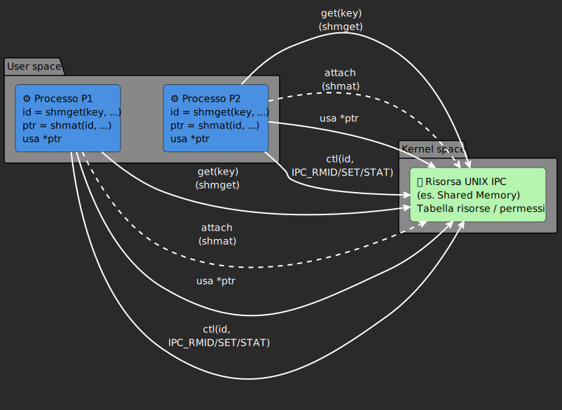
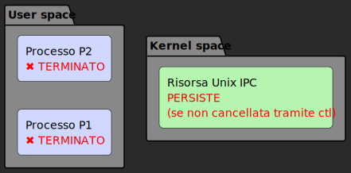

# IPC: Interprocess Communication

Per implementare la comunicazione e quindi anche la sincronizzazione tra processi, abbiamo bisogno che questi comunichino mediante un mezzo; tale mezzo è definito come **risorse IPC**.

Utilizzeremo **meccanismi di comunicazione** introdotti originariamente nel sistema operativo **UNIX System V**. In particolare **System V IPC** fornisce tre principali tipi di risorse gestite dal kernel:
- **Shared memory (SHM)** → memoria condivisa tra piú processi;
- **Semaphores (SEM)** → strutture per la sincronizzazione e mutua esclusione;
- **Message queue (MSG)** → code di messaggi per lo scambio asincrono di dati.

Quindi Linux/UNIX permette la **comunicazione tra processi** mediante primitive e strutture dati fornite dal kernel.

Alla base dei meccanismi di comunicazione è presente una *shared memory*; per implementare semafori e code di messaggi, necessari a gestire rispettivamente mutua  escluzione (competizione) e sincronizzazione (cooperazione), sono necessarie delle porzioni di memoria condivise tra i processi.

## Primitive GET e CTL

Ogni risorsa **IPC** è gestita con l'utilizzo di due primitive **get** e **ctl**.

La primitiva **get** utilizza una "chiave" (IPC key), ed opportuni parametri, per restituire al processo un **descrittore della risorsa**.

La primitiva **ctl** (control) permette, dato un descrittore, di:
- verificare lo stato di una risorsa;
- cambiare lo stato di una risorsa;
- rimuovere una risorsa

La rimozione però non nel senso stretto, in realtá la risorsa vine **solamente etichettata** come eliminabile al kernel: infatti questa viene eliminata se non sono presenti processi che la stanno utilizzando; ovvero processi `attached` alla risorsa.





---
Le risorse IPC sono **permanenti**: se un processo termina o si stacca dalla risorsa questa non si elimina automaticamente. è necessario una chiamata eplicita alla primitiva `clt`.



## Primitiva `get`

La primitiva `get` ha la seguente firma:
```c
  int ...get(key_t key, ..., int flag);
```
- **key** è la chiave dell'oggetto IPC. 
  
  Tale chiave è un valore intero arbitrario che può essere:
  - cablato nel codice;
  - generato da `ftok()`;
  - impostato con la macro `IPC_PRIVATE`.
- **flag**: indica la modalitá di acquisizione della risorsa e i permessi di accesso.
  
  Corrisponde ad una o piú costanti, passate insieme in "or logico" (carattere di pipe `|` ). Tali costanti sono:
  - macro `IPC_CREAT` definita in `sys/ipc.h`: impone di creare una nuova risorsa se non ne esiste giá una con la stessa chiave indicata. Se la risorsa è giá esistente allora il flag è ininfluente.
  - macro `IPC_EXCL` definita in `sys/ipc.h`: utilizzabile con `IPC_CREAT` per imporre di ritornare un errore se la risorsa è giá esistente. Questa modalitá è utile per evitare di inizializzare la risorsa IPC piú volte. Però nel caso la risorsa non esista questa viene creata.
  - **Permessi di accesso**: sono specificati con la notazione ottale. Per esempio, il valore `0664` indica i permessi di lettura e scrittura per `user` e `group`, e di sola lettura per `others`.

La primitiva `get` infine restituisce come risultato il **descrittore della risorsa IPC**, ovvero un valore intero che identifica la risorsa.

## Primitiva `ctl`
La primitiva `ctl` ha la seguente firma:

```c
  int ...ctl(int desc, ..., int cmd, ...);
```
- `desc`: indica il descrittore della risorsa ( ottenuto dalla chiamata `get()`).
- `cmd`: specifica il comando da eseguire, è possibile scegliere tra:
  - `IPC_RMID`: rimozione della risorsa indicata;
  - `IPC_STAT`: richiede informazioni statistiche sulla risorsa indicata;
  - `IPC_SET`: richiede al sistema la modifica di un sottoinsieme degli attributi della risorsa (es. i permessi di accesso).

Il parametro di ritorno di `ctl()` è pari ad `-1` nel caso di un errore, `0` nel caso di operazione riuscita.

## IPC keys
Ogni risorsa `IPC` è identificata da un **valore univoco nel sistema**, denominato **chiave**(IPC key). Abbiamo diversi modi per assegnare una chiave ad una risorsa IPC:


### Chiave cablata nel codice

Il modo piú semplice di **scegliere una chiave** è **usare un valore a piacere** del programmatore, "cablato" nel programma.

ESEMPIO:
```c
key_t mykey = 123;
int id = ...get(mykey,...);
```

Tale approccio è molto svantaggioso perché è **statico**, la chiave viene assegnata in modo statico, questo vuol dire che erroneamente un processo potrebbe utilizzare una chiave giá utilizzata per un'altra risorsa IPC destinata ad uno scopo completamente diverso.

In questo caso potrebbero crearsi delle **interferenzze** e quindi problemi di comunicazione tra processi.

### Chiave generata da `ftok()`

La chiamata di sistema `ftok()` genera una chiave univoca per una risorsa partendo da una stringa e un carattere passatogli per parametri.
```c
key_t ftok(char * path, char id);
```

ESEMPIO:
```c
key_t mykey = ftok("./percorso", 'a');
```
Per convesione si utilizza come prima stringa il percorso file dell'eseguibile che intende creare la risorsa. In generale piú esser inserita una qualsiasi stringa di caratteri. Il secondo parametro `id` invece è un carattere scelto a piacere.

La primitiva restituisce una chiave IPC ottenuta da una funzione aritmetica che combina l'*inode number*, il *minor device number*, del file indicato dal path, e il carattere indicato come secondo argomento. 

- *inode number* è l'identificatore univoco del file nel filesystem;
- *minor device number* è l'identificatore della partizione/dispositivo dove risiede il file.

Il metodo che utilizza `ftok()` per la creazione di una chiave associabile ad una risorsa IPC è quello piú versatile; è l'unico modo che abbiamo per permettere la comunicazione tra due processi associati ad eseguibili differenti.

## Chiave `IPC_PRIVATE`
`IPC_PRIVATE` (equivale a `0`), è un valore costante, che può essere usato per creare una risorsa **senza chiave**. In questo caso la risorsa è accessibile unicamente dal processo creatore e degli eventuali figli aventi la stessa immagine (utilizzare `exec()` significherebbe perdere l'accesso alla risorsa).

ESEMPIO:
```c
key_t mykey = IPC_PRIVATE;
int id = ...get(mykey, ...);

pid_t pid = fork();
if(pid == 0){
  /*figlio, utilizza il descrittore "id" */
}
else if(pid > 0){
  /*padre, utilizza il descrittore "id" */
}
```

## I comandi `ipcs` e `ipcrm`

Il comando `ipcs` visualizza tutte le strutture IPC (code di messaggi, shared memory, semafori) allocate, mostrandone la chiave IPC, l'identificativo del descrittore della risorsa, l'utente proprietario, i permessi per la risorsa e informazioni legate al tipo di risorsa IPC.

```bash
------ Message Queues --------
key        msqid      owner      perms      used-bytes   messages    

------ Shared Memory Segments --------
key        shmid      owner      perms      bytes      nattch     status      
0x00000000 6          giovanni   600        524288     2          dest         
0x00000000 65564      giovanni   600        33554432   2          dest         
0x00000000 65573      giovanni   606        4718592    2          dest         
0x00000000 65574      giovanni   606        4718592    2          dest         
0x00000000 32810      giovanni   606        12072960   2          dest         
0x00000000 32811      giovanni   606        12072960   2          dest         
0x00000000 32821      giovanni   600        524288     2          dest         

------ Semaphore Arrays --------
key        semid      owner      perms      nsems   
```

è possibile utilizzare i seguenti flag per mostrare solo alcune risorse IPC:
```bash
  Resource options:
 -m, --shmems      shared memory segments
 -q, --queues      message queues
 -s, --semaphores  semaphores
 -a, --all         all (default)
```
Tale comando (`ipcs`) cattura le sue informazione dal **filesystem virtuale** `/proc` di Linux. In particolar modo in `/proc/sysvipc/shm` sono contenute tutte le informazioni sulle shared memory.

Sempre nella stessa cartella possiamo trovare informazioni anche per le altre IPC:
- **message queue** → `/proc/sysvipc/msg`;
- **semafori** → `/proc/sysvipc/sem`.


Il comando `ipcrm` invece ci permette di marcare come eliminabile al kernel una struttura IPC dato il suo identificativo. Il comando è molto utile quando il programmatore non ha rimosso esplicitamente le strutture allocate.

ESEMPIO: eliminiamo la shared memory evente pid `133215`

```bash
ipcrm -m 133215
```

