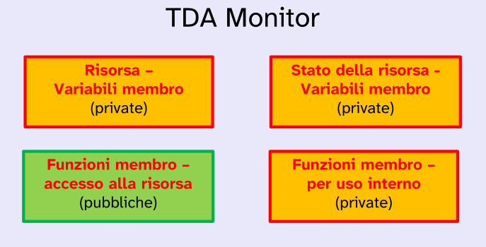
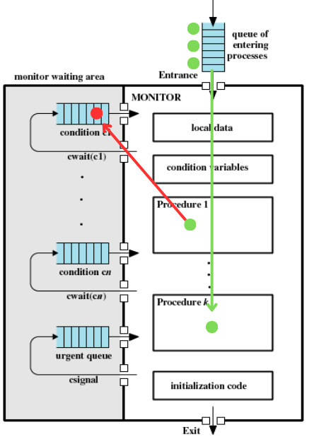
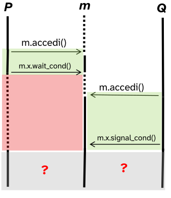
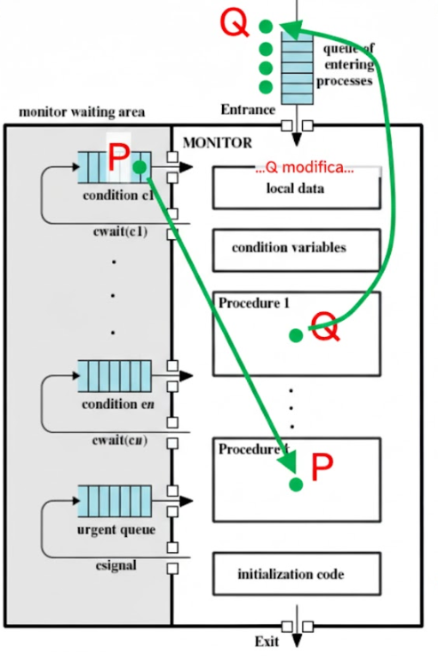
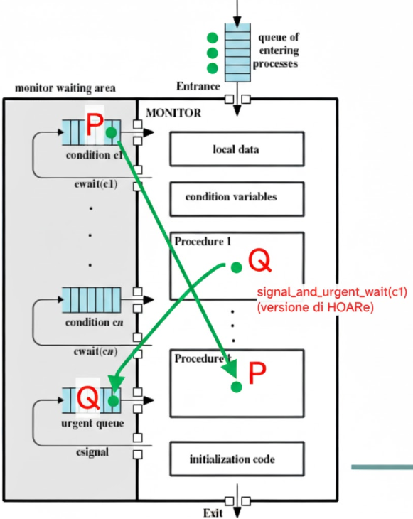
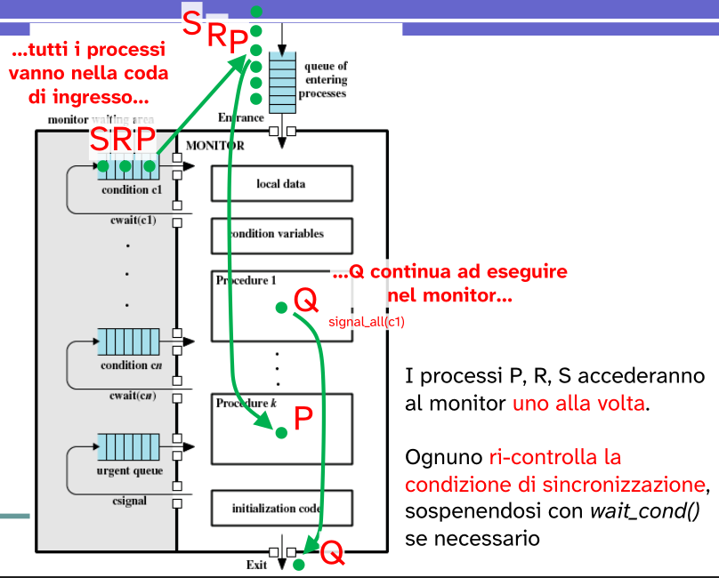

# Monitor

Il **monitor** è una struttura sintattica che opera su una risorsa condivisa (shm) gestendone l'accesso e la sincronizzazione tra processi/thread concorrenti.

Un monitor abbina un insieme di **operazioni** ad una struttura dati (risorsa) condivisa tra processi.

Il costrutto monitor è **sintatticamente** simile al costrutto *class* ma è utilizzato per la gestione delle risorse condivise tra processi. Quindi non possiede risorse locali, come avviene per le classi, ma delle risorse condivise.

Il monitor stesso sarà una risorsa condivisa.

Lo scopo di un monitor è quello di facilitare la programmazione condivisa. Infatti permette di creare **politiche di accesso** alle risorse condivise tramite delle condizioni che implementeremo (**variabili di condizione**).

<p align="center">
  
</p>

Un monitor lo possiamo vedere quindi come **tipo di dato astratto** contenente variabili di condizione e procedure che implementano le politiche di accesso ad una risorsa condivisa (`shm`).

In `c` implementiamo un TDA proprio con una `struct` che porta con se il concetto di classe dove ogni membro è pubblico.


<p align="center">
  
</p>

- **Risorsa**: consiste nella risorsa condivisa tra i vari processi che la competono;
- **Stato della risorsa**: consiste in altri variabili membro utili per la gestione come:
  
  - puntatore di testa/coda;
  - pid dell'ultimo processo ad aver effettuato un modifica sulla `shm`;
  - ...
- **Funzioni membro (pubbliche)**: per accesso alla risorsa da parte dei processi, quindi procedure pubbliche;
- **Funzioni membro (private)**: per uso interno al monitor.

## Strategie di controllo

La politica di accesso impone che:
- **un solo processo alla volta** può avere accesso alla risorsa condivisa (**competizione**);
- i processi devono seguire un determinato **ordine di accesso alla risorsa** (**cooperazione**).

### Competizione

Quindi per il primo punto: le **funzioni pubbliche** del monitor sono esegute in modo **mutuamente esclusivo**.

Appunto perché queste funzioni operano sulla risorsa critica che viene condivisa tra i processi. Significa che per eseguire una qualsiasi operazione definita nel monitor un processo, a monte, deve chiedere l'accesso a quest'ultimo.

<p align="center">
  
</p>

`m` è l'istanza di un monitor che gestisce l'accesso ad un risorsa critica. Quindi i processi per poter operare sulla `shm` chiamano una procedura di accesso definita dal monitor.

Nel caso il monitor sia già assegnato ad un altro processo, il processo che tenta di accedervi viene sospeso fin tanto che la risorsa monitor non viene rilasciata dal processo detentore.

Quindi in questo modo solo un processo per volta può avere accesso alla risorsa condivisa poiché l'accesso viene gestito dai metodi pubblici del monitor.

**Come implementare i metodi pubblici** di un monitor?

Attraverso:
- **librerie di funzioni** del linguaggio di programmazione
  
  Dobbiamo implementare delle librerie ad *hoc* per complementare quello che ci offre il linguaggio di programmazione; per gestire poi la competizione e cooperazione.

  In `c` implementiamo metoti come `enter()` e `leave_monitor()` per permettere l'operazione mutuamente esclusiva sulla risorsa;

- **parole chiave** del linguaggio di programmazione
  
  Esempio chiave è **JAVA**, che utilizza un monitor implicito che attraverso la parola chiave **Synchronize** permette a metodi di esser eseguiti in maniera mutuamente esclusiva.

```c
Monitor M {
    void metodo1(){
        enter_monitor();
        // operazioni su risorsa
        leave_monitor();
    }
}
```

Per la competizione il monitor fa uso di semafori **lock** per gestire la mutua esclusione: per l'entrata sul monitor e l'uscita sul monitor.

### Cooperazione

Nella gestione della cooperazione, i processi si sospendono se **non è verificata** una "**condizione logica**" di accesso.

Per la gestione della cooperazione si introduce un tipo di variabile detta **variabile condition**, che determina la sospensione di un processo nel momento in cui una condizione non è verificata.
```c
var_cond x;
```

Tale variabile condition definisce due metodi:
- `x.wait_cond()` sospende il processo chiamante...
- ... fino a che un altro processo esegue `x.signal_cond()`.

Simile ai semafori ma le operazioni **hanno un comportamento diverso**.

Avremo tante variabili condition quante sono le condizioni per cui un processo deve esser sospeso per cooperazione 

→ ogni variabile condition è associata ad una condizione logica.

```c
Monitor M {
    var_cond x;
    var_cond y;

    void metodo1(){
        enter_monitor();

        if/while(!condizione_logica) //tale condizione è legata a x
            x.wait_cond();
        // operazione su risorsa
        y.signal_cond();
        leave_monitor();
    }
}
```

Questo esempio potrebbe benissimo implementare il paradigma produttori/consumatori se associassimo ad `x` la condizione che riguarda lo spazio disponibile ed a `y` la condizione di messaggio disponibile.

Ovviamente nel momento in cui un processo viene sospeso, questo rilascia il monitor per permettere ad altri processi di entrare.

Nell'esempio è presente `if/while` perché ci sono diverse implementazioni possibili per l'operazione di `signal_cond()` che devono essere gestite in modo diverso.

Quindi per ottenere una corretta cooperazione tra processi e quindi un **ordine di accesso**:
- in ogni metodo del monitor, il processo chiamante controlla se è soddisfatta una **condizione logica**;
- se la condizione non è soddisfatta, il processo chiamante viene **sospeso**;
- nel momento in cui viene sospeso rilascia anche la risorsa monitor, in modo che un altro processo possa entrare ed eseguire operazioni che potrebbero portare alla sua sospensione oppure all'**attivazione** dei processi **sospesi su una condizione**.


## Monitor - paronamica

Possiamo schematizzare un monitor in questo modo:

<p align="center">
  
</p>

- Sono presenti diverse **code** in cui sono contenuti i processi che si sono sospesi e attendono si essere riattivati.
- Procedure che un processo piò effettuare sulla `shm` in modo esclusivo.
- **local data** in cui sono contenute le strutture condivise.
- **condition variables** sono la sezione in cui sono dichiarate le variabili condition.


<p align="center">
  
</p>

Il processo entra nel monitor chiedendo di eseguire una procedura in mutua esclusione. Quindi dopo la chiamata alla procedura di interesse viene chiamata una `enter_monitor()`.

All'interno della procedura potrebbe esserci una condizione che potrebbe portare il processo a sospendersi nel caso in cui non sia verificata; condizioni associate a variabili condition.

→ Per ogni variabile condition oltre ad una condizione logica è associata una **coda** in cui saranno memorizzati tutti i processi che si sono sospesi per il mancato soddisfacimento della condizione logica.

Quindi nel momento in cui è da gestire una cooperazione le procedure controllano, tramite le variabili locali, se la **condizione di sincronizzazione** è valida (es. buffer vuoto, buffer occupato).

Se la **condizione di sincronizzazione** è valida, il processo completa l'esecuzione e libera il monitor con una chiamata `leave_monitor()`.


Condizione **non** valida:

<p align="center">
  
</p>

Se al momento del controllo la **condizione di sincronizzazione non è valida**, il processo si sospende volontariamente usando la **condition** **variables** associata alla condizione che non è stata soddisfatta.

Mentre è in attesa, il monitor diventa libero, poiché il processo che si è sospeso deve aver rilasciato il monitor prima della sospensione con una `leave_monitor()`, e quindi è accessibile ad altri processi che attendono di entrare.

## Note su condition variables

---

<p style="font-size:1.3em; text-align:center;">
<b>var. condition</b> ≠ <b>semafori</b><br>
<b>wait_condition()</b> ≠ <b>wait_sem()</b><br>
<b>signal_condition()</b> ≠ <b>signal_sem()</b>
</p>

---

La `wait_cond()` **sospende sempre il processo chiamante**.

→ Nei semafori, con `wait_sem()`, la sospensione era **condizionata** allo stato interno del semaforo

La `signal_cond()` **non ha alcun effetto** se **non vi è alcun processo in attesa** sulla condition variables.

→ Nei semafori invece `signal_sem()` aveva sempre un effetto, ovvero quello di incrementare lo stato del semaforo.

## Diverse implementazioni di `signal_cond()` (semantica) 

A fronte di questa problematica abbiamo diverse implementazioni della procedura `signal_cond()`.

<p align="center">
  
</p>

Supponiamo che `P` acceda al monitor e debba eseguire una procedura in mutua esclusione, ma **non soddisfa** una condizione definita per la cooperazione.

→ Il processo spontaneamente si sospense utilizzando `wait_cond()` sulla condition variables associata a tale condizione.

Nel momento in cui `P` si sospende questo rilascia la risorsa monitor agli altri processi in attesa. Quindi il prossimo processo schedulato in attesa, `Q`, entra nel monitor ed esegue una procedura che potrebbe comportare **l'aggiornamento dello stato della risorsa**.

→ La condizione di sincronizzazione che ha portato `P` a sospendersi viene soddisfatta, quindi tale processo può continuare la propria esecuzione

Il processo `Q` dopo la modifica che ha portato la risorsa ad essere pronta per `P`, riattiva `P` che ritorna pronto.

---

**PROBLEMA:** `P` e `Q` non possono eseguire entrambi nel monitor, si violerebbe la **mutua esclusione**.

---

A questo problema **non** esiste una soluzione **unica**.

Diversi sistemi attribuiscono comportamenti (**semantica**) diversi alle primitive `wait_cond()`/`signal_cond()`.

### Prima soluzione: signal and wait

***signal_and_wait*** prevede:

- il processo segnalato `P` **riprenda** **immediatamente** l'esecuzione;
- il processo segnalante `Q` venga **sospeso**.

`Q` viene sospeso per evitare che possa modificare nuovamente la condizione di sincronizzazione per cui `P` si è sospeso.

Utilizzo della primitiva `wait_cond()` in questa semantica di `signal_cond()`:

- il processo segnalato è il primo ad eseguire;
- al risveglio, il segnalato **ha certezza di trovare verificata** la condizione di sincronizzazione, quindi non è necessario che questo la verifichi nuovamente.

Quindi lo schema di uso della `wait_cond()` sarà:
```c
if (!B) { // B = condizione di sincronizzazione
    cv.wait_cond(); // cv = var.condition, abbinata a B
}
// accesso alla risorsa...
```

In questo modo quando `P` entra per primo nel monitor, **prematuramente** (la condizione di sincronizzazione non è ancora valida), per cui si **sospende**.

Il processo `Q` **opera sulla risorsa condivisa** (es. buffer di stato) facendo in modo che venga soddisfatta la condizione di sincronizzazione, quindi effettua la `signal_cond()` sulla condition variable che comporta la sua sospensione.

Quindi `Q` dovrà uscire dalla risorsa monitor con una `leave_monitor()`.

→ `Q` attende l'uscira di `P` e **compete** con altri processi per rientrare nel monitor.

<p align="center">
  
</p>

---

#### signal_and_wait di Hoare

Una diversa soluzione di **signal_and_wait** potrebbe essere quella di **Hoare**.

In questa soluzione, il processo `Q` ha la precedenza sugli altri processi in attesa di entrare nel monitor.

Quindi `Q` non si sospende sulla coda in cui sono presenti tutti gli altri processi che sono in attesa, ma su una coda separata **urgent_queue**.

<p align="center">
  
</p>

Tale soluzione di Hoare è un caso particolare di signal_and_wait, detta **signal_and_urgent_wait**.

Prevede che il processo `Q` abbia la **priorità** su ogni altri processi che intendono entrare nel monitor.

Questa soluzione si può ottenere sospendendo il processo `Q` dopo la `signal_wait()` su una cosa detta *urgent_queue*, separata dal mutex.

mutex: meccanismo di mutua escluzione che permette l'accesso al monitor ad un solo processo per volta.

### Seconda soluzione: signal and continue

***signal_and_continue***:

- privilegia il processo **segnalatore** rispetto al **segnalante**;
- il processo `Q` segnalatore prosegue la sua esecuzione, mantenendo l'accesso esclusivo al monitor.

Quindi dopo il risvegli di `P` sospeso per il mancato soddisfacimento della condizione di sincronizzazione, questo viene nuovamente sospeso questa volta nella coda del mutex (insieme a tutti gli altri processi che in attesa di entrare nel monitor).

Per semplicità di implementazione il monitor signal-and-continue non usa la coda **urgent**.

<p align="center">
  
</p>

Essendo che `P` compete con gli altri processi per accedere al monitor potrebbe verificarsi la situazione in cui ad esser schedulato prima di `P` è `K`, che entra nel monitor una volra che `Q` lo ha rilasciato.

In qeusta sistuazione potrebbe accadere che `K` **modifichi nuovamente la risorsa** (le strutture contenute in *local data*) e quindi potrebbe far in modo che la condizione di sincronizzazione per `P` sia **non più verificata**.

Quindi è necessario che una volta che `P` rientri all'interno del monitor verifichi nuovamente la condizione di sincronizzazione.

→ Non abbiamo più la certezza che nel momento in cui `P` rientra nel monitor la condizione sia verificata.

Questo si può tradurre anche in una condizione di **attesa indefinita** per `P` (**starvation**).

Quindi in questo caso lo schema di uso della `wait_cond()` su una condition variable sarà:
```c
while (!B) { // B = condizione di sincronizzazione
    cv.wait_cond(); // cv = condition variable associata a B
}
// in questo caso è possibili che wait_cond() venga chiamata più
// volte prima che P possa accedere alla risorsa
```

`P` non ha la certezza che la condizione sia verificata, quindi deve controllare ogni volta che riottiene l'accesso al monitor.

#### signal_all

`signal_cond()` riattiva al più un solo processo.

Nel momento in cui si vuole risvegliare invece tutti i processi sospesi su una **condition variable** è possibili utilizzare la variante:

```c
signal_all();
```

Tutti i processi risvegliati vengono messi nella *entry_queue*, dalla quale uno alla volta potraà rientrare nel monitor.

<p align="center">
  
</p>

### Confronto: signal-and-wait vs signal-and-continue

La semantica di *signal-and-wait* richiede che venga chiamata **precisamente quando il processo segnalato deve essere svegliato**.

→ ovvero nel momento in cui è soddisfatta la condizione di sincronizzazione.

La semantica di *signal-and-continue* (e *signal-all*) è più **robusta**:

- il processo segnalante può chiamarla anche quando non è sicuro di se/quali processi risegliare;
- saranno i processi risvegliati a controllare se possono eseguire, oppure sospensersi.

### Granularità: semaforo vs monitor

Entrambi, sia monitor che semafori, sono dei concetti necessaria per la gestione di situazioni di cooperazione o competizione tra processi su una risorca condivisa.

Sono simili nell'utilizzo ma hanno tante differenza sia rispetto alla robustezza che alla granularità.

In particolar modo i semafori hanno una granularita *fine*, molto bassa, proprio perché gestiscono la mutua esclusione a **livello di singole operazioni**.

Mentre i monitor hanno una granularità più alta: il controllo non è sulla singola operazione sulla risorsa condivisa, ma sull'intera risorsa condivisa.

→ infatti nell'implementazione del problema produttori/consumatori con buffer di stato la modifica di questo a fine di un operazione (`IN_USO → OCCUPATO/LIBERO`), che sia di scrittura o lettura, deve essere eseguira all'interno del monitor (bloccando quindi gli altri processi che desiderano accedervi).

Mentre con i semafori la modifica sul buffer di stato `IN_USO → OCCUPATO/LIBERO` non era inclusa nella sezione critica, non ostacolavamo gli altri processi ad operare sulla risorsa.

Invece parlando di **robustezza** i monitor sono sicuramente molto più sicuri per via del loro **livello di astrazione maggiore**. Tutti le operazioni sulla memoria condivisa sono contenute all'interno del monitor. (possiamo dire che il monitor è un wrapper della `shm`)

Mentre per i semafori la gestione è esplicita, quindi è più alto il rischio di eventuali **deadlock**.