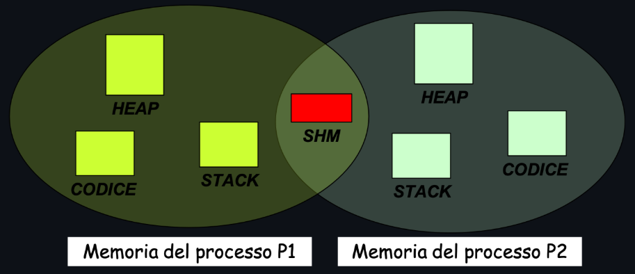
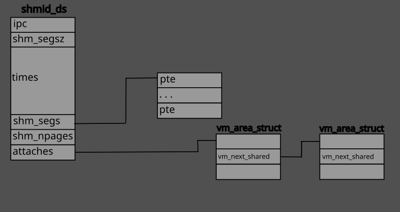

# Shared memory

I processi UNIX( a differenza dei thread) non possono condividere memoria, neanche i processi "parenti"; questi non sono altro che copie dell'immagine del processo padre e hanno uno *spazio di indirizzamento* diverso. Un processo **figlio** eredita una **copia** dei dati del processo **padre**: dopo la system call `fork()` la modifica dei dati da parte di un processo non si ripercuite sui dati dell'altro processo.

Una memoria condivisa (SHM) è una porzione di memoria accessibile da piú processi.



L'utilizzo di una memoria condivisa SHM prevede il seguente workflow:
1) Creazione della SHM
2) Collegamento alla SHM
3) Uso della SHM
4) Scollegamento della SHM
5) Eliminazione della SHM

Per implementare una shared memory mediante i meccanismi offerti dallo **standard systemV** è necessario l'utilizzo di alcune primitive implementate in:
```c
#include <sys/types>
#include <sys/ipc.h>
#include <sys/shm.h>
```
Il kernel per tener traccia di una **shared memory SystemV** utilizza una struttura dati interna speciale per ogni segmento di memoria condivisa. Il nome della struttura che utilizza è `shmid_ds`, ed è definita in `linux/shm.h`.

Tale struttura è utilizzabile tramite la libreria `sys/shm.h`.

```c
    /* One shmid data structure for each shared memory segment in the system. */

struct shmid_ds {
	struct ipc_perm shm_perm;        /* operation perms */
	int     shm_segsz;               /* size of segment (bytes) */
	time_t  shm_atime;               /* last attach time */
	time_t  shm_dtime;               /* last detach time */
	time_t  shm_ctime;               /* last change time */
	unsigned short  shm_cpid;        /* pid of creator */
	unsigned short  shm_lpid;        /* pid of last operator */
	short   shm_nattch;              /* no. of current attaches */

	/* the following are private */
	unsigned short shm_npages;       /* size of segment (pages) */
	unsigned long  *shm_pages;       /* array of ptrs to frames -> SHMMAX */ 
	struct vm_area_struct *attaches; /* descriptors for attaches */
};
```




## Creazione:
```c
int shmget(key_t key, int size, int flag);
```
`size` è la dimensione in byte della memoria condivisa. Possiamo quindi specificare qualsiasi valore di dimensione; supponendo di scegliere `size = 4` stiamo chiedendo di avere una memoria condivisa di `4 byte` ma in realtá il kernel sta allocando uno spazio di memoria pari a `4KB` perché la memoria condivisa viene alocata in **unitá di pagina** del sistema, e la **dimensione di una pagina su linux** è pari a **`4 KB`**.

Restituisce `-1` in caso di fallimento. Invece se ha successo restituisce il **descrittore della risorsa**.

---
ESEMPIO: con chiave cablata e senza flags
```c
	...
	key_t chiave = 40;
	int ds_shm;
	ds_shm = shmget(chiave, 1024, 0);

	if(ds_shm < 0) {
   		// la risorsa non esiste! esci dal programma
    	perror(“errore shmget!”);
    	exit(1);
  	}
  	... Utilizza la shared memory già esistente...
```
Se la shared memory non è stata giá creata da un altro processo, la funzione `shmget()` restituisce `-1`.

---
ESEMPIO: con chiave cablata e flag `IPC_CREAT`
```c
  	...
	key_t chiave = 40;
  	int ds_shm;
  	ds_shm = shmget(chiave, 1024, IPC_CREAT | 0664);

  	if(ds_shm < 0) {
   		// qualcosa è andato storto (memoria esaurita, etc.)
    	perror(“errore shmget!”);
    	exit(1);
  	}
  	... Utilizza la shared memory (esistente o nuova)...
```
In questo caso il flag `IPC_CREAT` impone di creare una nuova shared memory se non ne esiste una con la stessa `key`; la crea con le caratteristiche specificate di dimensione e permessi di accesso.

Nel caso in cui esiste giá una shared memory vente tale valore di `key`,  la chiamata restituisce semplicemente il descrittore della risorsa senza tener conto di `size` e dei permessi di accesso specificati.

---
ESEMPIO: chiave cablata e flag `IPC_CREAT` e `IPC_EXCL`
```c
	key_t chiave = 40;
 	int ds_shm = shmget(chiave,1024,IPC_CREAT|IPC_EXCL|0664);
 	if(ds_shm < 0) {
   		// La risorsa già esiste, viene segnalato con ds_shm<0.
		// Per ottenere un descrittore dalla SHM, occorre
   		// chiamare nuovamente shmget
   		// (senza nè IPC_CREAT nè IPC_EXCL)
   		
   		ds_shm = shmget(chiave, 1024, 0);
   		if(ds_shm<0) { 
   			/* errore */ 
   		}
	} else {
   		// La risorsa non esisteva, ed è stata appena creata.
   		// Il programma ha l’opportunità di inizializzarne
   		// il contenuto (ad esempio, «0» o una stringa vuota).
	}
	... Utilizza la shared memory ...
```

La shared memory viene creata dal primo `get` solamente se non ne esiste giá una con la stessa chiave, altrimenti restituisce `-1`.

In quest'ultimo caso otteniamo il descrittore con una chiamata `get` senza flag poichè sappiamo esistere la risorse IPC.

---

ESEMPIO: utilizzo `ftok()` per creare una key adatta a una risorsa IPC
```c
	key_t chiave = ftok("./eseguibile", 'k');
  	int ds_shm;
  	ds_shm = shmget(chiave, 1024, IPC_CREAT | 0664);

  	if(ds_shm < 0) {
    	// qualcosa è andato storto (memoria esaurita, etc.)
    	perror(“errore shmget!”);
    	exit(1);
  	}
  	... Utilizza la shared memory (esistente o nuova)...
```

In questo esempio non viene utilizzata una chiave cablata nel codice, ma più opportunamente si utilizza la system call `ftok()` per ottenere una IPC key univoca. 

Se due programmi differenti utilizzassero gli stessi parametri per la `ftok()` otterrebbero la stessa IPC key.

---

ESEMPIO: chiave privata con `IPC_PRIVATE`
```c
	int ds_shm = shmget(IPC_PRIVATE, 1024, IPC_CREAT|0664);

  	if(ds_shm < 0) {
    	// qualcosa è andato storto (memoria esaurita, etc.)
    	perror(“errore shmget!”);
    	exit(1);
  	}
  	... Utilizza la shared memory ...
```

In questo esempio si crea una shared memory senza assegnare una chiave, dal momento che IPC_PRIVATE equivale a una chiave IPC pari a `0`. 

Infatti, utilizzando il comando ipcs, la chiave apparirà con il valore pari a `0`. 

In questo caso, la shared memory è utilizzabile solo dal padre e i suoi figli, ovvero non è una soluzione corretta nel caso in cui avessimo più programmi eseguibili.

## Collegamento

Per poter utilizzare una shared memory e necessario effettuare il così detto *attach* tramite la system call `shmat()`,
```c
void *shmat(int shmid, const void *shmaddr, int shmflg);
```
dove:
- `shmid` e l'identificatore del segmento di memoria:
- `shmaddr` è l'indirizzo dell'area di memoria del processo chiamante al quale collegare il segmento di memoria condivisa.
  
  Se si utilizza il valore `0` o `NULL`, il kernel proverá a trovare una regione di memoria non mappata giá per allocarla per la shared memory. Questo approccio è quello raccomandato.
- `flag` indica le opzioni di collegamento, ad esempio per collegare in sola lettura si inserisce `IPC_RDONLY`.


La funzione `shmat()` restituirà l'indirizzo di memoria, nello spazio di indirizzamento del processo chiamante, al quale il segmento di memoria condivisa è stato collegato (*attached*). 

In caso di fallimento, la funzione restituirà il valore `-1`.

## Scollegamento

Una volta finito di utilizzare una `shm` è necessario scollegarsi (*detach*) dalla memoria condivisa tramite la system call `shmdt()`.

Questa operazione di norma è **inclusa** nel marcare come eliminabile una shared memory (`shmctl(shmid, IPC_RMID, NULL)`).

```c
int shmdt(const void *shmaddr);
```

dove:

- `shmaddr` è l'indirizzo a cui la memoria condivisa era stata collegata precedentemente con `shmat()`.

Ha come valore di ritorno:

- `0` se l'operazione è andata a buon fine;
- `1` in caso di errore, impostando `errno` (variabile globale delle funzioni in C) a un valore corrispondente al tipo di errore riscontrato.

## Controllo
La chiamata di sistema `shmctl()` permette di invocare un comando di controllo su una *shared memory* esistente.
```c
int shmctl(int shmid, int cmd, struct shmid_ds *buf);
```
dove:
- `shmid` è il descrittore della memoria condivisa su cui si vuole operare;
- `cmd` specifica il comando da eseguire. 
  
  Valori validi sono:
  - `IPC_STAT`: copia le informazioni di stato, della memoria condivisa, dalla struttura dati interna la kernel nella struttura `shmid_ds` puntata dalla variabile `buf`;
  - `IPC_SET`: permette di scrivere i valori di qualche membro della struttura `shmid_ds` puntata dalla variabile `buf` alla struttura interna al kernel;
  - `IPC_RMID`: marca da eliminare la shared memory, in modo che il kernel la rimuova solo quando non vi sono piú processi collegati;
  - `SHM_LOCK`: impedisce che il segmento di memoria condiviso venga *swappato* o paginato.
- `buf` è il puntatore alla struttura di tipo `shmid_ds`; funge sia da parametro di ingresso che da parametro di uscita, a seconda del `cmd` inserito.

La chiamata a sistema se fallisce restituisce `-1`.
## Codice visto in aula (contenente i concetti chiave)

### wokrflow di una shared memory
```c
#include <sys/shm.h>
#include <sys/ipc.h>
#include <stdlib.h>
#include <stdio.h>


int main(){
    //obiettivi
    // creare una chiave 
    // ottenere il descrittore
    // utilizzare la shm

    // creiamo/otteniamo il descrittore della risorsa
    int *p = NULL;
    key_t shm_key = IPC_PRIVATE;
    int ds_shm = shmget(shm_key, sizeof(int), IPC_CREAT | 0664);
    if (ds_shm < 0){
        printf("errore nella creazione della shm");
        exit(-1);
    }

    // colleghiamoci alla risorsa

    p = (int *) shmat(ds_shm,NULL,0); 
    // avenfo inserto NULL al secondo parametro do il compito di trovare un buffer di memoria disponibile da utilizzare per la shared memory
    // al posto di 0 avrei potuto inserire dei flag.
    if(p == NULL){
        printf("errore nella shmat()\n");
        exit(-1);
    }

    printf("dettagli della shm\n");
    printf("chiave IPC: %d\n", shm_key);
    printf("descrittore IPC: %d\n",ds_shm);
    printf("indirizzo della shm dopo l'attach: %p\n",p);

    // utilizziamo la risorsa
    *p = 10;

    // marco la shm come da eliminare per il kernel
    shmctl(ds_shm, IPC_RMID,NULL); // non sará eliminata fin tanto che esiste un processo attached


    return 0;
}
```
 Il risultato dell'esecuzione: 
 ```bash
 dettagli della shm
chiave IPC: 0
descrittore IPC: 98326
indirizzo della shm dopo l'attach: 0x7948fda27000
 ```
----
### Shared memory tra processo padre e figlio
 Proviamo adesso a utilizzare la shared memory tra processo padre e processo figlio.

 Prima utilizzando `IPC_PRIVATE` come chiave e successivamente utilizzarne una ricavata dalla chiamata di sistema `ftok()`.

 ```c
#include <sys/shm.h>
#include <sys/ipc.h>
#include <sys/wait.h>
#include <stdlib.h>
#include <stdio.h>
#include <unistd.h>

int main(){
    //obiettivi
    // creare una chiave 
    // ottenere il descrittore
    // utilizzare la shm

    // creiamo/otteniamo il descrittore della risorsa
    int *p = NULL;
    key_t shm_key = IPC_PRIVATE;
    //key_t shm_key = ftok(".sharedMemory_padre_figlio.c",'b');
    int ds_shm = shmget(shm_key, sizeof(int), IPC_CREAT | 0664);
    if (ds_shm < 0){
        printf("errore nella creazione della shm");
        exit(-1);
    }

    // colleghiamoci alla risorsa

    p = (int *) shmat(ds_shm,NULL,0); 
    // avenfo inserto NULL al secondo parametro do il compito di trovare un buffer di memoria disponibile da utilizzare per la shared memory
    // al posto di 0 avrei potuto inserire dei flag.
    if(p == NULL){
        printf("errore nella shmat()\n");
        exit(-1);
    }

    printf("dettagli della shm\n");
    printf("chiave IPC: %d\n", shm_key);
    printf("descrittore IPC: %d\n",ds_shm);
    printf("indirizzo della shm dopo l'attach: %p\n",p);

    // creiamo un processo figlio per provare la shared memory appena creata.
    pid_t pid = fork();
    if ( pid == 0 ) {// FIGLIO
        printf("[FIGLIO %d] il contenuto della shm: %d\n",getpid(),*p);
        *p = 123;// cambio il valore contenuto nella shared memory
        exit(0);
    }else if ( pid > 0 ){// PADRE
        wait(NULL);
        printf("[PADRE %d] contenuto della shm: %d\n",getpid(),*p);
    }


    

    // macro la shm come da eliminare per il kernel
    shmctl(ds_shm, IPC_RMID,NULL); // non sará eliminata fin tanto che esiste un processo attached


    return 0;
}
 ```

 Il risultato dell'esecuzione è:

 ```bash
chiave IPC: 0
descrittore IPC: 98333
indirizzo della shm dopo l`attach: 0x7ed908c19000
[FIGLIO 70150] il contenuto della shm: 0
[PADRE 70149] contenuto della shm: 123
 ```

` 0x7608e5496000` è l'indirizzo di memoria, nello spazio di indirizzamento del processo chiamante, al quale il segmento di memoria condivisa è stato collegato (*attached*).

Sia il processo padre che il processo figlio ottengono una copia del puntatore a memoria condivisa.

Possiamo visualizzare lo spazio di indirizzamento e verificare in che posizione di questo si trova la shared memory nello pseudo filesystem `proc`; conoscendo il PID del processo in questione

Utilizziamo quindi il comando: 
```bash
sudo cat /proc/70149/maps
```
ottengo: 
```bash
59c2dcab7000-59c2dcab8000 r--p 00000000 103:04 1734183   /home/giovanni/Desktop/SO/Sistemi_Operativi/IPC/sharedMemory_padre_figlio
59c2dcab8000-59c2dcab9000 r-xp 00001000 103:04 1734183   /home/giovanni/Desktop/SO/Sistemi_Operativi/IPC/sharedMemory_padre_figlio
59c2dcab9000-59c2dcaba000 r--p 00002000 103:04 1734183   /home/giovanni/Desktop/SO/Sistemi_Operativi/IPC/sharedMemory_padre_figlio
59c2dcaba000-59c2dcabb000 r--p 00002000 103:04 1734183   /home/giovanni/Desktop/SO/Sistemi_Operativi/IPC/sharedMemory_padre_figlio
59c2dcabb000-59c2dcabc000 rw-p 00003000 103:04 1734183   /home/giovanni/Desktop/SO/Sistemi_Operativi/IPC/sharedMemory_padre_figlio
59c2eb298000-59c2eb2b9000 rw-p 00000000 00:00 0          [heap]
7ed908800000-7ed908828000 r--p 00000000 103:04 688600    /usr/lib/x86_64-linux-gnu/libc.so.6
7ed908828000-7ed9089b0000 r-xp 00028000 103:04 688600    /usr/lib/x86_64-linux-gnu/libc.so.6
7ed9089b0000-7ed9089ff000 r--p 001b0000 103:04 688600    /usr/lib/x86_64-linux-gnu/libc.so.6
7ed9089ff000-7ed908a03000 r--p 001fe000 103:04 688600    /usr/lib/x86_64-linux-gnu/libc.so.6
7ed908a03000-7ed908a05000 rw-p 00202000 103:04 688600    /usr/lib/x86_64-linux-gnu/libc.so.6
7ed908a05000-7ed908a12000 rw-p 00000000 00:00 0 
7ed908bfd000-7ed908c00000 rw-p 00000000 00:00 0 
7ed908c19000-7ed908c1a000 rw-s 00000000 00:01 98333      /SYSV00000000 (deleted)
7ed908c1a000-7ed908c1c000 rw-p 00000000 00:00 0 
7ed908c1c000-7ed908c1e000 r--p 00000000 00:00 0          [vvar]
7ed908c1e000-7ed908c20000 r--p 00000000 00:00 0          [vvar_vclock]
7ed908c20000-7ed908c22000 r-xp 00000000 00:00 0          [vdso]
7ed908c22000-7ed908c23000 r--p 00000000 103:04 688597    /usr/lib/x86_64-linux-gnu/ld-linux-x86-64.so.2
7ed908c23000-7ed908c4e000 r-xp 00001000 103:04 688597    /usr/lib/x86_64-linux-gnu/ld-linux-x86-64.so.2
7ed908c4e000-7ed908c58000 r--p 0002c000 103:04 688597    /usr/lib/x86_64-linux-gnu/ld-linux-x86-64.so.2
7ed908c58000-7ed908c5a000 r--p 00036000 103:04 688597    /usr/lib/x86_64-linux-gnu/ld-linux-x86-64.so.2
7ed908c5a000-7ed908c5c000 rw-p 00038000 103:04 688597    /usr/lib/x86_64-linux-gnu/ld-l
7ffe4f02e000-7ffe4f050000 rw-p 00000000 00:00 0          [stack]
ffffffffff600000-ffffffffff601000 --xp 00000000 00:00 0  [vsyscall]

```
Dove ritroviamo il segmento a noi d'interesse:
```bash
7ed908c19000-7ed908c1a000 rw-s 00000000 00:01 98333   /SYSV00000000 (deleted)
```
Notiamo che il primo indirizzo coincide con l'indirizzo del puntatore alla shared memory.

Inoltre nonostante la `size` specificata per la shared memory fosse di soli `4 byte` (dimensione di un intero sulla mia architettura), ritroviamo un'area di memoria dedicata alla shared memory di dimensione `4KB`. `7ed908c1a000 - 7ed908c19000 = 4096`.

Questo per il motivo specificato prima quando si è parlato della chiamata `get`.


### Shared memory con `exec()`

Il processo padre crea un figlio che esegue una `exec()`, quindi non possiede piú la stessa immagine del padre ma è un processo del tutto diverso, anche nel testo (codice). In questi casi l'unica soluzione per ottenere una risorsa condivida è l'utilizzo della chiamata `ftok()`.

NON possiamo utilizzare `IPC_PRIVATE`.

```c
#include <sys/shm.h>
#include <sys/ipc.h>
#include <sys/wait.h>
#include <stdlib.h>
#include <stdio.h>
#include <unistd.h>

int main(){
    //obiettivi
    // creare una chiave 
    // ottenere il descrittore
    // utilizzare la shm

    // creiamo/otteniamo il descrittore della risorsa
    int *p = NULL;
    //key_t shm_key = IPC_PRIVATE;
    key_t shm_key = ftok(".shared_memory_exec&ftok.c",'p');
    int ds_shm = shmget(shm_key, sizeof(int), IPC_CREAT | 0664);
    if (ds_shm < 0){
        printf("errore nella creazione della shm");
        exit(-1);
    }

    // colleghiamoci alla risorsa

    p = (int *) shmat(ds_shm,NULL,0); 
    // avenfo inserto NULL al secondo parametro do il compito di trovare un buffer di memoria disponibile da utilizzare per la shared memory
    // al posto di 0 avrei potuto inserire dei flag.
    if(p == NULL){
        printf("errore nella shmat()\n");
        exit(-1);
    }

    printf("dettagli della shm\n");
    printf("chiave IPC: %d\n", shm_key);
    printf("descrittore IPC: %d\n",ds_shm);
    printf("indirizzo della shm dopo l'attach: %p\n",p);

    // creiamo un processo figlio per provare la shared memory appena creata.
    pid_t pid = fork();
    if ( pid == 0 ) {// FIGLIO
        execl("./altro_prog","./altro_prog", (char *) 0);
        printf("errore\n");
        exit(-5);
    }else if ( pid > 0 ){// PADRE
        wait(NULL);
        printf("[PADRE %d] contenuto della shm: %d\n",getpid(),*p);
    }


   

    // macro la shm come da eliminare per il kernel
    shmctl(ds_shm, IPC_RMID,NULL); // non sará eliminata fin tanto che esiste un processo attached


    return 0;
}
```

Risultato ottenuto: 
```bash
dettagli della shm
chiave IPC: -1
descrittore IPC: 98336
indirizzo della shm dopo l`attach: 0x76e4e8c28000
dettagli della shm
chiave IPC: -1
descrittore IPC: 98336
indirizzo della shm dopo l`attach: 0x78f6872c7000
[FIGLIO 73759] il contenuto della shm: 0
[PADRE 73758] contenuto della shm: 123
```

Da notare che l'indirizzo per la shared memory è cambiato. Appunto perché il processo figlio non è più una copia **dell'immagine** del processo padre una volta utilizzato la chiamata `exec()`.
