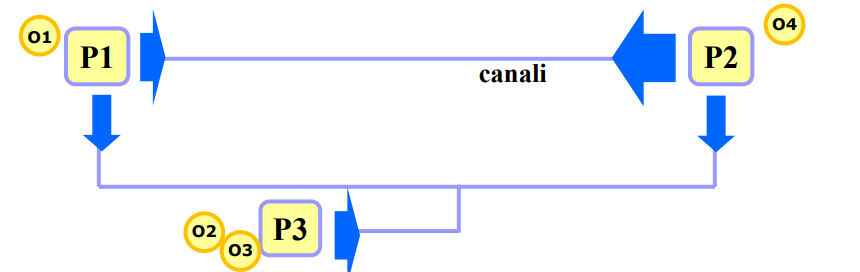
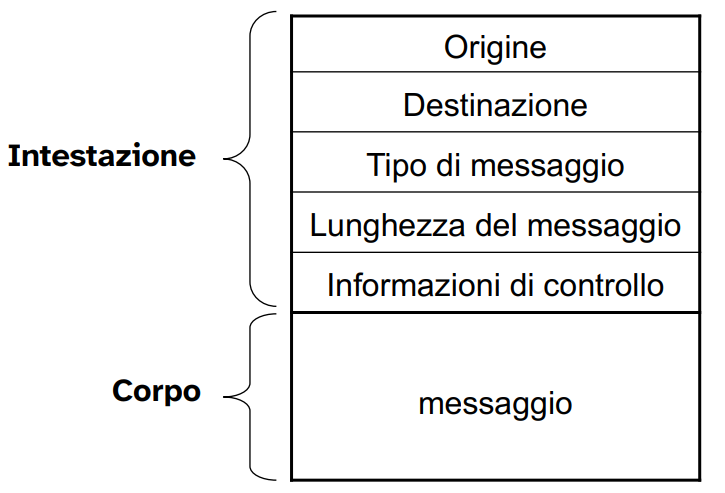
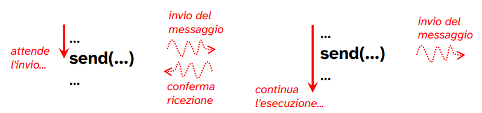
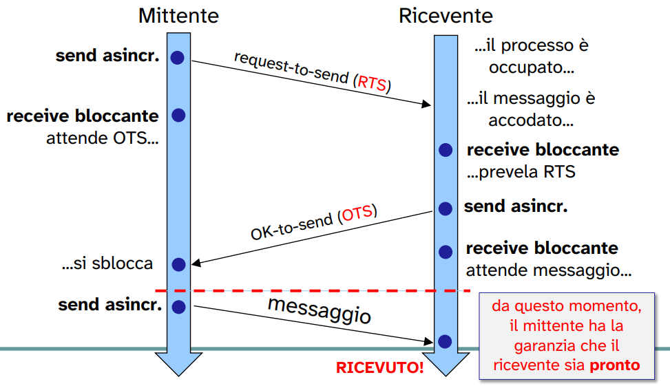
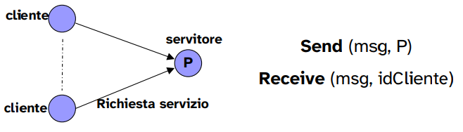
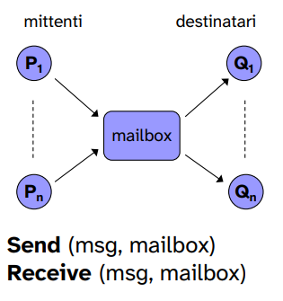

# Sincronizzazione nel modello ad ambiente locale

Il modello ad ambiente **locale** si riferisce ad una struttura in cui ogni processo opera nel proprio ambiente privato, **senza alcuna memoria condivisa** tra vari processi.

In questo modello tutte le risorse sono privare a ciascun processo e non possono essere modificate direttamente da altri processi.

Questo è un approccio tipico dei **sistemi distribuiti**.

Quindi ogni processo evolve in un proprio ambiente:

- non esiste memoria condivisa;
- le **risorse sono tutte private**;
- Non possono esser modificate direttamente da altri processi.

Il naturale supporto fisico a questo modello, come detto, sono i sistemi con architettura distribuita.

<p align="center">
  
</p>

---

Nota: 

Il **middleware** è un software intermedio che si trova "in mezzo" tra:

- sistema operativo
  
  e

- le applicazioni che si trovano su macchine diverse.

Il suo compito è nascondere le differenze tra: 

- sistema operativi diversi
- linguaggi di programmazione diversi
- reti e architetture hardware diverse

Quindi serve a creare un ambiente uniforme di comunicazione, in modo che due programmi possano scambiarsi dati come se lavorassero nello stesso sistema. 

Noi faremo tutto in locale → con le mailbox System V permetteremo ai processi di comunicare su canali di comunicazione che saranno delle *shared memory*.

---

La **cooperazione** si realizza mediante lo **scambio diretto di messaggi** per mezzo di primitive fornite dal S.O.

In questo modello la mutua esclusione sulle risorse di un processo è **garantita**, appunto perché tutte le risorse sono private.

## Primitive

Per gestire quindi la cooperazione in un modello ad ambiente locale abbiamo la necessità di due tipologie di primitive:

- **send(destination, message)**
- **receive(source, message)**

Variano fra i sistemi in base a due caratteristiche fondamentali:

- **tipo di sincronizzazione** dei processi comunicanti;
- **indirizzamento**: la modalità con cui si designano la provenienza e la destinazione.

La semantica di un messaggio è composta:

<p align="center">
  
</p>

Operiamo sull'intestazione per gestire la comunicazione.

- Tipo di messaggio: discrimina il tipo di messaggio contenuto all'interno del corpo;
- informazioni di controllo: ci permettono di modificare la semantica dell'interazione tra i processi.

L'**intestazione** è usata dal sistema operativo per gestire e instradare la comunicazione.

Mentre il **corpo** contiene le informazioni scambiate tra i processi.

### Send

La primitiva **send** può avere diverse caratteristiche a seconda del sistema operativo. In particolare il comportamento della primitiva piò essere di due tipi:

- **sincrono**: il processo che esegue la send **rimane in attesa** fin quando il messaggio non è stato ricevuto dal destinatario. Dopo la conferma di avvenuta ricezione il processo chiamante viene sbloccato;
- **asincrono**: il processo che esegue la send continua la sua esecuzione, **senza attendere** l'avvenuta ricezione del messaggio.

<p align="center">
  
</p>

**System V linux** di default ci garantisce l'implementazione di una **send** asincrona.

Quindi per implementare la send sincrona dobbiamo sfruttare la send asincrona e la receive.

### Receive

Analogamente alla primitiva send, la primitiva receive ha caratteristiche differenti a seconda del sistema operativo. In particolare può avere un comportamento di due tipi:

- **bloccante**: se il messaggio non è stato ancora inviato, il processo **rimane in attesa fino alla ricezione**;
- **non bloccante**: il processo continua la sua esecuzione **senza attendere** l'avvenuta consegna del messaggio.

Ovviamente se il sender ha già inviato il messaggio, il processo lo riceve e continua l'esecuzione senza sospendersi.


<p align="center">
  
</p>

**System V linux** di default ci garantisce l'implementazione di una receive **bloccante**.

---

Quando si parla di blocco e sblocco ci si riferisce ai possibili stati di un processo.

---

## Tipi di **sincronizzazione**

Quindi a seconda del comportamento delle primitive di send e receive tra il sender e il receiver possono avere **tre** diverse combinazioni che in genere vengono utilizzate.

- **Send sincrona, receive bloccante**
  
  - stretta sincronizzazione tra sender e receiver;
  - entrambi in attesa della consegna del messaggio, entrambi si bloccano nella comunicazione;
  - denominato anche "**rendezvous**".
- **Send asincrona, receive bloccante**
  
  - il sender continua a eseguire dopo l'invio;
  - il receiver rimane in attesa fino a che non riceve il messaggio.
- **Send asincrona, receive asincrona**
  
  - Nessuna delle due parti, sender e receiver, rimane in attesa della consegna;
  - completo disaccoppiamento tra mittente e destinatario;
  - tipo sincronizzazione è il più comune tra processi distribuiti, non conosciamo il momento in cui il destinatario o il sorgete è pronto.

Send asincrona e receive bloccante sono quelle che si trovano più spesso nei sistemi operativi e linguaggi di programmazione.

## Implementazione di una send sincrona a mezzo di send asincrona

Siamo in grado di implementare una **send sincrona** utilizzando send asincrona + receive bloccante (default di **System V linux**).

La send sincrona è utile quando il mittende deve conoscere se il destinatario ha ricevuto o meno il messaggio.

→ il sender deve determinare se il messaggio è stato ricevuto e lo fa inviando dei messaggi aggiuntivi al messaggio contenente l'informazione da scambiare.

<p align="center">
  
</p>

Quindi, tra mittente e destinatario, per la cominicazione sincrona è necessario che questi si scambino una serie di messaggi prima di inviare il messaggio contenente l'informazione.

- Il sender dopo aver inviato una richiesta *request-to-send* si mette in attesa di una risposta da parte del destinatario.

- Nel momento in cui il destinatario è pronto per la comunicazione invia una richiesta di *OK-to-send* al sender e a sua volta si mette in attesa per il messaggio.

- Il sender una volta sbloccato invia la il messaggio effettivo. 

Implementado questo scambio di messaggi tra sender e receiver è quindi possibile implementare quella che è una **send sincrona**.

Ovviamente questo procedura è da visualizzare in maniera **atomica**.

Implementazione tipo:

**send**

```
procedure sendSincrona(dest, mess){
    sendAsincrona(dest, messRTS)
  
    // messRTS è un messaggio di "pronto ad inviare"
  
    receiveBloccante(dest, messOTS)
  
    // messOTS è un messaggio di "pronto a ricevere"
  
    sendAsincrona(dest, mess)
}
```

**receive**

```
procedure receive(source, mess){
  receiveBloccante(source, messRTS)

  // il ricevente si blocca sulla ricezione di un messaggio
  // di richiesta di invio
  
  sendAsincrona(source, messOTR)
  
  // una volta ricevuto invia un messaggio inivia un messaggio
  // che sintetizza l'accettazione da parte del destinatario
  // di ricevere il messaggio
  
  receiveBloccante(source, mess);
}
```

Utilizzando procedure per il sender e per il receiver aventi tale workflow possiamo implementare una **send** avente un comportamento **sincrono**.

<p align="center">
  
</p>

Ovviamente il r**icevente potrebbe essere già pronto** per la ricezione di un messaggio RTS ancor prima che questo venga inviato;

 in questa situazione il **receiver è già sospeso** e alla ricezione del messaggio si sblocca e invia il messaggio di risposta.

 ## **Indirizzamento**

 Mi peremtte di specificare la destinazione e la provenienza della gestione del messaggio.

 In che modo posso specificare mittente e destinatario? 
 
 Esistono più modi:

- **comunicazione diretta simmetrica**
  
  sia il mittente che il destinatario specificano l'identificativo dell'altro.
  - mittente specifica il **PID** del destinatario nella send();
  - destinatario specifica il **PID** del mittente nella receive().
- **comunicazione diretta asimmetrica**
  
  - il mittente esplicita il **PID** del destinatario nella send();
  - il destinatario non indica un **PID**, viene a **conoscenza** del PID del mittente **alla ricezione del messaggio**, tramite parametro di uscita (specificato all'interno dell'intestazione del messaggio).
- **comunicazione indiretta**
  
  - il mittente fa riferimento ad una **mailbox** nella send();
  - il destinatario fa riferimento alla stessa **mailbox**, da cui preleva il messaggio tramite receive().

Questa ultima comunicazione **indiretta** fa riferimento a ciò che viene implementato e fornito da Linux che sfruttano le **mailbox System V**

Mittente e destinatario fanno riferiemento ad un **nodo intermendio**.

---

**ESEMPI:**

**COMUNICAZIONE DIRETTA**

comunicazione diretta simmetrica: **schema a pipeline**


<p align="center">
  
</p>

comunicazione diretta asimmetrica: **schema client-server**

<p align="center">
  
</p>

**COMUNICAZIONE INDIRETTA**

I messaggi vengono inviati ad una struttura dati condivisa (detta **coda** o **mailbox**)

Il vantaggio di questo tipo di comunicazione è che sender e receiver sono **indipendenti**, per la presenza della mailbox.

Possibili schemi di implementazione:

- one-to-one
- one-to-many
- many-to-one
- many-to-many

<p align="center">
  
</p>


Infine possiamo quindi avere diversi modi di sincronizzazione per modelli ambiente locale che sono determinati dalla combinazione tra le tipologie di sincronizzazione che possiamo ottenere e i possibili indirizzamenti utilizzabili.

ckjdsbkvjbskv


