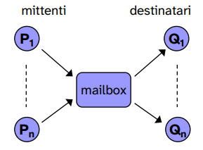
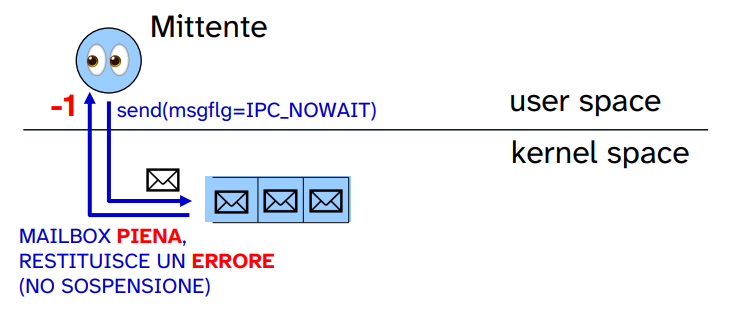
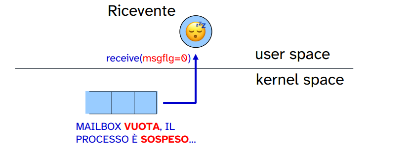
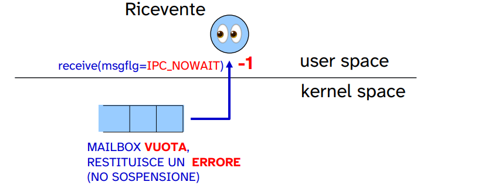
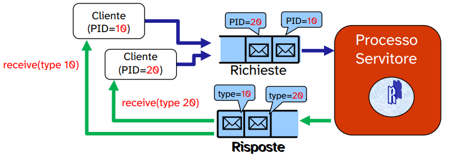

# Coda di messaggi: mailbox

UNIX (System V), come anche Linux, mette a disposizione primitive IPC che supportano la **comunicazione indiretta** tra processi (anche indipendenti) basata su uno **scambio di messaggi**. 

Questa comunicazione è realizzata tramite le **System V Message Queue**, ovvero strutture dati gestite dal kernel che consentono l'invio e la ricezione di messaggi in maniera **indiretta**.

La comunicazione è indiretta perché lo scambio di messaggi non avviene direttamente tra il mittente e il destinatario, ma avviene tra utente e **mailbox** che ha la funzione di *proxy*.

> Tali **Message queue** sono anche dette **mailbox**.

Questo tipo di comunicazione che sfrutta le mailbox è quella **più flessibile** possibile per implementare uno scambio di messaggi. Infatti ci permette di implementare una comunicazione: 

- one-to-one
- one-to-many
- many-to-one
- many-to-many

<p align='center'></p>

UNIX System V mette a disposizione unicamente le primitive di **send asincrona**, di **receive bloccante** e **receive non bloccante**.

In ingresso/uscita dalla mailbox avramo un messaggio che non è altro che un vettore di byte.

Una mailbox può essere vista come una *coda di messaggi*.

Essa è caratterizzata da:

- Una chiave, come per le altre risorse IPC;
- Un proprietario, ovvero il processo che la istanzia;
- gruppo di appartenenza;
- Un insieme di permessi di accesso, indicati da un numero in ottale (es. `0644`).

## Operazioni su code di messaggi

Le librerie che ci permettono di lavorare con *code di messaggi* sono: 

```c
#include <sys/ipc.h>
#include <sys/types.h>
#include <sys/msg.h>
```

### Creazione di una coda di messaggi: `msgget`

Per creare una nuova coda di messaggi, o accedere ad una esistente, bisogna invocare la system call `msgget()`.

```c
int msgget(key_t key, int msgflg);
```

`key` e `msgflg` hanno lo stesso ruolo dei parametri visti per `semget()` e `shmget()`.

Infatti tale funzione restituisce il **descrittore** della coda di messaggi identificata da una chiave `key` (ottenuta tramite codice cablato, `IPC_PRIVATE` o `ftok()`), oppure `-1` in caso di esito negativo.

Come per le altre risorse IPC, `msgflg` può valere vari FLAG come `IPC_CREAT` in *or logico* con i permessi, se il processo chiamante deve creare la coda di messaggi, oppure `0` nel caso in cui si vuole ottenere il descrittore di una coda già istanziata.

> NOTA: la dimensione della coda e il numero massimo di messaggi sono decisi automaticamente dal **kernel**
>
> Per modificare la dimensione o il numero massimo di messaggi è necessatio **ricompilare** il kernel per modificare un parametro apposito.

ESEMPIO: 

```c
#include <sys/ipc.h>
#include <sys/msg.h>
#include <sys/types.h>

int main(){
    key_t chiave = ... // IPC_PRIVATE, codice cablato o 
                       // risultato di ftok()
    int qid;
    qid = msgget(chiave, IPC_CREAT | 0664);

    if (qid < 0){
        perror("errore msgget");
        exit(1);
    }
    ... // operazioni sulla message queue

    return 0;
}
```

### Operazioni di controllo sulla coda di messaggi: `msgctl`

La system call che permette di eseguire comandi per la gestione della risorsa `mailbox` è la `msgctl()`:

```c
int msgctl(int msqid, int cmd, struct msqid_ds* buf);
```

La chiamata `msgctl()` esegue l'operazione di controllo specificata tramite `cmd` sulla coda di messaggi identificata da `msqid` (descrittore).

In particolare, per `cmd` possiamo utilizzare:

| `cmd` | descrizione del comando |
|-------|-------------------------|
| `IPC_STAT` | viene effettuata una copia della **struttura dati del kernel** (che mantiene informazioni sulla *Message Queue*) associata alla coda di messaggi identificata da `msqid` alla struttura dati `msqid_ds` puntata da `buf`. |
| `IPC_SET` | permette di modificare le caratteristiche della coda. |
| `IPC_RMID` | permette di rimuovere **immediantamente** la coda di messaggi identificata da `msqid`.|

L'eliminazione con il FLAG `IPC_RMID` non avviene come per le altre risorse IPC, ovvero la risorsa **non viene marcata come eliminabile** per il kernel e nel momento in cui si verifica una condizione questa viene eliminata, ma viene eliminata **istantaneamente**.

`msqid_ds` è una struttura che il kernel mantiene per ogni istanza di *Message Queue* creata. Tale struttura è definita in `linux/msg.h` come segue:

```c
/* one msqid structure for each queue on the system */
struct msqid_ds {
    struct ipc_perm msg_perm; // contains the access permissions of the msq 
    struct msg *msg_first;  /* first message on queue */
    struct msg *msg_last;   /* last message in queue */
    time_t msg_stime;       /* last msgsnd time */
    time_t msg_rtime;       /* last msgrcv time */
    time_t msg_ctime;       /* last change time releted to msgctl op. */
    struct wait_queue *wwait; // queue of processes waiting to send a msg
    struct wait_queue *rwait; // queue of processes waiting to receive a msg
    ushort msg_cbytes;      /* current number of bytes stored */
    ushort msg_qnum;        /* number of msg in the queue */
    ushort msg_qbytes;      /* max number of bytes on queue */
    ushort msg_lspid;       /* pid of last msgsnd */
    ushort msg_lrpid;       /* last receive pid */
};
```

Per operare tramite `msgctl()`, il processo chiamante deve avere i permessi di lettura/scrittura sulla risorsa IPC.

### Invio di un messaggio: `msgsnd`

Una volta ottenuto il descrittore di una *Message Queue* è possibile effettuare un operazione di invio (con accodamento) di un messaggo.

Per inviare un messaggio bisogna utilizzare la system call `msgsnd()`:

```c
int msgsnd(int msqid, const void *msgp, size_t msgsz, int msgflg);
```

- `msqid` è il descrittore della coda di messaggi ottenuto da `msgget()`
- `const void *msgp` è il puntatore alla **struttura messaggio** che contiene il messaggio vero e proprio da inviare.
  
  Tale struttura può avere un qualsiasi nome e deve seguire un pattern specifico (**convensione**):

  ```c
  typedef struct{
    long message_type;
    char message_text[MAX_SIZE];
  } msgp;
  ```

  dove: 

  - `message_type` identifica il tipo di messaggio che deve essere sempre un intero positivo (maggiore di `0`) `long` e deve trovarsi sempre come primo parametro della struttura;
  
    Non deve assumere come valore `0` poiché è un valore riservato ad un particolare comportamento della `msgrcv()`. 
  - `message_text` identifica il messaggio vero e proprio da inviare.
    
    → in realtà possiamo inserire qualsiasi campi dopo il primo, il vincolo sul pattern da seguire è rivolto solo a `message_type`.

  il campo `message_type` diventa molto importante quando viene accoppiato con funzioni di `receive` **selettive**, che permettono di estrarre un particolare messaggio dalla coda della mailbox.

  Infatti, è possibile estrarre dalla coda di messaggi il messaggio che il cui campo tipo è quello specificato in `message_type` nonstante non si trovi in cima alla coda.

  Se `message_type` assume il valore del PID del processo mittente possiamo implementare una **comunicazione diretta asimmetrica** sfruttando una **comunicazione indiretta** offerta dalle mailbox (nel caso di **una sola coda**).

  In `sys/msg.h` fornisce una struttura messaggio che possiamo sfruttare (ma non è obbligatorio):

  ```c
  struct msgbuf
  {
    __syscall_slong_t mtype;	/* type of received/sent message */
    char mtext[1];		/* text of the message */
  };
  ```

- Il campo `msgsz` rappresenta la dimensione (in byte) del messaggio, ovvero la dimensione della struttura del messaggio meno la dimensione del campo `message_type` → (`sizeof(msdbuf) - sizeof(long)`).
- Il campo `msgflg` è un FLAG che ci permette di specificare la semantica dell'operazione di send.
  
  | FLAG | descrizione |
  |------|-------------|
  |`0`| la `msgsnd()` blocca il processo se la mailbox è piena, e invia il messaggio nel momento in cui si libera una posizione dalla coda.|
  |`IPC_NOWAIT`| la `msgsnd()` invia il messaggio, ma se la mailbox è piena allora il processo non si sospende, la system call ritorna `-1` e il messaggio non viene accodato. |
  
  `0`:
  
  <p align='center'></p>
  
  `IPC_NOWAIT`
  
  <p align='center'></p>

  Da notare che la `msgsnd()` è sempre **asincrona** (indipendentemente da `IPC_NOWAIT`) quindi il processo chiamante non si sospende mai tranne nel caso in cui la cosa è piena.

  Ma questo comportamento non definisce la **send come sincrona** perché vale per una particolare condizione. 
  
  Per ottenere una **send sincrona**, è necessario applicare lo schema di **renderzvous**.

  In generale la funzione restituisce `0` se non si sono verificati errori.

ESEMPIO DI SEND:

```c
struct message {
    long type;
    char text[15];
    int val;
} msg;

msg.type = 1; // intero positivo, maggiore di 0
strcpy(msg.text, "My first msg");
msg.val = 5;

// send asincrona, si blocca il chiamante solo se la coda è piena

int result = msgsnd(msqid, (void*)&msg, sizeof(struct message) - sizeof(long), 0);

if (result < 0){
    perror("Errore nell'invio di un messaggio\n");
}
```

NOTA: è possibile implementare facilmente il problema produttori/consumatori nel momento in cui un processo produttore si sospende se la coda dei messaggi è piena.

E un processo consumatore si sospende con la **receive bloccante** fornita da **UNIX System V**.

### Ricezione di un messaggio: `msgrcv`

La system call che consente la ricezione di un messaggio da una mailbox è `msgrcv()`:

```c
ssize_t msgrcv(int msqid, void*msgp, size_t msgsz, long msgtyp, int msgflg);
```

Tale system call permette di consumare un messaggio dalla mailbox identificata da `msqid`.

Il buffer contenente il messaggio sarà puntato da `msgp`, e il campo messaggio avrà dimensione pari a `msgsz` (che sarà sempre la dimesione della struttura messaggio tolta la dimensione del campo `message_type`).

Il campo `msgtyp` svolge importanti funzioni, infatti definisce il comportamento della `msgrcv()`:

| type | comportamento |
|------|---------------|
|`msgtyp == 0` | viene prelevato il primo messaggio della coda (ovvero quello inviato da più tempo). |
| `msgtyp > 0` | viene prelevato il primo messaggio della coda il cui campo tipo sia pari al valore di `msgtyp`. |
| `msgtyp < 0` | viene prelevato il primo messaggio dalla coda il cui campo tipo abbia un valore minore o uguale a `\|msgtyp\|`. |

Infine per il campo `msgflg`:

- se impostato a `0` indica una **ricezione bloccante**: se non ci sono messaggi da consumare nella mailbox aventi il tipo specificato, il processo si *sospende* sulla system call `msgrcv()` fino al giungere del messaggio;
  
  <p align='center'></p>

- se impostato a `IPC_NOWAIT`, si ha il comportamento di una **receive non bloccante**: se non ci sono messaggi del tipo specificato in `msgtyp` viene restituito `-1`.

  <p align='center'></p>

In generale la chiamata ritorna `0` se non si sono verificati errori.

ESEMPIO DI RECEIVE:

```c
struct message {
    long type;
    char text[25];
    int val;
} msg;

long msgtyp = 0;

// receive bloccante
int result = msgrcv(msqid, (void*)&msg, sizeof(struct message) - sizeof(long), msgtyp, 0);

if(result < 0){ 
	perror(”Errore nella ricezione di un messaggio”); 
}

printf(”Messaggio: tipo=%d, text=%s, val=%d\n”,
        msg.type, msg.text, msg.val);
```

#### receive selettiva

Specificare il tipo mi permette di implementare una **receive selettiva** che sia bloccante o non. Tramite l'utilizzo opportuno del tipo ho la possibilità di implementare diversi tipi di comunicazione: one-to-one, one-to-many, etc.

<p align='center'></p>

Questo è un esempio di receive selettiva, dove `B` è un valore intero positivo e identifica un tipo di messagio

---

Possiamo utilizzare il campo tipo per la **ricezione selettiva dei messaggi di risposta da un server**.

- sfruttando due code di messaggi, una per l'invio l'altra per la ricezione di messaggi dal server;
- ogni client invia una richiesta includendo il suo **PID**;
- il server invia la risposta usando come tipo il **PID** del processo che ha inviato la richiesta;
- ogni client **riceve selettivamente** la risposta con tipo il proprio **PID**.

<p align='center'></p>

Inoltre mediante l'ausilio di **due Message Queue** possiamo implementare una **comunicazione diretta simmetrica** utilizzando sempre una comunicazione indiretta.

Sfruttando il campo tipo di ogni messaggio e il PID dei processi che vogliono comunicare tra loro.

A mediare la comunicazione è necessario un terzo processo che faccia da **server**, il quale smista i messaggi nella coda di entrata (aventi come tipo il PID del destinatario e nel payload il PID del mittente) nella coda di uscita modificando il tipo con il PID del mittente.


## Errori

Nel momento in cui si verifica un errore in una delle system call viste (di controllo, invio, ricezione o creazione), il tipo di errore è indicato nella variabile globale `errno`, definita per ogni processo.

Questo vale non solo per le *Message Queue* ma per qualsiasi primitiva che utilizziamo.

