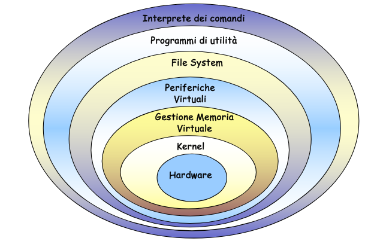

# Architettura di un SO

## Funzionalità di un SO

- Virtualizzazione delle risorse hardware
  - file system
  - processi
  - periferiche astratte
  - ...
  
  Sono tutti concetti che permette di ottenere una virtualizzazione e un'estensione delle risorse hardware della macchina fisica.

  Oltre a creare un'astrazione per la macchina fisica, il SO fornisce anche un API di sistema che permette alle applicazioni utente di operare sull'hardware delegando le operazioni a quest'ultimo che interagisce direttamente con l'hardware.

  Queste API garantiscono un accesso uniforme rispetto tutte le componenti hardware che possono essere anche molto eterogenee tra loro.

- Gestione e coordinamento
  
  Il SO ha il compito di arbitrare le richieste dei programmi utente
  - meccanismi di protezione → per evitare azioni illecite da parte di processi malfunzionanti
  - meccanismi per la comunicazione inter-processo
  - gestore delle risorse → scheduling

- Tutti questi strati mi **permettono di astrarre** le risorse hardware le quali sono gestite direttamente dal Kernel, che fa da ultimo intermediario tra il livello software e quello hardware.
- Quindi tutti gli strati che si contrappongono tra l'hardware e i programmi di utilità definiscono una **macchina** **virtuale**.
- Tutti gli strati intermedi che definiscono un'astrazione potrebbero essere inclusi all'interno del Kernel, questo infatti dipende dall'architettura del SO.

Ogni strato serve a nascondere la complessità dello strato sottostante e a fornire servizi più semplici e potenti allo strato superiore.

## Kernel

Il Kernel è quella parte del SO che risiede in memoria principale.

Contiene funzionalità fondamentali del SO.

A livello **kernel**, la macchina virtuale realizzata dal SO (dal punto di vista delle singole applicazioni utente):

- possiede tante unità centrali quanti sono i processi attivi nel sistema (ovvero processori virtuali).
  
  Ogni processo ha l'illusione di avere per se un processore dedicato, indipendentemente dal numero reale di processori fisici;
- non possiede meccanismi di interruzione. I processi vedono un flusso di esecuzione continuo e non devono gestire le interruzioni hardware perché sono intercettate dal kernel che provvede alla gestione;
  
  questo è possibile per il context switch che viene fatto all'atto della sospensione del processo per la gestione da parte del SO delle interrupt. Nel momento in cui è terminata la ISR per gestire l'interrupt il processo torna ad eseguire sulla CPU partendo dallo stato in cui è stato sospeso.

  Quindi per il processo la gestione delle interruzioni è trasparente.
- possiede istruzioni di sincronizzazione e scambio di messaggi tra processi che operano su processori virtuali.
  
  Tali meccanismi di sincronizzazione e scambio di messaggi avvengono tramite l'utilizzo di syscalls.

## Gestione della memoria

A livello della **gestione della memoria**, la macchina virtuale realizzata dal SO (dal punto di vista dei processi):

- consente di far riferimento a **spazi** **di** **indirizzamento** **virtuali**.
  
  Questi creano un'astrazione per i processi, illudendo questi di avere a disposizione l'intera memoria centrale per se.
- gestisce la protezione, ovvero il gestore della memoria verifica che non ci siano interferenze tra i vari processi, quindi che lo spazio di indirizzamento del singolo processo sia isolato e non accessibili da altri processi.
  
  Quindi due processi potrebbero utilizzare due indirizzi virtuali uguali ma questi saranno mappati in indirizzi fisici distinti nel momento il cui i processi andranno ad accedere a questi.
- consente di rendere trasparente la posizione effettiva dei dati/istruzioni per i processi. Infatti i dati che un processo intende leggere e modificare possono risiedere temporaneamente in memoria di massa in casi particolari.
  
  Questi casi particolari corrispondono ad esempio alla saturazione della memoria centrale. In tali casi alcune pagine vengono swappate in una porzione della memoria secondaria utilizzata per mantenere pagine della memoria centrale che non vengono subito utilizzate.

## Gestione delle periferiche

Al livello **gestione delle periferiche**, la macchina virtuale realizzata dal SO (dal punto di vista dei processi):

- dispone di periferiche dedicate ai singoli processi.
  
  Illude quindi i processi di avere a disposizione tutte le risorse disponibili;
- maschera le caratteristiche fisiche delle periferiche.
  
  I processi non conoscono quali risorse compongono effettivamente l'hardware poiché il SO crea un'astrazione di queste rendendo il loro accesso uniforme.

  Quindi nel caso di un lettura o scrittura il processo che la richiede non sà effettivamente le caratteristiche fisiche dell'hardware su cui sta scrivendo o leggendo.

  A conoscere ciò sono i driver specifici che implementano effettivamente le operazioni di lettura e scrittura specifiche per il determinato hardware in questione.
- gestisce parzialmente i malfunzionamenti delle periferiche.

## File system

Permette di trasformare un enorme contenitore di bit disordinati, memoria secondaria, in un archivio ordinato.

Quindi gli strati superiori vedranno un'organizzazione ordinata della memoria.

Al livello **file system**, la macchina virtuale realizzata dal SO (dal punto di vista del processo):

- gestisce blocchi di informazioni su memoria di massa strutturati logicamente;
  
  Quindi delle sequenze di byte memorizzate in memoria di massa identifica le sequenze che rappresentano cartelle e file;

- ne controlla gli accessi;
  
  Per ogni accesso verifica se il processo richiedente ha i permessi necessari per leggere o scrivere su tale blocco di memoria.

  Questo perché ogni file ha associato dei metadati. Tra questi metadati ci sono le informazioni riguardanti i permessi di accesso da parte dei processi;
- ne gestisce l'organizzazione.
  
  Gestisce la geometria della memoria di massa e implementa i metodi che devono essere utilizzare per accedere correttamente ai dati. 

