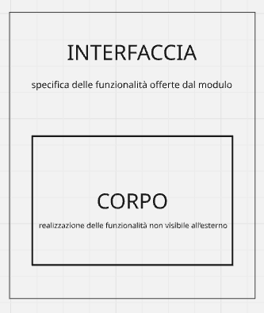
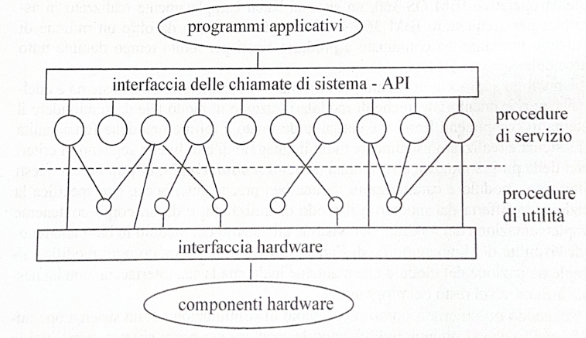
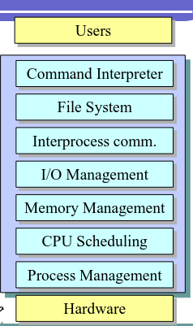

# Architettura di un SO

## Funzionalità di un SO

- Virtualizzazione delle risorse hardware
  - file system
  - processi
  - periferiche astratte
  - ...
  
  Sono tutti concetti che permette di ottenere una virtualizzazione e un'estensione delle risorse hardware della macchina fisica.

  Oltre a creare un'astrazione per la macchina fisica, il SO fornisce anche un API di sistema che permette alle applicazioni utente di operare sull'hardware delegando le operazioni a quest'ultimo che interagisce direttamente con l'hardware.

  Queste API garantiscono un accesso uniforme rispetto tutte le componenti hardware che possono essere anche molto eterogenee tra loro.

- Gestione e coordinamento
  
  Il SO ha il compito di arbitrare le richieste dei programmi utente
  - meccanismi di protezione → per evitare azioni illecite da parte di processi malfunzionanti
  - meccanismi per la comunicazione inter-processo
  - gestore delle risorse → scheduling

- Tutti questi strati mi **permettono di astrarre** le risorse hardware le quali sono gestite direttamente dal Kernel, che fa da ultimo intermediario tra il livello software e quello hardware.
- Quindi tutti gli strati che si contrappongono tra l'hardware e i programmi di utilità definiscono una **macchina** **virtuale**.
- Tutti gli strati intermedi che definiscono un'astrazione potrebbero essere inclusi all'interno del Kernel, questo infatti dipende dall'architettura del SO.

Ogni strato serve a nascondere la complessità dello strato sottostante e a fornire servizi più semplici e potenti allo strato superiore.

## Kernel

Il Kernel è quella parte del SO che risiede in memoria principale.

Contiene funzionalità fondamentali del SO.

A livello **kernel**, la macchina virtuale realizzata dal SO (dal punto di vista delle singole applicazioni utente):

- possiede tante unità centrali quanti sono i processi attivi nel sistema (ovvero processori virtuali).
  
  Ogni processo ha l'illusione di avere per se un processore dedicato, indipendentemente dal numero reale di processori fisici;
- non possiede meccanismi di interruzione. I processi vedono un flusso di esecuzione continuo e non devono gestire le interruzioni hardware perché sono intercettate dal kernel che provvede alla gestione;
  
  questo è possibile per il context switch che viene fatto all'atto della sospensione del processo per la gestione da parte del SO delle interrupt. Nel momento in cui è terminata la ISR per gestire l'interrupt il processo torna ad eseguire sulla CPU partendo dallo stato in cui è stato sospeso.

  Quindi per il processo la gestione delle interruzioni è trasparente.
- possiede istruzioni di sincronizzazione e scambio di messaggi tra processi che operano su processori virtuali.
  
  Tali meccanismi di sincronizzazione e scambio di messaggi avvengono tramite l'utilizzo di syscalls.

## Gestione della memoria

A livello della **gestione della memoria**, la macchina virtuale realizzata dal SO (dal punto di vista dei processi):

- consente di far riferimento a **spazi** **di** **indirizzamento** **virtuali**.
  
  Questi creano un'astrazione per i processi, illudendo questi di avere a disposizione l'intera memoria centrale per se.
- gestisce la protezione, ovvero il gestore della memoria verifica che non ci siano interferenze tra i vari processi, quindi che lo spazio di indirizzamento del singolo processo sia isolato e non accessibili da altri processi.
  
  Quindi due processi potrebbero utilizzare due indirizzi virtuali uguali ma questi saranno mappati in indirizzi fisici distinti nel momento il cui i processi andranno ad accedere a questi.
- consente di rendere trasparente la posizione effettiva dei dati/istruzioni per i processi. Infatti i dati che un processo intende leggere e modificare possono risiedere temporaneamente in memoria di massa in casi particolari.
  
  Questi casi particolari corrispondono ad esempio alla saturazione della memoria centrale. In tali casi alcune pagine vengono swappate in una porzione della memoria secondaria utilizzata per mantenere pagine della memoria centrale che non vengono subito utilizzate.

## Gestione delle periferiche

Al livello **gestione delle periferiche**, la macchina virtuale realizzata dal SO (dal punto di vista dei processi):

- dispone di periferiche dedicate ai singoli processi.
  
  Illude quindi i processi di avere a disposizione tutte le risorse disponibili;
- maschera le caratteristiche fisiche delle periferiche.
  
  I processi non conoscono quali risorse compongono effettivamente l'hardware poiché il SO crea un'astrazione di queste rendendo il loro accesso uniforme.

  Quindi nel caso di un lettura o scrittura il processo che la richiede non sà effettivamente le caratteristiche fisiche dell'hardware su cui sta scrivendo o leggendo.

  A conoscere ciò sono i driver specifici che implementano effettivamente le operazioni di lettura e scrittura specifiche per il determinato hardware in questione.
- gestisce parzialmente i malfunzionamenti delle periferiche.

## File system

Permette di trasformare un enorme contenitore di bit disordinati, memoria secondaria, in un archivio ordinato.

Quindi gli strati superiori vedranno un'organizzazione ordinata della memoria.

Al livello **file system**, la macchina virtuale realizzata dal SO (dal punto di vista del processo):

- gestisce blocchi di informazioni su memoria di massa strutturati logicamente;
  
  Quindi delle sequenze di byte memorizzate in memoria di massa identifica le sequenze che rappresentano cartelle e file;

- ne controlla gli accessi;
  
  Per ogni accesso verifica se il processo richiedente ha i permessi necessari per leggere o scrivere su tale blocco di memoria.

  Questo perché ogni file ha associato dei metadati. Tra questi metadati ci sono le informazioni riguardanti i permessi di accesso da parte dei processi;
- ne gestisce l'organizzazione.
  
  Gestisce la geometria della memoria di massa e implementa i metodi che devono essere utilizzare per accedere correttamente ai dati. 

## Architettura dei sistemi operativi

Il SO è un programma di notevole **complessità** e **dimensione**. Infatti tutti i **layer** che abbiamo visto prima, necessari per garantire la virtualizzazione dell'hardware e una sua gestione efficiente, fanno **parte** **del** **SO**.

É quindi fondamentale applicare, durante il suo progetto e la sua realizzazione, le più sofisticate **tecniche proprie dell'ingegneria del software**, al fine di garantire un risultato che goda di tutte le **proprietà che garantiscano la qualità di un sistema software**: correttezza, modularità, facilità di manutenzione, efficienza di esecuzione, etc.

Per questo sono stati proposti, nel tempo, **vari modelli strutturali** cui fare riferimento **per organizzare i componenti** durante le fasi di progetto, realizzazione e test del sistema.

### sistemi operativi monolitici

I primi sistemi operativi erano costituiti da un solo programma (**sistemi monolitici**) senza una particolare suddivisione dello stesso in moduli.

Il sistema operativo era **costituito da un insieme di procedure di servizio** a ciascuna delle quali corrispondeva una **chiamata al sistema**.

Normalmente le procedure erano scritte in **linguaggio** **assembler** per consentire un più efficiente accesso alle risorse hardware della macchina.

Questo tipo di approccio al progetto del sistema poteva essere **adeguato soltanto nel caso di sistemi molto semplici**, come nel caso dei primi sistemi operativi e, successivamente, come nel caso di semplici **sistemi non multiprogrammati**, per esempio il sistema operativo MS-DOS.

Col crescere della complessità tipica dei moderni sistemi multiprogrammati questo approccio ha rapidamente mostrato tutti i propri limiti.

### sistemi operativi modulari

Un valido approccio utilizzato per affrontare la complessità di un sistema è quello di fare riferimento a **tecniche di modularizzazione** in modo tale da suddividere il sistema in componenti (moduli), **ciascuno destinato a fornire una delle funzionalità del sistema**.

Realizzato usualmente in un **linguaggio di alto livello seguendo i criteri tipici della programmazione strutturata** (**sistemi modulari**).

In base ai criteri della programmazione strutturata, ogni modulo è caratterizzato da una ben precisa interfaccia, che specifica la funzionalità offerta dal modulo, e un corpo contenente l'implementazione del modulo, non visibile all'esterno.

In questo modo ogni modifica che veniva apportata ai moduli non influenzava il funzionamento degli altri, a meno che la modifica non era fatta sull'interfaccia offerta dal modulo.

Il primo esempio di strutturazione di un sistema operativo fu quello di che si ottenne modificando la struttura dei primi sistemi monolitici in modo tale da identificare i vari moduli componenti e dettagliando con cura le rispettive interfacce.

I vari moduli furono distinti in due categorie: 

- le procedure di servizio offerte dal sistema ai programmi applicativi tramite chiamate di sistema;
- le procedure di utilità, utilizzate dalle prime ma non direttamente visibili ai processi.

Ovviamente ogni chiamata di sistema provocava un cambio di contesto da modalità utente a modalità kernel.

Questo tipo di struttura è anche quella adottata nel sistema Unix. 

In questo caso fanno parte del sistema:

- sia le tipiche **componenti di un sistema operativo**, invocate tramite le chiamate di sistema, eseguite in **stato** **privilegiato** e identificate globalmente con il termine *kernel*
- sia **l'insieme dei programmi di utilità del sistema** costituiti dalla shell, dai compilatori, dai caricatori, dai linker e dalle librerie di sistema, eseguiti in stato non privilegiato come i normali programmi utente.

Nonostante gli indubbi vantaggi indotti dall'uso di tecniche di modularità, la complessità dei sistemi operativi è andata progressivamente crescendo, richiedendo quindi ulteriori paradigmi di progetto in grado di affrontare in modo più idoneo la crescente complessità.

### sistemi operativi a livelli gerarchici di astrazione

Consistono in SO modulari, organizzati in una struttura gerarchica.

Uno degli aspetti fondamentali della tecnica dell'organizzazione gerarchica consiste nel **ridurre il numero di possibili interconnessioni** fra i moduli di un sistema, semplificando quindi sia la fase di progetto sia quella di verifica.

Ovvero si punta ad ottenere un'organizzazione in moduli che punti a diminuire le dipendenze tra questi e quindi aumentare il livello di coesione.

Tale tecnica che permette questo tipo di organizzazione di un sistema operativo è possibile applicarla seguendo due possibili paradigmi complementari.

- top-down, livelli di raffinamento successivi.
  
  Consiste nello scomporre il sistema software nelle sue funzionalità principali, astraendo i dettagli implementativi. Successivamente ciascuna di queste funzionalità veniva a sua volta scomposta in altre funzionalità che la comprendessero astraendo sempre i dettagli implementativi; e così via.

  Fino a che non si arrivi ad un livello di funzionalità elementare da cui può iniziare l'implementazione.
- bottom-up.
  
  Consiste nel partire dal basso, quindi a stretto contatto con l'hardware.

  Implementare delle funzionalità aggiuntive che non sono disponibili in hardware e da queste funzionalità si parte ad implementarne che le utilizzino.

  Quindi si arriva ad un livello che non è più necessario comunicare direttamente con l'hardware grazie alle funzionalità elementari che sono state implementate in principio.

  Questo quindi permette di implementare funzionalità che astraggono sempre di più il livello hardware.

Un utilizzo combinato di questi due paradigmi permette di realizzare **sistemi operativi strutturati in moduli organizzati gerarchicamente in diversi livelli di astrazione**, in modo tale che i **moduli realizzati a un certo livello** utilizzano esclusivamente le **funzionalità offerte dai moduli di livello più basso** e **forniscano le loro funzionalità ai moduli** di livello più alto. 

Possiamo intendere questa struttura come se ogni livello definisse una nuova macchina astratta, le cui funzionalità sfruttano quelle offerte dalla macchina astratta di livello inferiore.

### sistemi operativi a microkernel

La necessità di proteggere dall'acceso diretto l'hardware da parte dei programmi utente che avrebbero potuto causare dei danni irreparabili si è introdotto il concetto dei livelli di esecuzione:

- kernel mode
- user mode

Questo però ha portato il sistema ad essere più difficilmente modificabile ed estensibile.

Modifiche o estensioni potrebbero risultare necessarie in vari casi:

- si deve aggiungere un driver in seguito alla connessione di un nuovo dispositivo
- si intende modificare alcune scelte relative alla gestione di una o più risorse al fine di rendere il sistema più adatto ai requisiti imposti dai programmi applicativi specifici che andranno in esecuzione su questo.

Per dare una soluzione a questo tipo di problemi è stata proposta una soluzione nota col nome di **struttura** **a** **microkernel**. 

Il microkernel implementa solo i **meccanismi essenziali** a discrezione del progettista.

Tutte le **strategie per la gestione** delle risorse sono implementate all'esterno del kernel, da processi di sistema che girano in user mode.

Quindi sono facilmente modificabili ed estensibili.

- Driver
- Memory management
- CPU scheduling

Ovviamente è inevitabile che tutti questi programmi non abbiano la necessità di operare direttamente sulle risorse hardware, quindi si utilizzano comunque delle componenti del SO che girano in kernel mode per espletare alcune funzioni. → context switch

Questa struttura permette di aumentano l'affidabilità e la sicurezza dei sistemi perché gli eventuali guasti non si propagano nel kernel, ma rimangono in user mode.

I gestori delle risorse sono particolari processi di sistema, spesso indicati come **server** (file server, terminal server, printer server, ...).

Quando un processo applicativo deve usare una risorsa, deve interagire con il processo server gestori di quella risorsa attraverso i meccanismi di comunicazione forniti dal microkernel.

La comunicazione interprocesso è la caratteristica svantaggiosa di questa struttura perché provoca una perdita delle performance.

Il motivo principale è dovuto al maggior numero di context switch necessari per espletare un singolo servizio ad un processo client.

Infatti utilizzando il comando `time` in UNIX, che misura il tempo che un processo trascorre in user-mode, in kernel-mode e l'attesa nel caso di operazioni di IO, si sono notate le perdite di performance.

## Esempio di architetture modulari: linux

Il kernel Linux è monolitico perché è un unico binario che viene caricato in memoria centrale.

Nel tempo è stato introdotto il meccanismo dei moduli caricabili che ha permesso quindi di estendere le funzionalità del kernel senza la necessità che questo venga ricompilato ogni volta.

Quindi possiamo dire che il kernel linux ha un'architettura monolitica e modulare perché implementa il meccanismo dei moduli caricabili che possono essere collegati e scollegati dal kernel a runtime.

I comandi per caricare o scaricare un modulo dal kernel sono:

- `insmod`
- `rmmod`

Il rischio che si corre con questa struttura è che i moduli che possono essere collegati al kernel girano nello stesso spazio di indirizzamento del kernel, quindi se questi hanno un bug grave possono mandare in crash l'intero sistema (kernel panic).

In generale, il progetto del kernel linux ha cercato di prendere i vantaggi dei due mondi: monolitico e flessibilità modulare.

## Windows acrchitecture

Struttura modulare per renderlo più flessibile. Questo sistema è basato su un'architettura a microkernel ibrida.

- Non è puramente un'architettura a microkernel, anche se la maggior parte delle funzionalità sono eseguite all'esterno del microkernel.
- Tutti i moduli esterni sono caricati dinamicamente e quindi posso essere rimossi, aggiornati, o sostituiti senza riscrivere o ricompilare tutto il sistema.

