

# Deadlock

Deadlock è un fenomeno che può presentarsi nelle **applicazioni concorrenti** che porta a un blocco permanente di processi in **competizione per risorse condivise**.

→ può portare a crash, situazioni di stallo, etc. (da evitare completamente)

Nei sistemi operativi **general-porpose**, si ammette l'esistenza di deadlock → non si implementano tecniche per evitare il problema ma si rileva nel momento in cui si presenta e si cerca di risolverlo.

## Deadlock: definizione e generalità

Indica una situazione di **blocco permanente** di un gruppo di processi in competizione per le risorse di sistema (che sono limitate → motivo principale per cui si deve gestire la competizione).

Deadlock è un problema complesso e di rilievo, che può provocare gravi malfunzionamenti.

A seconda dello scopo per cui è progettato, un sistema operativo adotta una **gestione** diversa per controllare il deadlock.

Ad esempio, per i sistemi **real-time** evitare il deadlock è fondamentale, quindi avranno una gestione più rigida che tende a prevenire tali fenomeni a differenza di altri tipi di sistemi operativi, come general-porpose, che potranno tendere a non rilevarli e risolverli a posteriori.

---

Esempio: attraversamento di un incrocio

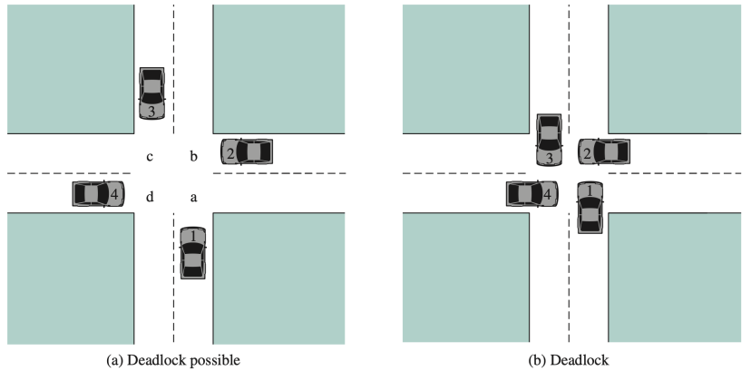

Sono presenti diversi quadranti identificati dalle lettere `a`, `b`, `c` e `d`; che possono rappresentare le risorse critiche.

- Ogni auto ha bisogno di attraversare due quadranti;
- Ogni auto rappresenta un processo di un sistema operativo.

Ogni si inserisce nel rispettivo primo quadrante, ma per completare la curva deve ottenere l'accesso al quadrante alla loro destra (o sinistra) occupato da un'altra auto, e per quest'ultima vale lo stesso ragionamento.

Facendo lo stesso ragionamento si crea un situazione di stallo (se nessun'auto indietreggia).

---

Esempio: copia di un file

- un sistema ha 2 dischi esterni
- `P1` e `P2` copiano un grosso file da un disco all'altro;
- si suppone sia necessaria la **mutua esclusione**.

Quindi ciascun processo acquisisce uno dei due dischi per leggere e successivamente richiedono l'accesso all'altro.

Ma l'altro disco si ritrova già acquisito. Quindi i due processi attendono a vicenda che l'altro rilasci la risorse.

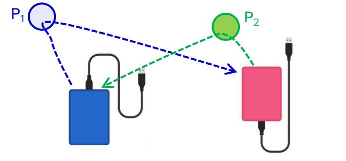

→ si crea la cosiddetta **attesa circolare** che è la manifestazione del deadlock.

---

### Il problema del deadlock

Una condizione **necessaria** affinché nelle **applicazioni concorrenti** si verifichi un deadlock è che siano presenti almeno due semafori **mutex**, ovvero entrambi inizializzati ad 1.

Quindi quando è presente la **mutua esclusione**.

  <!-- Colonna P1 -->

  <b>P₁</b>  
  wait (mutex1) 
  &lt;inizio uso disco 1&gt; 
  …  

  

    wait (mutex2)
  

  &lt;inizio uso disco 2&gt; 
  …  
  signal (mutex2) 
  … 
  signal (mutex1) 

  <!-- Colonna P2 -->

  <b>P₂</b>  
  wait (mutex2) 
  &lt;inizio uso disco 2&gt; 
  …  

  

    wait (mutex1)
  

  &lt;inizio uso disco 1&gt; 
  …  
  signal (mutex1) 
  … 
  signal (mutex2) 

I due processi potrebbero sospendersi entrambi su le `wait()` evidenziate.

Questo è un classico esempio di attesa circolare che si presenta se avviene la seguente sequenza di azioni:

- `P1` esegue `wait(mutex1)` e acquisisce la prima risorsa critica;
- `P2` esegue `wait(mutex2)` e acquisisce la seconda risorsa critica;
- `P1` ha bisogno della seconda risorsa critica, quindi esegue `wait(mutex2)` e si blocca;
- `P2` ha bisogno della prima risorse critica, quindi esegue `wait(mutex1)` e si blocca.

Nel caso in cui l'esecuzione dei due processi segue questa sequenza, i due processi rimangono bloccati

Questa situazione però **non** **è** **detto** che accada a ogni esecuzione dell'applicazione concorrente.

→ **non** è un fenomeno **deterministico**, ovvero non significa che questo si manifesti ogni volta che si hanno le condizioni adatte.

In alcuni casi il deadlock dipende da come i processi si alternano sulla CPU.

Per questo motivo il deadlock può manifestarsi **saltuariamente**, in base alla **velocità relativa di esecuzione dei processi**.

> La velocità relativa di esecuzione dei processi è un modo per descrivere come i processi avanzano nel tempo l'uno rispetto l'altro, questo avanzamento non è deterministico perché durante l'esecuzione possono:
>
> - essere interrotti dal kernel (preemption),
> - essere sospesi in attesa di un operazione di I/O (la cui durata non è sempre la stessa),
> - ricevere più o meno tempo di CPU in base alla politica di sheduling adottata,
> - essere ritardati da cache miss.

Come si potrebbe risolvere questa situazione?

Un terzo dovrebbe gestire questa concorrenza, andando ad esempio a killare un processo in modo che questo liberi la risorsa detenuta a favore dell'altro.

## **Deadlock ≠ Starvation**

<table>
<tr>
<td align="center" style="border: none">
  
**attesa infinita**

</td>
<td align="center" style="border: none">

**attesa indefinita**

</td>
</tr>
</table>

Deadlock e starvation sono due concetti totalmente diversi che possono essere confusi.

- Con starvation identifichiamo una situazione di attesa **indefinita**. Tale fenomeno è molto legato al concetto di priorità.

- Con deadlock identifichiamo una situazione di attesa **infinita**, in nessun modo i processi possono uscire da questa situazione, al contrario della starvation. Tale fenomeno è molto legato al concetto di mutua esclusione.

## Grafo di assegnazione delle risorse

Il grafo si assegnazione delle risorse serve a modellare in modo formale lo stato delle risorse e dei processi di un sistema, per poter **capire se esiste il rischio di deadlock**.

Tramite questa formalizzazione possiamo implementare algoritmi in grado di rilevare una possibile manifestazione di deadlock tra i processi in esecuzione.

Un grafo è un insieme di vertici (o nodi) *V* e un insieme di archi *E*.

- V è partizionato in **due tipi**:

  - *P* = {P1, P2, ..., Pn} è l'insieme costituito da tutti i **processi** nel sistema.
  - *R* = {R1, R2, ..., Rn} è l'insieme costituito da tutti i tipi di **risorse** nel sistema.
- **Arco di richiesta** (arco orientato) Pi → Rj, Pi chiede l'accesso a Rj.
- **Arco di assegnazione** (arco orientato) Rj → Pi, Rj è assegnata al processo Pi.

Ogni risorsa può avere più istanze.

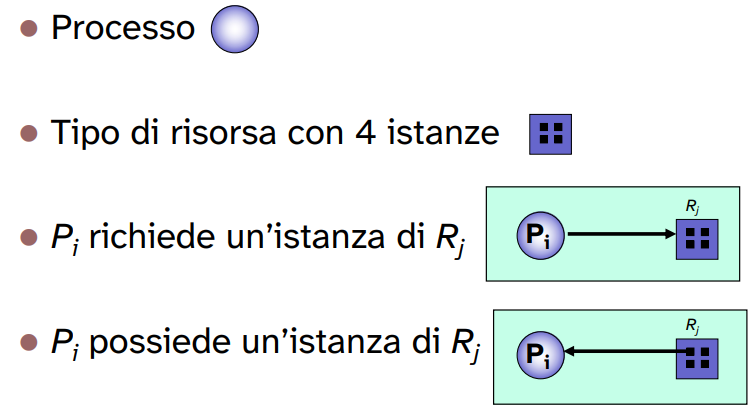

Una condizione **sufficiente** per la possibile (perché dipende sempre dalla velocità relativa di esecuzione) manifestazione di un deadlock è un **ciclo** nel grafo di assegnazione.

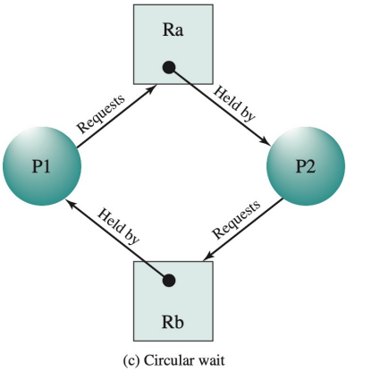

In questo caso `P1` richiede `Ra` la cui unica istanza è detenuta da `P2` che richiede a sua volta `Rb` la cui unica istanza è detenuta da `P1`.

Nel momento in cui è presente un ciclo del genere possiamo essere **sicuri** che tra questi processi è **possibile** che avvenga una situazione di deadlock.

Invece possiamo considerare che **si verifica** il deadlock se i processi partono da una condizione iniziale in cui hanno già in possesso le rispettive risorse e facciano una richiesta per l'altra, quando nessuno dei due processi ha terminato.

Ovviamente nel caso in cui le risorse avessero più istanze non ci sarebbe un problema, perché i due processi accederebbero a istanze diverse e quindi non si violerebbe la **mutua esclusione**.

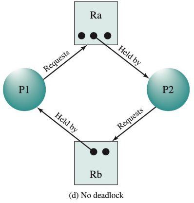

→ Questo **non** significa che avere più istanze **risolva** il problema, perché basta che si aggiungano altri processi al grafo con una particolare configurazione che la situazione di deadlock potrebbe accadere.

OSSERVAZIONI:

- Un ciclo è una condizione sufficiente per la possibile condizione di deadlock.
  
  → Se il grafo **non contiene cicli** ⟹ non si verificano situazioni di stallo

- Se il grafo **contiene un ciclo** ⟹ si potrebbe verificare una situazione di stallo, la cui possibilità diminuisce con il numero di istanze per ogni risorsa.
  
  Quindi la possibilità che ci sia un deadlock esiste ma non è detto che si verifica, perché tutto dipende anche dalla velocità relativa di esecuzione di ogni processo.

Un caso che possiamo considerare UTOPICO è quando ogni risorsa ha tante istanze quanti siano i processi che potenzialmente possano richiederla → impossibile proprio perché non sappiamo il numero di processi che potenzialmente è troppo elevato e le risorse sono limitate.

Linux cosa fa? Quando rileva un deadlock tenta di **eliminare** (a posteriori) questa condizione andando a terminare uno dei processi scatenanti, la cui scelta dipende da delle metriche.

Quindi accetta che questa situazione può verificarsi e nel momento in cui è tale risolve il problema mediante una sua politica di gestione.

## Metodi per la gestione dei deadlock

Esistono diversi approcci per gestire la situazione di deadlock che consistono principalmente in prevenirli (a priori) o rilevarli (a posteriori).

1) Prevenzione dei deadlock (**PREVENTION**):
   
   rendere **impossibile** il verificarsi delle **condizioni di deadlock**, ma al costo di un basso utilizzo delle risorse.

   Questo approccio tenta di annullare le condizioni che possono causare un deadlock → evitano che si creino dei cicli nel grafo di assegnazione delle risorse.

   Ma nel fare questo **limitano l'utilizzo delle risorse non sfruttandole a pieno**, quindi rallentando il sistema.
2) Evitare i deadlock (**AVOIDANCE**):
   
   le condizioni per il deadlock sono consentite, quindi si ammette l'esistenza delle condizioni tali per cui esso può avvenire, me il sistema **evita di entrare** in uno stato di deadlock.

   Evita la condizione **analizzando ogni richiesta** di risorse prima di concederla, e **accettandola solo** se non porta il sistema in uno "**stato non sicuro**".
3) Rilevazione del deadlock (**DETECTION**):
   
   Si permette al sistema di entrare in uno stato di deadlock, per poi risolvere il problema (**ripristino il sistema**).

   Quindi si ammette che ci possa esser la condizione di deadlock, non si fa nulla per evitarla, ma nel momento in cui questa si verifica il sistema tenta di tornare in uno stato sicuro.

   Ovvero si gestisce il deadlock solo dopo che questo si verifica.

La maggioranza dei sistemi operativi general-porpose, inclusi UNIX e Windows, **non dispone di una soluzione generale ed efficiente** al problema del deadlock.

Poiché tutte le politiche di gestione elencate hanno grandi problemi per cui non possono essere adottati.

NOTA: se creo due processi e faccio in modo che questi vadino in deadlock, il sistema operativo non fa nulla. Sarà un problema demandato al programmatore offrire una soluzione alla specifica situazione.

## Condizioni per il deadlock

Le condizioni **necessarie** sono:

- **Mutua esclusione** → un processo per alla volta può usare la risorsa.
- **Impossibilità di prelazione** → una risorsa può esser rilasciata **solo volontariamente** dal processo che la possiede, al termine della sua esecuzione. 
  
  Quindi non esistono casi in cui a un processo venga prelazionata una risorsa a favore di un altro che la richiede.
- **Possesso e attesa** → un processo che possiede almeno una risorsa, **attende di acquisire ulteriori risorse** già possedute da altri processi.

Invece le condizioni **necessarie e sufficienti** sono (tutte quelle necessarie + attesa circolare):

- **Mutua esclusione**
- **Impossibilità di prelazione**
- **Possesso e attesa**
- **Attesa circolare** → che abbiamo visto essere una **condizione necessaria e sufficiente**.

Affinché ci sia attesa circolare devono necessariamente esser verificate tutte le condizioni necessarie. Quindi possiamo dire che se è presente un'attesa circolare allora automaticamente è presente una condizione di deadlock.

(Attesa circolare è una conseguenza di un ciclo nel grafo di assegnazione, ma non è detto che si verifichi)

Attesa circolare è la condizione che si verifica nel momento in cui

- esiste un insieme {P0, P1, P2, ..., Pn} di processi in attesa, tali che:
  
  - P0 è in attesa per una risorsa che è posseduta da P1
  - P1 è in attesa per una risorsa che è posseduta da P2
  - ...
  - Pn-1 è in attesa per una risorsa che è posseduta da Pn
  - Pn è in attesa per una risorsa che è posseduta da P0
  
  Ovvero quando nel grafo di assegnazione si crea un ciclo di attesa perché non ci sono abbastanza istanze di risorse disponibili affinché almeno uno di questi processi non ha bisogno di attendere.

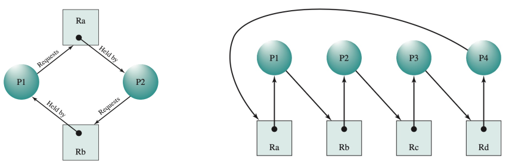

## Deadlock PREVENTION

Nella deadlock **prevention**, di evita il deadlock **invalidando** una delle quattro condizioni necessarie e sufficienti.

Svantaggi nell'utilizzo di questo tipo di gestione del deadlock:

1) mancato uso di risorse che sono disponibili;
2) esecuzione rallentata dei processi. → la politica di gestione costringe a processi ad attendere anche quando non è necessario
3) non è possibile alcun tipo di cooperazione tra processi

### Mutua esclusione

La mutua esclusione è imposta dalle caratteristiche della risorsa e spesso non è rimovibile a meno che non si serializzi l'esecuzione dei processi, quindi non si necessita di un mutex.

In questo caso però peggiorano molto le performance perché non si sfrutta più la concorrenza tra i processi.

- Può esse rilassata in alcuni casi di risorse condivisibili
  
  come, ad esempio, le risorse read-only.

- Comporta costi maggiori → il sistema deve garantire che una risorsa critica (che potrebbe generare inconsistenze) non sia accessibile da più processi che ne fanno richiesta.
  
  Quindi che la risorsa è posseduta da un solo processo per volta.

### Possesso e attesa

Eliminando questa condizione si forza un processo a **richiedere una risorsa solo quando non ne possiede altre** (es. all'avvio richiede tutte le risorse necessarie alla sue esecuzione).

In questo caso si deve implementare una sorta di dichiarazione per ogni processo delle risorse che utilizza. 

Tale dichiarazione deve contenere tutte le risorse necessarie che verranno bloccate per tutta l'esecuzione del processo. Quindi si può capire che è molto inefficiente come soluzione perché le risorse vengono bloccate per tutta l'esecuzione anche se il processo le utilizza in una piccola parte.

→ Approccio soggetto a **starvation**, perché potrebbe esistere un processo che è sempre in esecuzione e utilizza una risorsa che non potrà mai essere utilizzata da altri processi.

- In questo caso se P1 non termina mai → P2 non potrà mai terminare la propria esecuzione.

### Impossibilità di prelazione

Rilassando il vincolo di impossibilità di prelazione se un processo già possiede alcune risorse, e ne richiede un'altra che non gli può esser allocata immediatamente, allora **rilascia tutte le risorse possedute**.

Quindi non si mette in attesa per la singola risorsa che richiede mantenendo il possesso di quelle già allocate, ma libera tutte le risorse e si mette in attesa.

Tale processo quindi non si metterà in attesa per la sola risorsa in più richiesta ma anche per tutte le altre che possedeva e che ha rilasciato.

→ il processo verrà eseguito nuovamente solo quando può riottenere il possesso sia delle **vecchie che delle nuove risorse**.

<!-- @todo inserisci un immagine o una gif esemplificativa -->

### Attesa circolare

Si stabilisce a priori un **ordinamento totale** tra tutte le risorse.

E si richiede che ogni processo richieda le risorse seguendo l'ordine prestabilito.

Quindi se un processo ha bisogno di utilizzare un certo numero di risorse deve richiedere l'accesso a queste nell'ordine prestabilito nonostante tale ordine non sia quello delle operazioni che effettua su queste.

Nell'esempio successivo P2 chiede l'accesso prima a "disco 1" poi a "disco 2" nonostante operi inizialmente solo su "disco 2".

→ provoca una perdita delle performance perché un processo potrebbe possedere una risorsa per un tempo che è molto superiore rispetto al tempo effettivo nel quale opera su tale risorsa.

ESEMPIO: 

Ordine imposto:

1) disco 1
2) disco 2

  <!-- Colonna P1 -->

  <b>P₁</b>  
  …  
  

  wait (mutex1) 
  &lt;inizio uso disco 1&gt;
  

  …  
  wait (mutex2)

  &lt;inizio uso disco 2&gt; 
  …

  <!-- Colonna P2 -->

  <b>P₂</b>  
  …  
  

  wait (mutex1)
   
  wait (mutex2) 
  

  &lt;inizio uso disco 2&gt; 
  
  … 

  &lt;inizio uso disco 1&gt; 
  …  

- In questo caso, supponendo che P2 faccia per **primo** la prima richiesta delle risorse:
  
  - P1 è **impossibilitato a usare "disco 1"** anche se P2 sta usando "disco 2".
  - Si è imposto un ordine di acquisizione delle risorse (a discapito dell'efficienza).

Questo tipo di approccio per la gestione PREVENTION non permette l'implementazione di una cooperazione (come anche gli altri approcci) tra processi.

→ implementando il problema produttori consumatori otteniamo che i produttori producono sempre fino a che non terminano. Solo dopo la terminazione dei produttori i consumatori potranno accedere ai dati prodotti.
→ comportamento non richiesto per l'implementazione.

## Deadlock AVOIDANCE

Nella gestione AVOIDANCE il sistema decide **a tempo di esecuzione** se una richiesta di una risorsa può portare a un deadlock (**prevenzione dinamica**).

- **nessun vincolo a priori** delle risorse
- se lo stato attuale delle risorse è **rischioso**, un algoritmo **rifiuta la richiesta** di allocazione

Quindi si accetta la possibilità di incorrere in un deadlock, non eliminando le condizione necessarie, ma si cerca di evitarlo valutando lo stato in cui si trova in sistema ogni volta che viene effettuata una richiesta (a *run-time*).

Quindi istante per istante, possedendo **la storia precedente del grafo delle assegnazioni delle risorse**, un algoritmo valuta se **successivamente** a una certa richiesta da parte di un processo porta l'applicazione a un deadlock.

Quindi l'algoritmo deve essere in grado di fare una **sorta di predizione sull'andamento dell'esecuzione** dei processi sugli istanti successivi a una qualsiasi richiesta per una risorsa.

Quindi possiamo considerarla come una prevenzione, che **non è più statica** come per la gestione PREVENTION, ma **dinamica**.

Anche questa come soluzione al deadlock è molto complicata perché richiede diverse assunzioni: come quella di riuscire a prevedere le eventuali richieste di un processo se questo non le dichiara a priori.

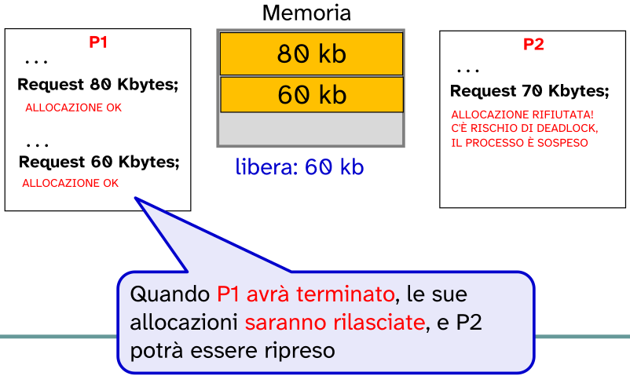

La memoria totale è `200 kb`.

- P2 non avrà accesso alla risorsa nel momento in cui la richiede perché il processo P1 è già in esecuzione e possiede già una istanza della stessa risorsa.

  Però il motivo per cui viene rifiutata la richiesta di P2 è perché guardando la storia di P1 si nota che affinché questo possa terminare dovrà ottenere un'altra istanza della risorsa.

  Nel momento in cui richiederà un'altra istanza della risorsa non ci sarà più spazio per l'istanza richiesta da P2

  - Caso in cui avviene il deadlock →  P2 riceva la risorsa (supponendo che successivamente ne richieda un'altra da `80 kb`).

    → Quindi la memoria in possesso sarà `80 + 70 = 150kb`.

    → Il processo P1 si sospende perché ne richiede `70kb` e allo stesso modo si sospende P2 perché ne richiede, come detto, `80kb`.

    → Entrambi i processi sono sospesi in attesa che l'altro rilasci la risorsa: deadlock.
  
  Nell'esempio un algoritmo ha valutato questa situazione conoscendo la storia di allocazione dei processi.

Quindi è necessario supporre che per ogni processo si deve dichiarare la **storia di allocazione**, altrimenti non di possono fare previsioni sull'andamento dell'esecuzione.

Questo produce un **overhead** elevato sullo sheduler e in generale sul kernel. Ma da una soluzione per non entrare nel deadlock.

Linux implementa ciò? No perché non si conosce a priori la storia di allocazione di ogni processo → è impossibile prevedere un deadlock in questo modo.

  <b style="color:#d40000;">Presupposto</b>: queste tecniche richiedono di
  conoscere in anticipo
  tutte le richieste che un processo può fare nell’arco della sua esecuzione.

Questa è un assunzione molto pesante, un caso più semplice di utilizzo è quello che: ogni processo **dichiara** il **numero massimo** di istanze di risorse di cui può avere bisogno.

→ Tali istanze però potrebbero non esser utilizzate subito e quindi tolte ad altri processi che potrebbero sfruttarle immediatamente.

### Approcci

Abbiamo due diversi approcci per questo tipo di gestione:

1) **Process initiation Denial**: all'avvio di un nuovo processo (rifiuto l'esecuzione del processo)
   
   Non si avvia un processo se le sue richieste potrebbero portare ad un deadlock
2) **Resource Allocation Denial**: al momento di una richiesta di allocare una risorsa. (il processo esegue ma possono essere vietate le richieste nonostante la disponibilità corrente è valida)
   
   Si consente l'avvio, ma le richieste di allocazione possono essere rifiutate se possono portare a deadlock.

---

Entrambi questi approcci si basano sulla costruzione di diverse strutture algebriche:

sia *n* = numero di processi, 

e *m* = numero di tipi di risorse

- **Resource** = *R* = (R1, ..., Rm)
  
  Risorse totali nel sistema. Ri p il numero di istanze presenti nel sistema per la risorsa i-esima.
- **Available** = *V* = (V1, ..., Vm)
  
  Numero di istanze per ogni risorsa non allocate ad alcun processo. Vi rappresenta il # di istanze della risorsa Ri non ancora allocate.
- **Claim** = *C* = matrice *n x m*
  
  Cij = richiesta del processo Pi per la risorsa Rj
- **Allocation** = *A* = matrice *n x m*
  
  Aij = allocazione corrente al processo Pi della risorsa Rj

---

### Process Initiation Denial

- La matrice *C* (di richiesta) indica **il numero massimo di richieste** per ogni processo (righe), di una certa risorsa (colonne).
- Deve essere fornita prima dell'avvio dei processi
  
  Quindi questa matrice verrà aggiornata e ricalcolata ogni volta che un processo termina o inizia la sua esecuzione.

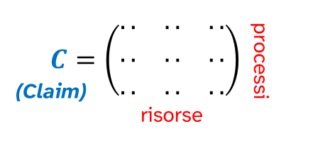

Un processo Pn+1 viene eseguito solo se: 

Cioè un processo viene eseguito se il **numero massimo di richieste di tutti i processi** (sommatoria) **più quelle del nuovo processo** (Cij) per la risorse j-esima è minore del numero di istanze della richiesta Rj.

Questo deve esser calcolato per ogni tipo di risorsa → per ogni colonna di *C*.

ESEMPIO:

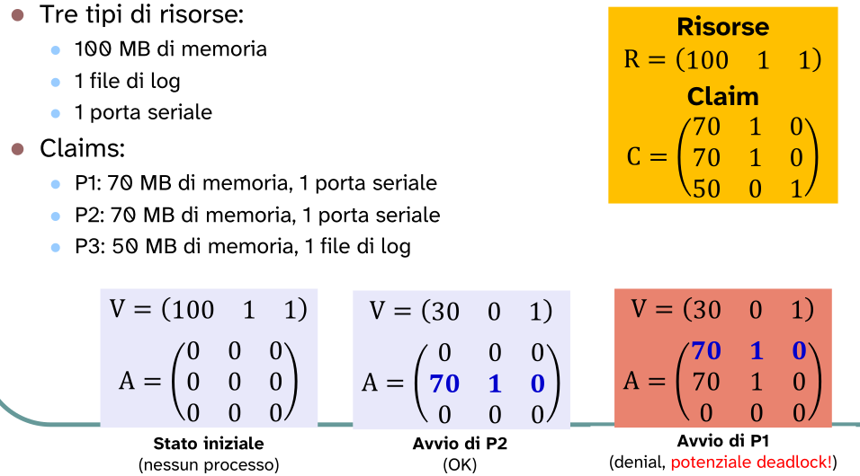

In questo esempio P1 non viene eseguito fin tanto che P2 non termina la sua esecuzione (almeno).

Il motivo per cui non viene eseguito è proprio il [vincolo](#legge_numero_richieste_massimo) imposto da process initiation denial:

- nel momento in cui P1 tenta di esser eseguito.
  
  Per MB di memoria:\
  100 (R1) >= 70 (C11) + 70 (C21) + 0 (C31) = 140 ⟹  non verificato

  Per la porta seriale:\
  1 (R2) >= 1 (C12) + 1 (C22) + 0 (C32) = 2 ⟹  non verificato

### Resource Allocation Denial

Tale approccio viene chiamato anche **algoritmo del banchiere**

→ viene eseguito ad ogni tentativo di allocazione;

- se l'allocazione può portare ad uno stato "non-sicuro" viene rifiutata.

L'algoritmo fa in modo che lo stato del sistema (risorse e processi) **non sia mai uno stato non sicuro**

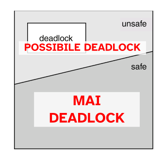

La **strategia** consiste nel trovare una sequenza di esecuzione *safe*.\
La sicurezza di uno stato dipende dalle risorse disponibili, e dalle richieste di tutti i processi nel sistema.

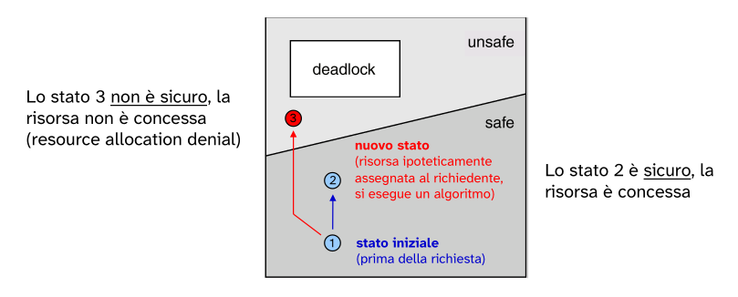

Quindi l'obiettivo è fare in modo di determinare una sequenza di esecuzione che non faccia mai entrare lo stato del sistema nella porzione del piano *unsafe*.

ESEMPIO:

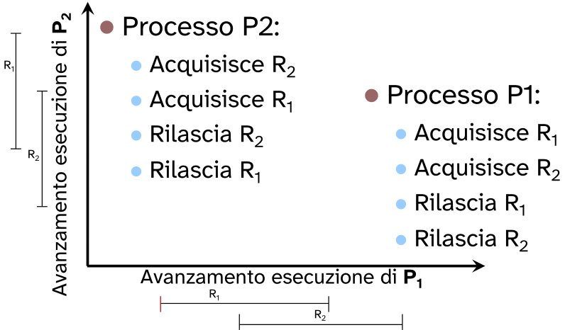

In questo esempio si può vedere la sequenza delle operazioni di richiesta e rilascio delle risorse R1 e R2 per i processi P1 e P2.\
Si nota subito che questa configurazione **potrebbe** portare ad uno stato non sicuro (deadlock) a run-time (dipende dalla velocità relativa di esecuzione).

Infatti non è detto che possa esserci un deadlock, perché come vediamo l'algoritmo del banchiere ha come risultato due sequenze sicure per lo stato iniziale.\
→ quindi lo stato iniziale è uno stato sicuro, ciò significa che l'esecuzione potrebbe arrivare a terminare senza il manifestarsi di **deadlock** (se viene seguita una delle sequenze sicure). 

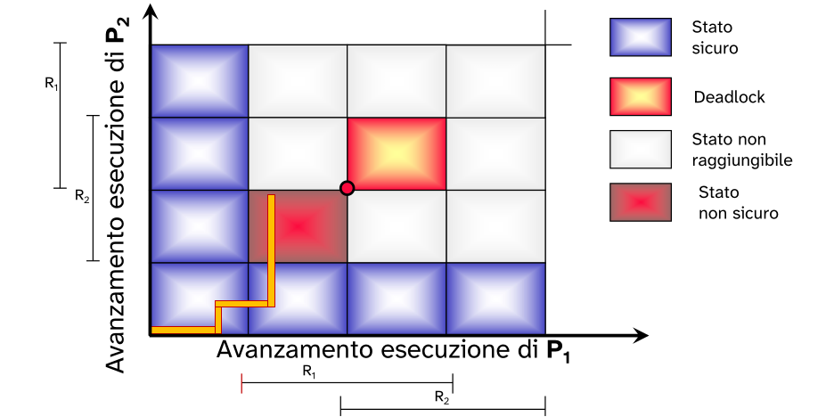

- Il modo in cui sono stati eseguiti i due processi hanno portato lo stato ad essere **non sicuro**, in questo caso è inevitabile il deadlock.
- Entrambi i processi resteranno in attesa l'uno dell'altro.

#### Sequenza sicura

Il sistema è in uno <b style="color:#d40000;"> stato sicuro</b> se, partendo da questo stato, <b style="color:#d40000;">esiste un sequenza sicura</b> di esecuzione di tutti i processi nel sistema.

Tale sequenza è una sequenza di **esecuzione "ipotetica"** dei processi nel sistema che porta al processo richiedente di una risorsa a terminare la propria esecuzione. (es. Pa, Pb, Pc, ...)

(che porta a tutti i processi del sistema a terminare)

Affinché uno stato sia sicuro è sufficiente che esista almeno una sequenza sicura.

L'algoritmo del banchiere prevede proprio di trovare la sequenza sicura che verifichi lo stato corrente, se al processo che ha richiesto una risorsa la ottiene.

Se esiste almeno una sequenza sicura,\
tale che il processo richiedente possa terminare dopo una serie di terminazioneùi di altri processi.

(tale che tutti i processi del sistema possano terminare dopo una serie finita di terminazioni di altri processi)

→ Allora lo stato **è** **sicuro** e la richiesta viene accettata.

→ Altrimenti se **non esiste** lo stato non sarà sicuro e quindi la richiesta **viene rifiutata**;
il processo si mette in **attesa** e verrà riattivato solo nel momento in cui la sua richiesta porti in uno stato sicuro.

#### workflow

- Si parte da uno stato che si suppone esser sicuro.

  
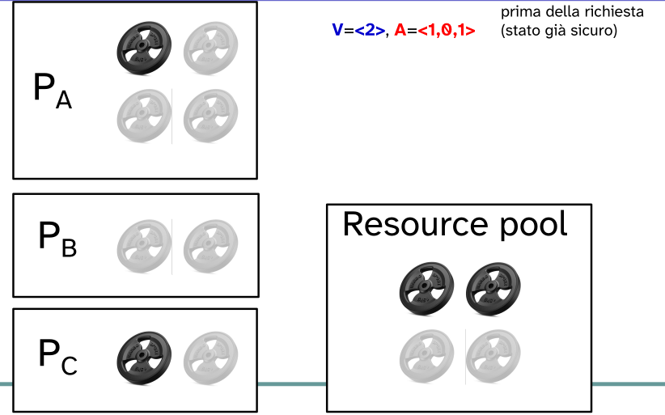

- Un processo Pa fa una richiesta di istanze di risorsa.
  
  
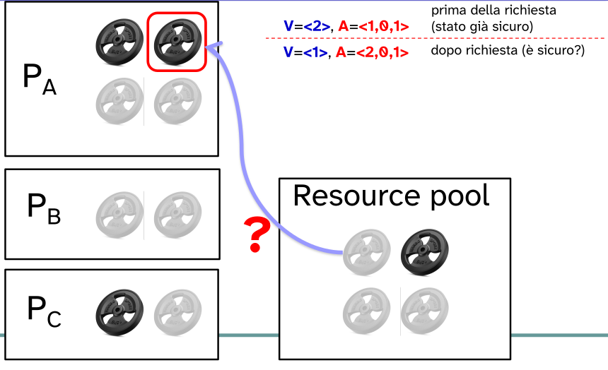

- Dopo tale richiesta si verifica che lo stato sia sicuro, supponendo che la richiesta sia stata accettata.

→ come avviene tale verifica:

- si tenta di trovare una sequenza sicura partendo dallo stato in cui la richiesta di Pa sia stata accettata.
  
  
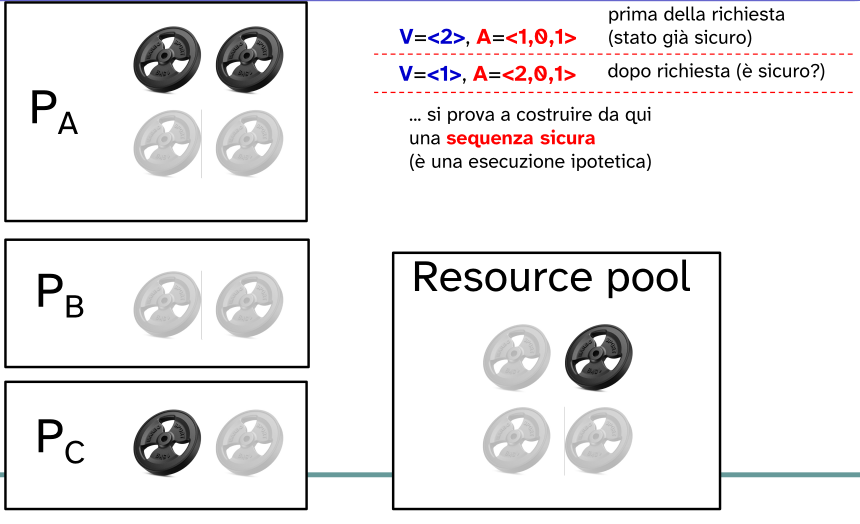

- si considera **ogni processo Pi** in esecuzione che necessita dello stesso tipo di risorse (Pa,Pb,Pc);
- si verifica se il processo Pi possa terminare, con **le risorse disponibili rimanenti**, considerando che la richiesta di Pa sia stata accettata.
  
  Quindi si suppone di assegnare al processo Pi tutte le risorse del suo **claim**, se disponibili.\
  Se c'è disponibilità si suppone che il processo termini e rilasci le risorse possedute;

  
  
  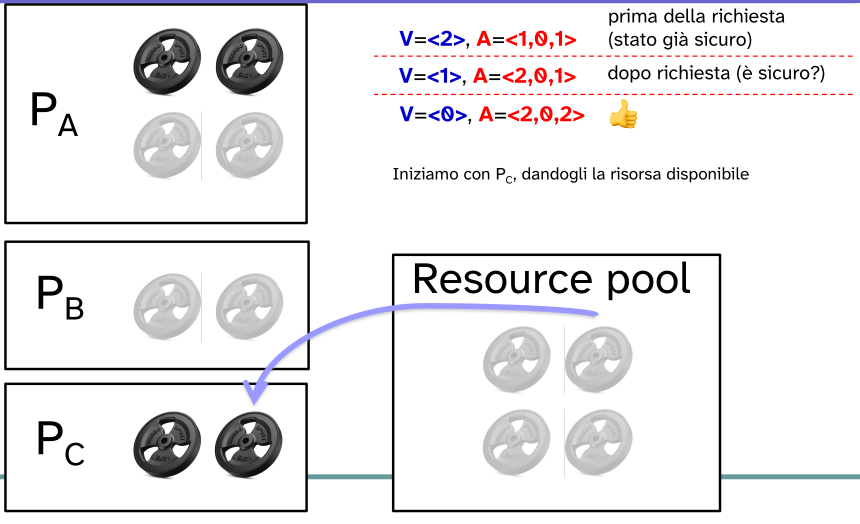

- se il processo i-esimo riesce a terminare allora potrà essere aggiunto alla **sequenza sicura**; altrimenti si passa al prossimo processo.

  
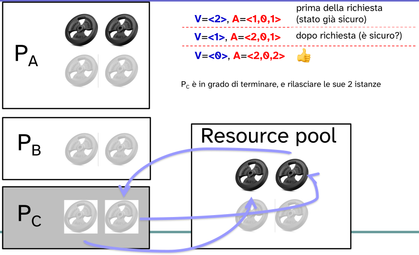

  - Pc è in grado di terminare quindi viene aggiunto alla sequenza sicura di esecuzione.
  - Si suppone che dopo la sua terminazione **rilasci** tutte le risorse possedute.\
    → in modo da permettere ad altri processi di terminare.
  
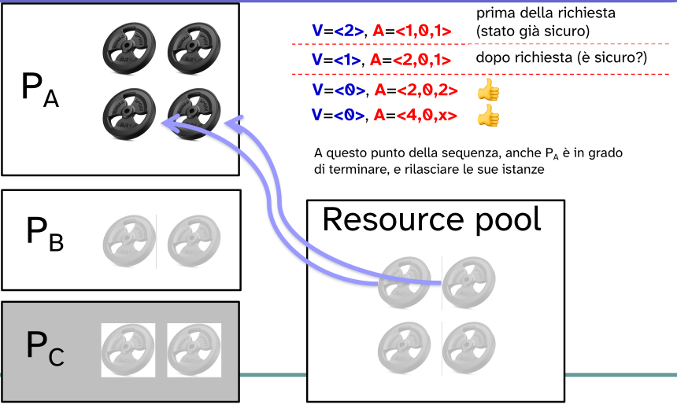

  
  - Pa riesce a terminare, viene aggiunto alla sequenza sicura.
  
  
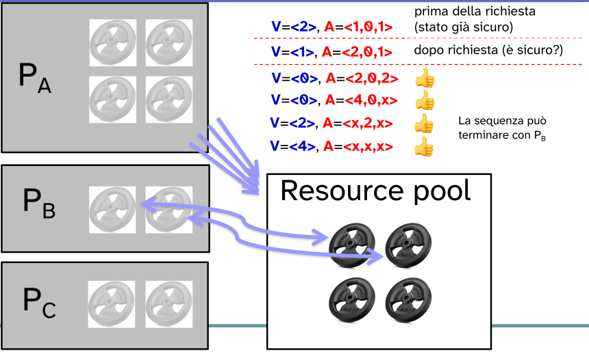

  - Anche Pb riesce a terminare.\
    → Si è trovato una sequenza sicura di esecuzione in cui tutti i processi terminano a valle dell'allocazione di risorse a Pa.

Si itera questo procedimento fin quando:

- il prossimo processo a far parte della sequenza sicura è il processo richiedente, Pa.
- A questo punto **termina l'algoritmo con una sequenza sicura di esecuzione**.

⟹ la richiesta viene accettata perché lo **stato**, dopo l'allocazione delle risorse al processo Pa, è **sicuro**.

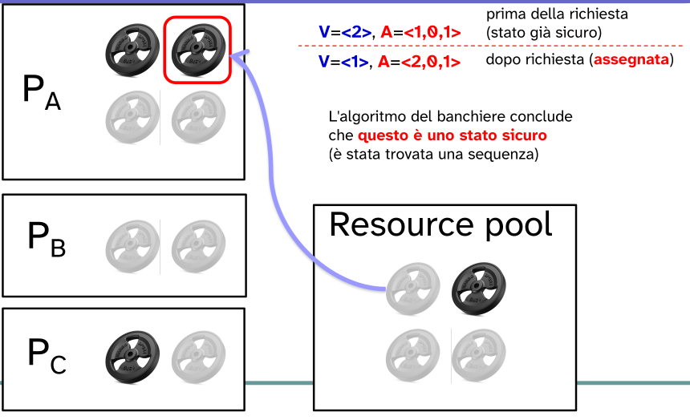

oppure

- se per un'iterazione **non** si trova alcun processo in **grado** **di** **terminare** **completamente**, supponendo di assegnargli tutte le risorse del **claim** (**se disponibili**).
- Allora il risultato dell'algoritmo è che non esiste una sequenza sicura.

⟹ la richiesta di Pa viene **rifiutata** perché lo stato successivo se la richiesta fosse accettata sarebbe **non sicuro**.\
Il processo rimane in attesa fin quando la propria richiesta non porti in uno stato sicuro.

#### caratteristiche di una sequenza sicura

La sequenza sicura (P1, P2, ..., Pn) è un ordine di esecuzione dei processi, tale che:

- include **tutti i processi attualmente attivi** nel sistema;
- ogni processo Pi esegue **completamente**, dopo che tutti i processi precedenti Pj, j < i, abbiano a loro volta **eseguito per intero** e nell'ordine della sequenza;
- Ogni processo Pi ottiene tutte le risorse del suo **claim**, e le **rilascia** **tutte** al termine della sua esecuzione;
- ogni processo Pi usa una **quantità di risorse non superiore** alla somma di:

  - risorse **disponibili** nello stato S
  - risorse **rilasciate** dei processi **precedenti** nella sequenza, Pj con j < i 

#### considerazioni

Per un corretto funzionamento è necessario che l'algoritmo sia sempre **eseguito** **ad** **ogni** **tentativo** **di** **allocazione** di risorse.

In ogni momento in cui lo stato cambia si verifica se esiste almeno una sequenza sicura.

Intuitivamente, l'algoritmo garantisce sempre che **esista almeno una exit strategy** che evita il deadlock.

Questa sequenza sicuro non è detto che sia l'ordine effettivo con cui eseguiranno i processi.

#### problematiche:

- è richiesto che sia **noto** **preventivamente** il numero **massimo** di risorse che ogni processo utilizzerà;
- i processi che vengono analizzati dell'algoritmo devono essere indipendenti (non è prevista la sincronizzazione).
  
  Altrimenti il problema si complicherebbe eccessivamente\
  → si dovrebbe tener conto che un processo possa terminare solo se termini prima un altro processo;
- deve esser presente un numero predeterminato e costante di risorse da allocare;
- Tutti i processi devono rilasciare le risorse possedute prima di terminare.

## Deadlock DETECTION

- Non vincola le richieste alle risorse, consente il verificarsi del deadlock.
- Il sistema esegue un algoritmo **per il rilevamento dell'attesa circolare**:
  
  - periodicamente;
  - ad ogni richiesta;
  - quando il grado di uso della CPU è basso.
- In caso affermativo, il sistema applica un algoritmo di **ripristino** (recovery).

La strategia di detection sfrutta il **grado di attesa**, che è un grafo costruito da quello di assegnazione delle risorse.

Tale grafo rappresenta l'attesa che un processo ha rispetto un altro processo.

- Ogni nodo è un processo.
- Gli archi indicano che un processo è in attesa che un altro processo rilasci la propria risorsa.
- Periodicamente viene aggiornato e chiamato l'algoritmo per la **ricerca di eventuali cicli di attesa**.
  

  - Tale algoritmo richiede un numero di operazioni dell'ordine di *n*^2, dove *n* è il numero di vertici (processi).

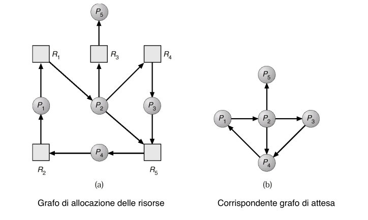

Strategie di ripristino:
- si **uccidono tutti i processi** in uno stato di deadlock
- si esegue un **checkpoint** di uno stato precedente al deadlock e si fanno **ripartire i processi**
- si **uccide un processo alla volta** fino a quando il deadlock non esiste più
- si **prelazionano le risorse** ai processi bloccati fino a quando il deadlock non esiste più

Nel caso in cui la strategia prevede l'aborto di un processo in esecuzione, si possono utilizzare diverse metriche per decidere quale tra quelli interessati:

- minor tempo di CPU consumato fino a quel momento
- minor numero di linee di output prodotte finora
- maggior tempo stimato per la terminazione
- minor numero di risorse allocate finora
- minore priorità

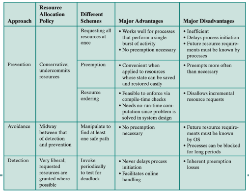

