# Gestione della memoria

La **memoria principale** costituisce, insieme la CPU, una delle risorse per realizzare **l'astrazione di processo**.

Il processo dispone di una **area di memoria** ad esso **riservata** (non accessibile da altri processi).\
Tale area di memoria (*memoria virtuale*) illude il processo facendogli credere di avere a disposizione **l'intera memoria principale**.

Questa memoria riservata permette a ciascun processo di avere una **vista indipendente** **e continua** della memoria, anche se, fisicamente, la memoria principale è condivisa tra più processi e l'allocazione dell'immagine di questi non è detto che sia continua.

Il sistema operativo, come per il processore, attraverso l'utilizzo dei **PCB** garantisce il principio di **isolamento** tra processi, ovvero è necessario assicurarsi che l'esecuzione di uno non interferisca con quella di un altro.\
Quindi fisicamente i processi non devono accedere ad aree di memoria fisiche in cui è contenuta l'immagine di un altro processo.

<p align='center'>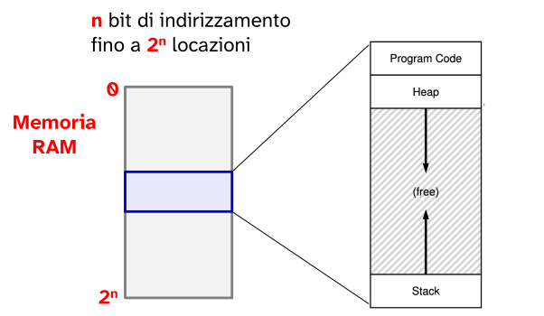</p>

L'immagine del processo è descritta all'interno del PCB dello specifico processo.\
In questa struttura sono contenute anche informazioni **su dove si trovano** le diverse parti dell'immagine **in memoria centrale**.

I processi non accedono mai direttamente alla memoria principale tramite degli indirizzi.\
Lavorano invece su una propria **memoria virtuale** (riservata), esso non utilizza indirizzi di memoria fisici ma bensì **virtuali**.

Tali **indirizzi virtuali** hanno senso solo nella visione della memoria del processo → non corrispondono a veri e propri indirizzi della memoria principale.

---

ESEMPIO:

Quando utilizziamo indirizzi all'interno di un codice non stiamo realmente utilizzando indirizzi fisici ma indirizzi virtuali.

Infatti quando stampiamo gli indirizzi di memoria delle variabili che utilizza un processo non stiamo realmente stampando indirizzi di memoria, ma indirizzi di memoria logici.

```c
#include <stdio.h>
#include <stdlib.h>
int main() {
    int x = 3;
    printf("location of stack: %p\n", &x);
    char * p = malloc(1024);
    printf("location of heap : %p\n", p);
    printf("location of code : %p\n", main);
}
```

```console
location of stack: 0x7fff691aea64
location of heap : 0x1096008c0
location of code : 0x1095afe50
```

Tali indirizzi virtuali che abbiamo stampato vengono tradotti da un componente hardware (MMU - Memory Management Unit) per eseguire le istruzioni desiderate.

---

Il kernel a differenza di un Hypervisor astrae l'hardware per consentire l'esecuzione di un processo in modo indipendente.

La posizione (**indirizzi**) di codice e dati nella memoria di un processo è un'**astrazione**. → indirizzi virtuali.

La posizione effettiva in memoria fisica è **gestita dal sistema operativo**.

## Aspetti e parametri caratterizzanti la gestione della memoria 

- **Supporto Hardware** per la gestione della memoria, in particolare l'isolamento tra i processi. (MMU)
- **Organizzazione logica** della memoria virtuale, ovvero le diverse sezioni che fanno parte della memoria virtuale di ogni processo.
- **Organizzazione fisica** della memoria principale, ovvero descrive come è allocata in memoria principale l'immagine di ogni singolo processo.
  
  Tale organizzazione è necessaria per capire dall'indirizzo virtuale a quale indirizzo fisico si sta effettivamente accedendo.
- **Dimensione della memoria virtuale** che può essere più **grande della memoria fisica disponibile**. 
  
  Quindi il sistema operativo deve fare in modo di emulare la memoria fisica utilizzando la memoria secondaria, per permettere l'esecuzione dei processi che utilizzano più memoria di quanta ne sia disponibile.
- **Rilocazione**:
  
  La rilocazione è un meccanismo che permette di caricare l'immagine di un processo in memoria principale.

  Esistono due principali tipi di rilocazione:

  - statica: gli indirizzi vengono definiti al momento della compilazione o caricamento del programma e non possono essere cambiati.
  - dinamica: gli indirizzi possono essere modificati durante l'esecuzione del programma, ad esempio quando il programma viene riattivato e ritorna nella memoria principale dallo swap.
- **Organizzazione dello spazio virtuale**
  
  - spazio virtuale unico: tutta la memoria di un processo è trattata come un'unica area.
  - spazio virtuale segmentato: la memoria del processo è suddivisa in **segmenti** (ad esempio, codice, dati, stack) che vengono gestiti separatamente.
- **Allocazione**
  
  Si riferisce alla maniera con cui il sistema operativo assegna la memoria principale ai processi.

  - contigua: i dati di un processo sono collocati in un blocco contiguo di memoria.
  - non contigua: i dati di un processo possono essere sparsi in diverse aree della memoria, come avviene nella **paginazione**.
- **Caricamento**
  
  Il caricamento riguarda come i processi vengono caricati in memoria:

  - tutto insieme: il processo viene caricato tutto in una volta nella memoria.
  - a domanda: solo le parti del processo necessarie vengono caricate in memoria, quando l'esecuzione ne richiede l'accesso.

## Tecniche di gestione della memoria

---

Rilocazione significa allocare l'immagine del processo nella memoria principale, può avvenire in diversi modi.

Questa rilocazione può essere statica o dinamica.

---

Nei primi sistemi, il posizionamento del codice e dati è **fisso**. → con asim abbimo inserito in posizioni fisse il codice e i dati.\
Il processo è caricato in RAM tutto insieme come un **unico blocco** (allocazione contigua).

<p align='center'>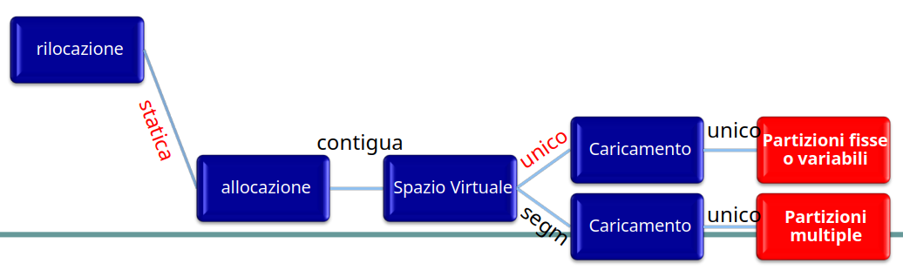</p>

Statica perché era più semplice.

Con l'introduzione di hw più evoluti si è permesso di configurare nella CPU il posizionamento di codice e dati, a **tempo di esecuzione**.\
→ ad esempio sfruttando una base e un offset per determinare l'indirizzo fisico.

Con il supporto dei compilatori, la memoria del processo è divisa in blocchi (segmenti) che possono essere **gestiti in maniera separata e indipendente dal SO**.\
Ad esempio il SO protegge il segmento dedicato al codice dando il permesso di sola lettura all'area di memoria a cui sarà destinato.

<p align='center'>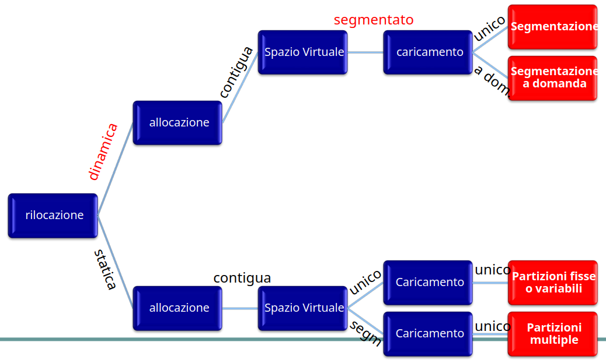</p>

Ulteriori evoluzioni hw hanno permesso di **caricare** l'immagine del processo (o un suo segmento) **non più per intero**, ma in **piccole porzioni (pagine)** ( caricamento a domanda) **sparpagliate** in memoria fisica (allocazione non contigua).

Quindi è stata introdotta l'allocazione di tipo **non contigua** grazie allo sviluppo dell'hardware MMU.

Che vantaggio mi da l'accolazione di tipo non contigua?\
→ uso efficiente dell'area di memoria in termini di **flessibilità e dinamicità**; i processi non devono essere necessariamente allocati in un blocco contiguo di memoria.\
→ attenua il **problema della frammentazione**, perché non ho bisogno di trovare una area di memoria di dimensione tale da contenere interamente l'immagine del processo. Ci sono due tipi principali di frammentazione:

- frammentazione interna: si verifica quando la memoria allocata per il processo **è più grande di quella effettivamente necessaria**.
- frammentazione esterna: si verifica quando ci sono **molti piccoli spazi liberi sparsi** nella memoria fisica, ma **nessuno** di questi **è abbastanza grande da ospitare un nuovo processo**.
  

<p align='center'>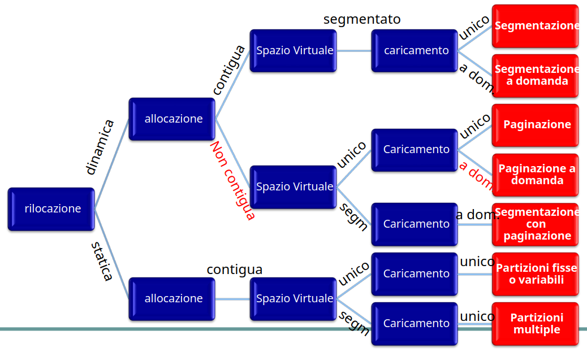</p>


- **Partizioni fisse**: memoria suddivisa in blocchi di **dimensione fissa**. Facile da gestire ma potrebbe causare **frammentazione interna**.
- **Partizioni variabili**: la memoria virtuale viene allocata in blocchi di **dimensioni variabili** a seconda delle necessità del processo. Riduce la frammentazione interna ma può comunque portare a **frammentazione esterna**.
- **Partizioni multiple**: una combinazione di partizioni fisse e variabili.
- **Segmentazione a domanda**: caricamento dinamico di segmenti di processi solo quando necessari. Ottimizza l'uso della memoria, ma può causare ritardi nei processi se la memoria virtuale deve essere frequentemente caricata dal disco.
<!-- @todo aggiungi paginazione e segmentazione con paginazione -->

## Rilocazione 

Modalità di allocazione dei dati e del codice di un processo in memoria fisica.

L'associazione di **istruzioni e dati** ad indirizzi di memoria (fisica) si può compiere in ognuna delle sequenti fasi:

- **compilazione**: se nella fase di compilazione conosce dove il processo risiederà nella memoria, allora può **inserire direttamente gli indirizzi fisici nel codice oggetto**.

  → si genera così **codice assoluto**: gli indirizzi nel codice oggetto sono indirizzi fisici reali della RAM. Quindi codice e dati saranno allocati sempre in tali posizioni ad ogni esecuzione.

  → potrebbe essere un problema se il SO decidesse di caricare il programma in un'altra zona della memoria. Sarebbe necessaria una ricompilazione perché tutti gli indirizzi sarebbero **sbagliati**.

  Quindi in questo caso gli indirizzi sarebbero fissati per sempre (fino ad una successiva ricompilazione)\
  → nessuna **flessibilità**;
- **caricamento**: se nella fase di compilazione non è possibile sapere in che punto della memoria risiederà il processo, il compilatore deve generare **codice rilocabile**.
  
  Quindi il **compilatore** **non** **inserisce** nel codice oggetto **indirizzi fisici** ma dei valori relativi che il loader dovrà sistemare.

  Quando il processo viene caricato in memoria, il **loader sceglie un indirizzo di partenza** e scorre il codice oggetto aggiustando tutti gli altri indirizzi relativi.

  → dopo il caricamento, lo spazio di indirizzamento del processo non può più esser spostato, altrimenti andrebbero aggiornati tutti gli indirizzi fisici;
- **esecuzione**: se durante l'esecuzione il processo può essere spostato da un segmento di memoria ad un altro, è necessario che si ritardi l'associazione degli indirizzi fino alla fase di esecuzione. (rilocazione dinamica)
  
  → Qui entriamo in merito della **memoria virtuale** che permette al SO di:
  
  - spostare un processo in RAM;
  - fare swapping su disco;
  - caricare pezzi di processo dove capita (dove si ha disponibilità) → utilizzo efficiente della memoria.
  
  Per permettere ciò **non conviene** fissare gli indirizzi fisici **né a compilazione, né al caricamento**.\
  Allora cosa accade:
  - nel codice non vengono inseriti indirizzi fisici ma **logici**;
  - ogni volta che la CPU fa un accesso a memoria, interviene la **MMU** che traduce gli indirizzi logici nei corrispettivi indirizzi fisici a run-time.
  
  Se il processo viene spostato, basta cambiare il **modo** con cui la MMU traduce gli indirizzi.

  Quindi per realizzare questo schema sono necessarie specifiche caratteristiche dell'architettura → MMU

### statica

La rilocazione statica stabilisce gli indirizzi di codice e dati **al momento della compilazione o caricamento**.

La posizione del codice e dei dati **non può più essere modificata** a tempo di esecuzione.\
→ nella programmazione in assembly si decide a priori dove il codice viene posizionato in memoria centrale.

<p align='center'>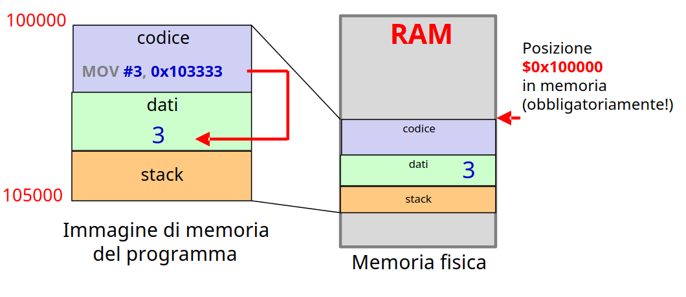</p>

Il problema di questo tipo di rilocazione si presenta nel **contex switch**: il processo quando viene prelazionato e inserito nella coda dei processi pronti oppure swappato\
→nel momento della sua successiva esecuzione deve trovarsi sempre nella stessa area di memoria, altrimenti tutti gli indirizzi fisici su cui lavora sarebbero sbagliati.\
Questo è un grande **onere computazionale** affidato al sistema operativo.

Quindi con una rilocazione statica è il compilatore o il caricatore ad inserire degli indirizzi fisici all'interno rispettivamente del codice oggetto o del codice eseguibile.

<p align='center'>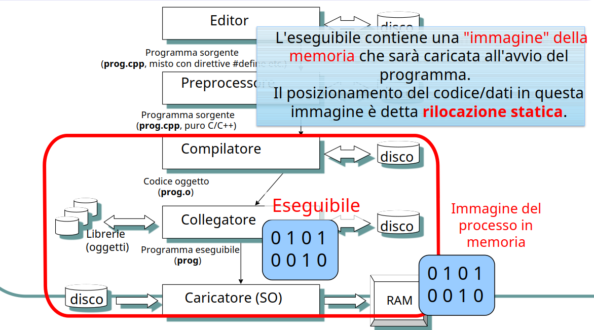</p>

Questi indirizzi non potranno esser cambiato al meno che il codice non venga ricompilato oppure ricaricato.


### dinamica

Con questo approccio, dinamico, l'indirizzo di codice/dati nella immagine (*virtuale*) **non corrisponde** alla loro posizione effettiva in RAM (*indirizzo fisico*).

L'effettiva posizione dello spazio di indirizzamento del processo è **scelta da SO**, al caricamento iniziale del processo, o anche durante la sua esecuzione.

→ richiede un supporto hardware che permetta a tempo di esecuzione di tradurre gli indirizzi virtuali in indirizzi fisici.

Infatti la rilocazione di tipo dinamico si introduce un distinzione fondamentale:

- **Indirizzo virtuale**:
  
  indirizzo **acceduto dal programma** durante l'esecuzione.

- **Indirizzo fisico**:
  
  indirizzo visto dall'unità di memoria, **posizione effettiva** del dato/istruzione.

Quando otteniamo **segmentation fault** significa che l'indirizzo virtuale che stiamo utilizzando, erroneamente, non è associato ad un indirizzo fisico facente parte dell'immagine del processo nella memoria fisica → l'indirizzo fisico che stiamo deferenziando non è mappato nella memoria virtuale.\
→ la traduzione da indirizzo virtuale a indirizzo fisico ha dato questo problema.

Vedremo che il fault può essere **ripristinabile**, perché il segmento/pagina non sono in memoria fisica ma sono swappati in memoria di massa. → ci troviamo nella situazione di un caricamento a domanda.

Il processore vede solo indirizzi logici (virtuali)\
→ **tradotti dall'hardware** che ha la visibilità della memoria fisica, ovvero MMU.\
MMU rende trasparente l'accesso del processore agli indirizzi fisici.

Se non fosse così il processore **sarebbe più performante** (vedrebbe direttamente gli indirizzi fisici), ma perderei tutta la parte di virtualizzazione.

Infatti come abbiamo visto, aprendo il file eseguibile od oggetto, non sono presenti indirizzi fisici ma unicamente indirizzi virtuali che solitamente partono tutti da `0x0`.

<p align='center'>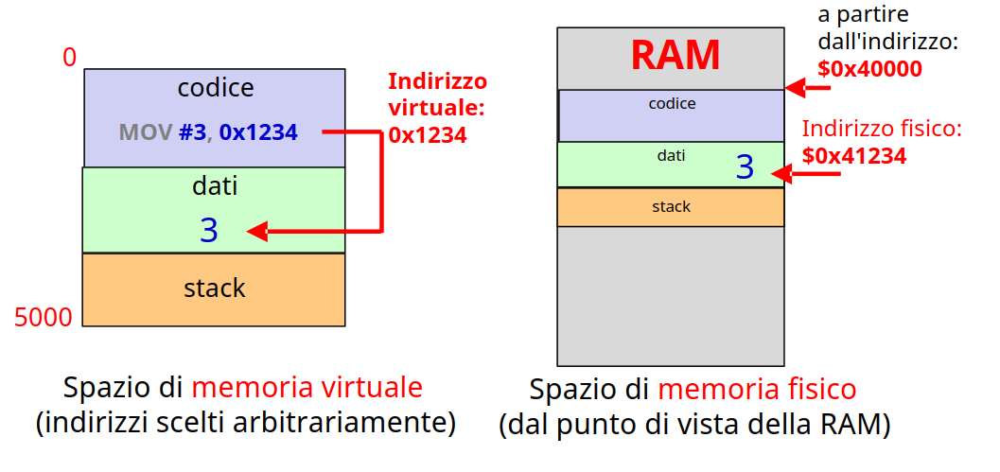</p>

#### Vantaggi della rilocazione dinamica

La rilocazione dinamica consente lo **swapping**
- un processo è temporaneamente **sospeso** e trasferito in **memoria secondaria**;
- il processo potrà poi essere ri-caricato in un'**area** di **memoria** **differente**, in base alla situazione attuale della memoria.

#### MMU (Memory Management Unit)

MMU è un componente hardware della CPU che ha il compito di rendere **trasparente l'accesso al processore** alla memoria fisica tramite una traduzione di **indirizzi virtuali** (utilizzati dal processore) **in indirizzi fisici**.

ESEMPIO DI RILOCAZIONE DINAMICA:

Caso basilare (obsoleto):

- spazio virtuale unico → viene trattato come un unica area.
- allocazione contigua → viene allocato in memoria tutto insieme.

MMU in questo caso possiamo rappresentarla come un componente hardware avente due registri speciali: **limite** e **base**.

In questo caso banale la traduzione avviene con la somma tra l'indirizzo virtuale + la base, ovviamente a valle di una verifica sull'indirizzo virtuale (se esiste un indirizzo fisico mappato con tale indirizzo virtuale).

<p align='center'>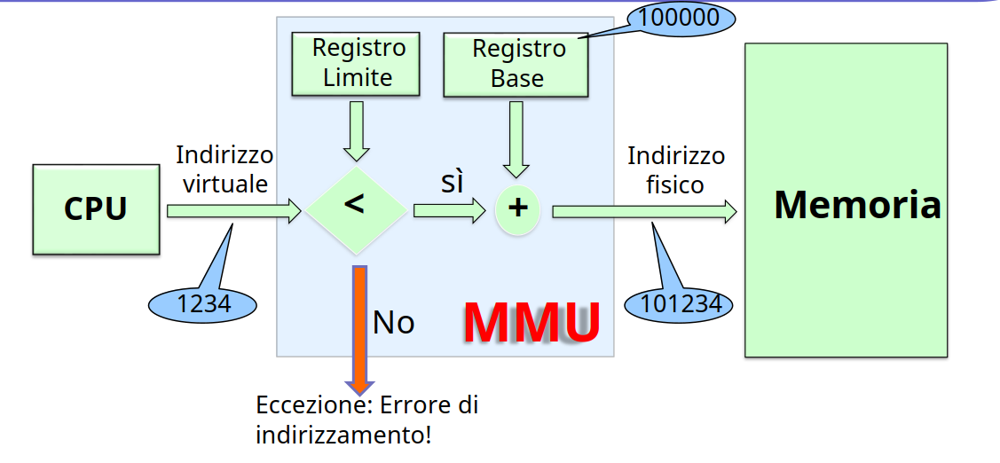</p>

Ovviamente dobbiamo prevedere un modo per modificare i registri dell'MMU, che sono specifici per ogni processo.

Oltre a cambiare valore per ogni processo i due registri devono esser modificati anche ogni volta che un processo passa in esecuzione da che era swappato\
→ con la rilocazione dinamica potrebbe ritrovarsi in una posizione della memoria fisica differente alla precedente

Questo modello infatti non è la realtà, è uno schema di funzionamento base dell'MMU.

## Caricamento unico e a domanda

Il caricamento in memoria dell'immagine del processo è fatta dal **loader** che è parte del SO che:

- **legge** l'eseguibile (e.g. ELF);
- **alloca** memoria per il processo;
- **mappa** gli indirizzi virtuali negli indirizzi fisici (a seconda della rilocazione utilizzata: statica o dinamica);
- **copia** in RAM le parti necessarie del programma (**a seconda della tipologia di caricamento**);
- **prepara** il processo per la prima esecuzione → ad esempio, crea il PCB.

Nella fase di copia il loader si può comportare in due modi a seconda della tipologia di caricamento implementata:

- Nel **caricamento unico** (tutto insieme)
  
  - Il loader carica tutta l'immagine del programma in memoria RAM.
  
  Questo è un approccio tipico dei vecchi sistemi o microcontrollori.
- Nel **caricamento a domanda** (demand loading)
  
  - Il loader crea solo le mappature virtuali → fisiche.
  - Il caricamento effettivo del codice/dati avviene **solo quando necessario**.
  - La MMU genera un fault quando la **CPU tenta di accedere a una parte del processo che NON è ancora stata caricata in memoria fisica**.
  
  A questa fault generata (**interruzione sincrona**), il SO chiama un handler che fa una recovery. Ovvero verifica se tale parte di processo a cui voule accedere la CPU è presente in memoria secondaria e la carica, permettendo al processore di proseguire con l'esecuzione.

  Se tale parte non viene trovata viene rilanciata ancora la fault che in questo caso genera la terminazione del processo → ha tentato di accedere ad un indirizzo di memoria che non fa parte del proprio spazio di indirizzamento.

  >NOTA: fault è un tipo di interruzione sincrona perché viene chiamata nel momento in cui nella tabella delle pagine o segmenti non è stata mappata la pagina virtuale in una fisica.
  > **NON è asincrona**.

## Gestione dello spazio virtuale

Vi sono due possibili approcci per gestire lo **spazio virtuale** degli indirizzi.

- Uno **spazio unico**\
  (corrispondente all'intero processo)
- Un insieme di **segmenti**\
  (**segmentazione** → la memoria del processo è gestita in porzioni separate)

<p align='center'>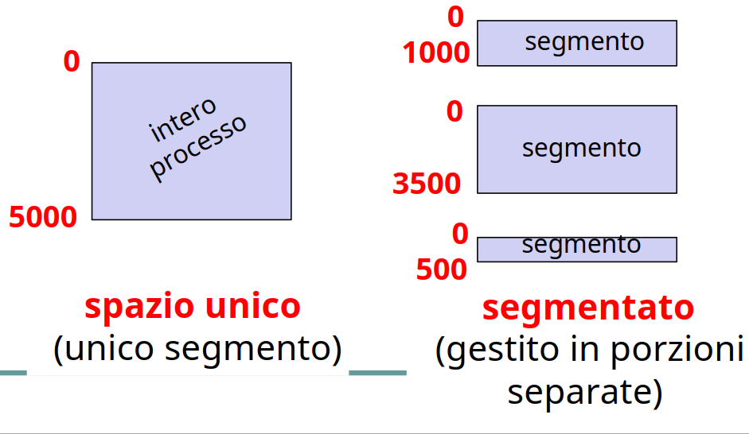</p>

Nell'approccio segmentato l'immagine del processo è suddivisa in **porzioni logiche** (segmenti) gestite in modo separato ed indipendente dal sistema operativo.\
Ogni segmento può avere una dimensione variabile, in base alla struttura logica del programma (codice, heap, stack, dati).

**Vantaggio principale**:\
La segmentazione facilita la condivisione di aree di memoria fisica tra più processi, mappandole in segmenti distinti del loro spazio di indirizzamento.\
* → Esempio:\
  il segmento di codice (text) di un programma è di sola lettura.\
  Più processi che eseguono lo stesso programma possono **condividere la stessa copia fisica** del codice, mappandola nel proprio spazio di indirizzamento virtuale all'interno del segmento dedicato all'area testo.

## segmentazione

<div style="display: flex;">
<div>
A <b>tempo di compilazione</b>, si configura lo spazio virtuale segmentato.

Viene creato un diverso **segmento** per ciascun **modulo** del programma.

---

#### vantaggi della segmentazione

- **Protezione** dei segmenti;\
  permette una **granularità fine** nella gestione dei permessi sullo spazio di indirizzamento.\
  Ad ogni segmento può avere **permessi diversi** (lettura, scrittura, esecuzione).

</div>
<p align='center'>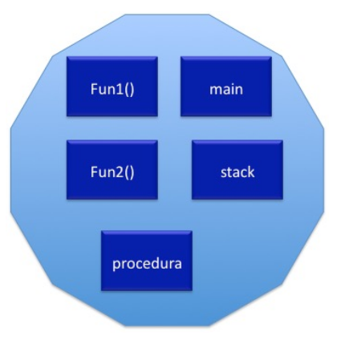</p>
</div>

- **Condivisione** dei segmenti;\
  segmenti come **codice** (text) o le **librerie** **condivise** possono essere mappate da più processi e condividere un'unica copia fisica, **riducendo l'uso della memoria**.

- **Allocazione indipendente** dei segmenti in memoria fisica → riduce (ma non elimina) il problema della frammentazione.\
  Ogni segmento può essere **collocato separatamente in punti diversi** della memoria fisica.

---

Un indirizzo virtuale è una coppia (contiene due informazioni), fatta da:

- un **identificativo** del segmento;
- uno **scostamento** (offset) all'interno del segmento.

<p align='center'>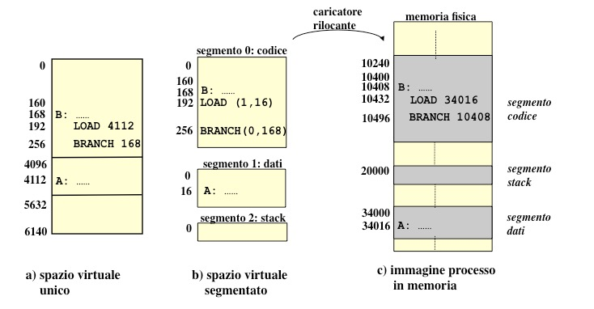</p>

L'**MMU** è il componente su cui si basa anche la segmentazione.

- Traduce gli indirizzi virtuali dalla forma (*segmento*, *offset*) in indirizzi fisici.
- Nel caso di **pochi segmenti**, è sufficiente avere nella MMU più coppie di registri base/limite: uno per ogni segmento.

Questo è un **limite** fisico importante perché non mi permetterebbe di avere molti segmenti. → non posso avere un numero infinito di registri.

---

ESEMPIO SEGMENTAZIONE CASO SEMPLICE:

<p align='center'>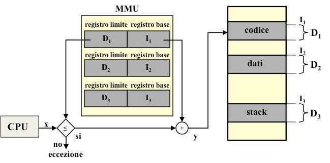</p>

- in questo caso ogni coppia di registri corrisponde a limite e base per un segmento allocato in memoria fisica
- l'identificativo `sg` servirà per capire a quale tipologia di segmento accedere facendo riferimento alla giusta coppia D, I
- l'offset (`off`) sarà sommato al corretto registro base I se <= del registro limite D corrispondente ad un segmento, altrimenti la MMU solleverà un eccezione (segmentation fault).

---

Nel caso **generale**, quando si vuole supportare un **numero arbitrario di segmenti**, non è possibile avere una coppia **base/limite** nella MMU per ogni segmento di un processo.

Per questo motivo:

- le coppie base/limite non risiedono nella MMU, ma sono memorizzare in **memoria RAM**;
- queste informazioni sono raccolte in una struttura dedicata, chiamata **tabella dei segmenti (segment table)** unica **per ogni processo**;
- ogni **entry** della tabella dei segmenti contiene i dati relativi a un **segmento del processo**: **indirizzo base**, **limite** e **bit di controllo** (permessi rwx).

La MMU gestisce la segment table con due appositi **registri**:

- **STBR** (Segment Table Base Register): indirizzo in memoria fisica in cui si trova la tabella dei segmenti.
- **STLR** (Segment Table Limit Register): dimensione della tabella dei segmenti (indica il **numero di segmenti del processo**)

Il SO, all'atto del caricamento in memoria del processo da eseguire, imposterà l'**indirizzo fisico** dell'*entry point* della *segment table* nel registro **STBR**.\
Tale indirizzo essendo strettamente legato al processo, è contenuto all'interno del PCB.

---

ESEMPIO DI TRADUZIONE UTILIZZANDO LA SEGMENT TABLE:

<p align='center'>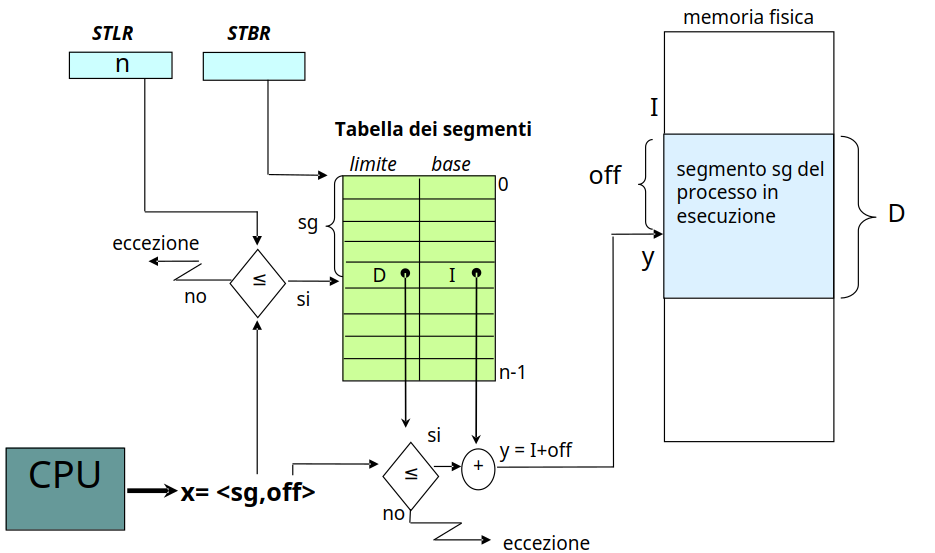</p>

- `sg` è l'offset per identificare l'entry point relativo ad un segmento.
- Per accedere alla tabella il processore utilizza le informazioni contenute in `STBR` e `STLR`  i cui valori sono contenuti all'interno del PCB di ogni processo.

---

NOTA sulla segment table:

- ogni processo ha una **segment table differente**
- i registri STBR/STLR sono configurati ad ogni **contex switch** dei processi\
  → durante il contex switch il SO carica i valori di STBR/STLR dal **PCB del processo** (sono legati al singolo processo).

<p align='center'>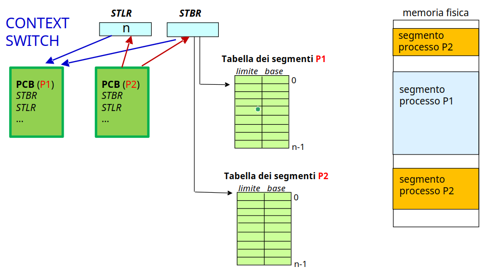</p>

#### protezione

Ogni segmento può avere diversi **permessi di accesso** specificati da bit di controllo contenuti nella segment table.

- Ogni riga della segment table di un processo contiene per ogni entry anche una sequenza di **bit di controllo** per gestire i permessi sull'area di memoria in cui è mappato il segmento.
- MMU produce una **exception** se il programma non rispetta i permessi.

<p align='center'>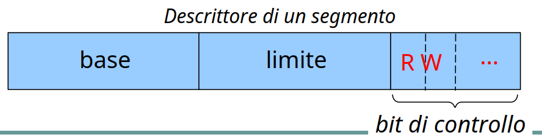</p>

#### condivisione

La segmentazione consente la **condivisione dei segmenti** tra più processi, allocando in memoria fisica una sola copia del segmento.

Abbiamo due processi con le rispettive tabelle dei segmenti.

→ Se hanno una entry in comune significa che i due processi possono accedere alla stessa area di memoria fisica.\
Quindi stanno effettivamente condividendo la copia del segmento di memoria. Questo permette di allocare una sola copia del segmento in memoria.

<p align='center'>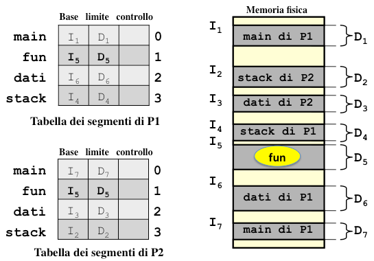</p>

#### allocazione

Uno spazio/segmento di memoria virtuale può essere **collocato in memoria fisica** in due possibili modi:

- allocazione **contigua**:
  
  lo spazio/segmento è **copiato per intero**, in un intervallo di memoria fisica agli indirizzi [D;D+I]

- allocazione **non contigua** (**paginazione**)


##### allocazione contigua

- Il SO colloca il proprio blocco di memoria virtuale, e quelli dei processi, in intervalli **non-sovrapposti** della memoria fisica
- Quando un processo termina, la memoria fisica occupata si libera, creando un **hole**
- Quando un nuovo processo viene caricato, occorre **cercare un hole sufficientemente grande** da contenerlo
  
  → compito dello sheduler a medio termine.

<p align='center'>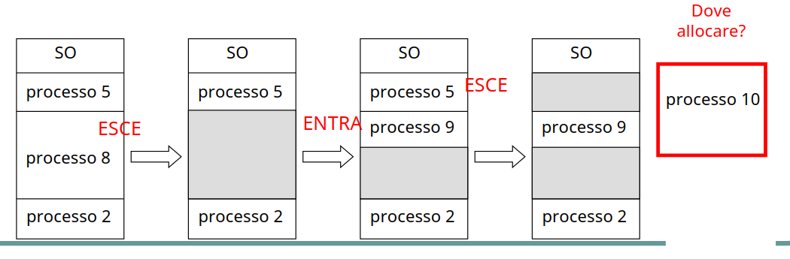</p>

Questo è un esempio su come facilmente si può arrivare ad un problema di **frammentazione esterna** della memoria.

Se ci sono **più buchi liberi**, ci sono vari criteri per scegliere dove collocare un segmento:

- **first-fit**: si assegna il **primo** hole sufficientemente grande;
- **best-fit**: si assegna lo hole **più piccolo** tra quelli sufficientemente grandi per contenere lo spazio di indirizzamento del processo;
- **worst fit**: si assegna lo hole più grande.

In generale, gli **schemi a partizione di dimensione variabile** soffrono del problema della frammentazione esterna.

**Frammentazione esterna**: spazio di memoria perduto sotto forma di spezzoni.

- Lo spazio di memoria totale sarebbe sufficiente per soddisfare una richiesta, **ma non è contiguo**.
- → non si sfrutta a pieno la quantità di memoria totale a disposizione.

Dualmente gli schemi a partizione di dimensione fissa soffrono del problema della frammentazione interna.

**Frammentazione interna**: è un concetto relativo al singolo segmento, in particolare è legato alla dimensione di questo.

Se i segmenti hanno una dimensione fissa, non è detto che l'immagine di un processo sia un multiplo di questa dimensione. Quindi tale immagine potrebbe occupare un numero di segmenti, ma non tutte le word di questi segmenti avranno un significato.

Ovvero siamo sprecando una porzione dell'ultimo segmento in cui è contenuta l'immagine del processo.

<p align='center'>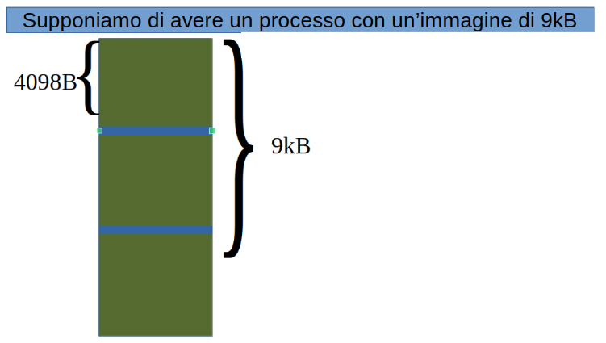</p>

## Paginazione

La segmentazione oggi non viene più utilizzata.

Invece viene utilizzata la paginazione perché permette di eliminare un enorme problema: la frammentazione esterna.

Ovviamente non è perfetto come approccio infatti anche questo introduce un problema, quello di frammentazione interna. → perdo mediamente per ogni pagina una quantità di memoria pari alla metà della dimensione della pagina stessa.

**Paginazione**:

- tecnica di allocazione **non contigua** → se fosse contigua la paginazione non avrebbe senso;
- lo spazio virtuale è diviso in **blocchi di dimensione fissa**;
- evita la frammentazione esterna;
- introduce la frammentazione interna.
  
  A causa del fatto che lo spazio virtuale è suddiviso e quindi caricato in memoria fisica all'interno di blocchi di dimensione **fissa**.

<p align='center'>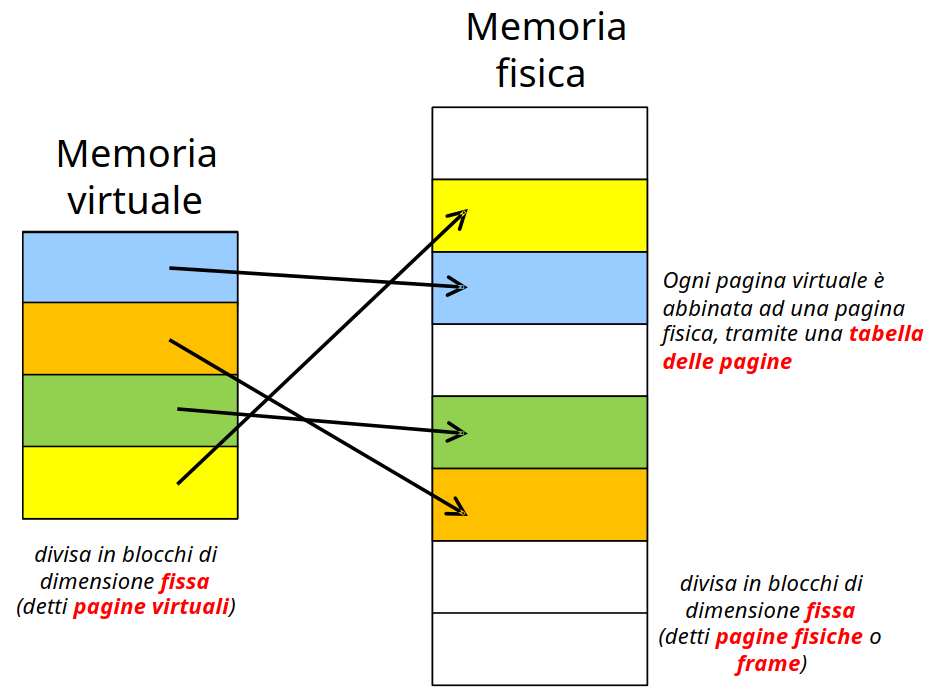</p>

- La **tabella delle pagine** è salvata in RAM e come per la segmentazione l'*entry point* è memorizzato nel PCB di ogni processo.
- Ogni processo ha la propria tabella delle pagine.

Come detto questo approccio è soggetto alla frammentazione interna.

<p align='center'>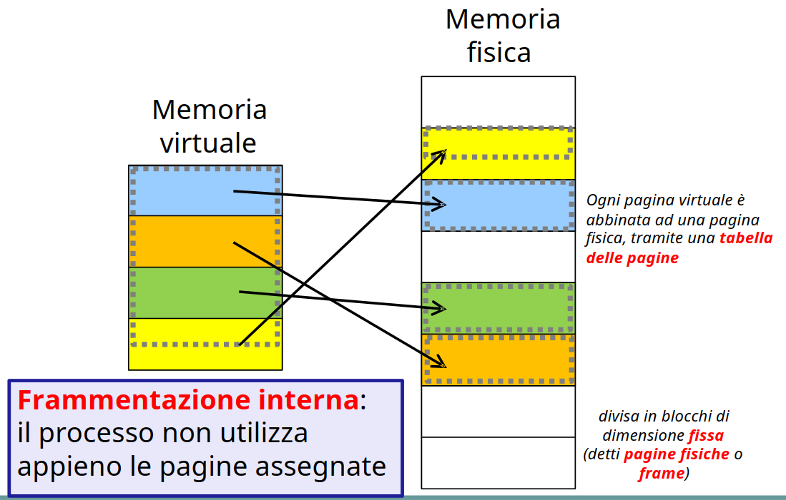</p>

- La pagina associata all'ultima pagina della memoria virtuale non è completamente utilizzata.\
  → spreco della memoria, perché non è possibile più utilizzarla fino a quando non viene deallocata.

Cosa accade nel momento in cui si verifica una frammentazione interna:

- spazio di memoria perso per un blocco assegnato ma non utilizzato a pieno
- si verifica se la dimensione del processo non è un multiplo esatto della dimensione dei blocchi

Questo fenomeno è tanto **più trascurabile** quanto **più piccola è assegnata la dimensione** di ogni pagina.

>Tipicamente, la **dimensione di pagina** è una potenza di 2, compresa tra 512 byte e 16 MB.

### Traduzione degli indirizzi

Essendo l'allocazione non contigua è necessario memorizzare ogni pagina virtuale in che posizione della memoria fisica si trova.

Nel codice, quindi, si utilizzano indirizzi virtuali che devono essere **tradotti dall'MMU** in indirizzi fisici a run-time.

Questo hardware è necessario perché nell'approccio di allocazione **non contigua non si conosce a priori dove sarà rilocato il codice**.\
→ dobbiamo sempre tener conto che se parliamo di paginazione allora stiamo parlando di rilocazione non contigua, altrimenti la paginazione non avrebbe senso.

Quindi quando l'architettura utilizza l'approccio di paginazione si tutti i programmi utilizzano indirizzi virtuali.

La paginazione, inoltre, non è solo una tecnica di allocazione non contigua, ma anche una tecnica per la **gestione della memoria virtuale**. In altre parole, la paginazione permette di creare uno spazio virtuale più grande della memoria fisica, se la gestione del caricamento delle pagine è della tipologia: **a domanda**.

Un indirizzo virtuale contiene la **coppia**:

- **numero di pagina (p)**:\
  identifica una pagina nella memoria fisica → nel contesto di un processo.
- **scostamento di pagina(d)**:\
  indica la posizione dell'indirizzo all'interno della pagina.

**A differenza della segmentazione**, non sono due valori separati, ma sono contenuti entrambi in un **unico valore**.\
→ Nel constesto della CPU, ovvero questa vede un unico indirizzo le cui informazioni non le tratta separatamente.

ESEMPIO: indirizzo virtuale a **16bit**: `0x0803`

<p align='center'>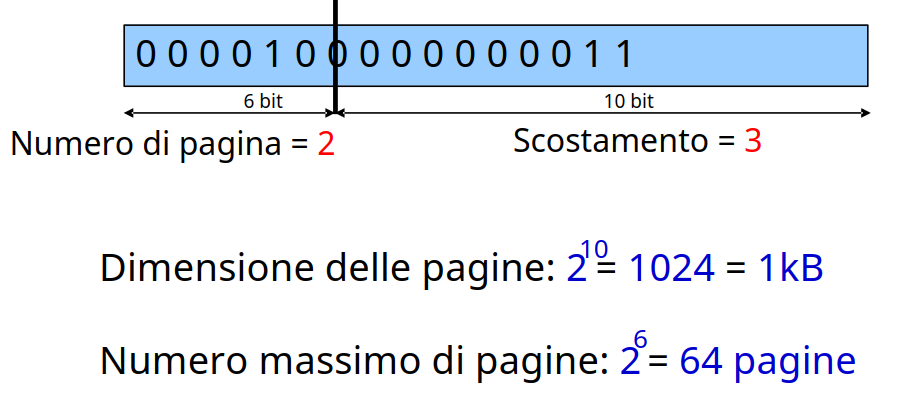</p>

Quindi l'indirizzo viene diviso in due campi ognuno dei quali porta con se un'informazione.

Vediamo come avviene la traduzione con l'utlizzo dell'MMU sulla *page table*.

<p align='center'>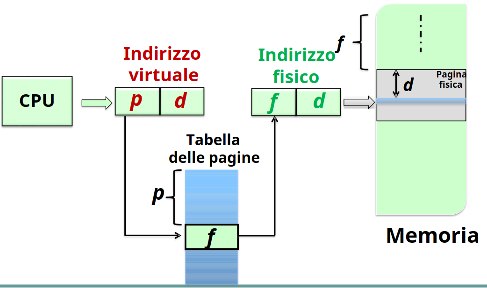</p>

L'MMU valuta in che posizione si trova l'indirizzo base della pagina identificata da `p` e utilizza tale indirizzo `f` sommato all'offset `d` per ottenere la traduzione in indirizzo fisico.

Ovviamente saranno presenti condizioni che bloccano i casi in cui si eccede dalla tabella delle pagine con `p`.

### Tabella delle pagine

La tabella delle pagine ha una riga per **ogni pagina virtuale** del **processo**.

All'interno di questa riga sono contenuti:

- indice della **pagina fisica**,
- **bit di gestione** (permessi di accesso, etc.).

Ovviamente quando si tenta di operare su una pagina l'MMU verifica che il programma non violi i permessi presenti su tale.\
→ in caso di violazione solleva un **page fault**.

<p align='center'>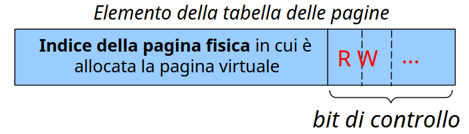</p>

La tabella delle pagine è in **memoria principale**.\
La MMU usa 2 registri utilizzarla:

- **PTBR** (Page-Table Base Register):
  indirizzo fisico della tabella delle pagine in memoria fisica.
- **PTLR** (Page-Table Length Register):\
  dimensione della tabella delle pagine.

Questi due valori sono contenuti all'interno del PCB di ogni processo e vengono caricati in tali registri ogni volta che avviene un **contex switch**.

<p align='center'>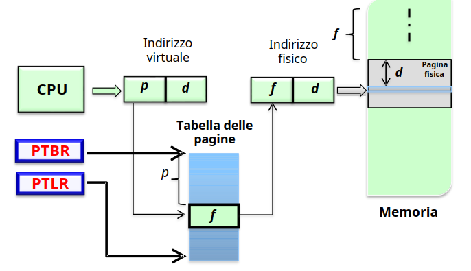</p>

### architettura di paginazione con TLB

Per accedere ad ogni singolo dato nella memoria quindi servono **due accessi**.

1) per **leggere la tabella delle pagine**
2) per **accedere al dato/istruzione** vero e proprio

Questo provoca un **rallentamento** degli accessi a memoria.

Per **migliorare l'efficienza**, si usa una **cache associativa** detta **TLB** (Translation Look-aside Buffer) che si trova all'interno dell'MMU.

La ricerca di un valore in tale cache associativa ha complessità O(1) → costante.

<!-- @todo da chiedere perché è lineare -->
<p align='center'>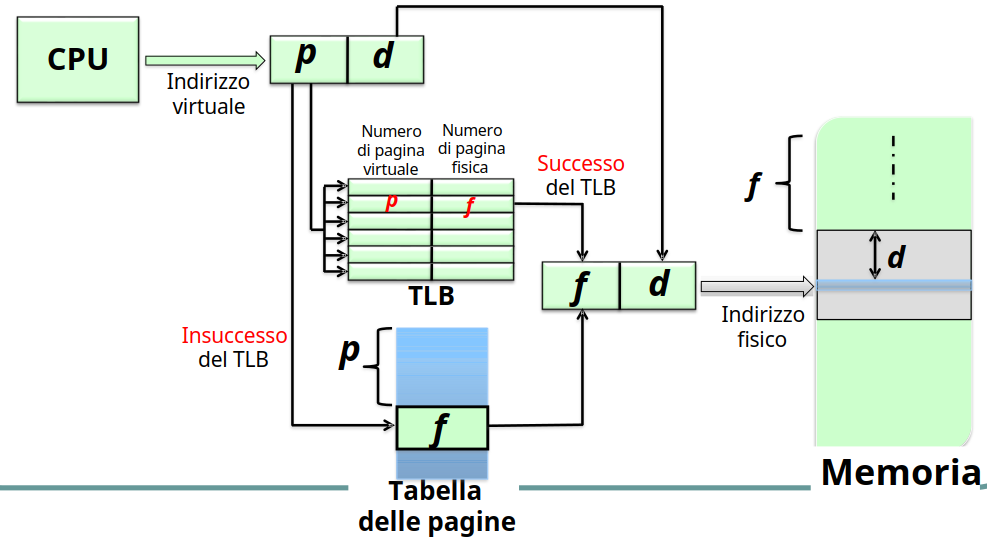</p>

- Si possono verificare due situaizioni:
  - L'accesso alla TLB produce un cache hit, quindi subito ho l'entry point della pagina in memoria fisica, tale operazione richiede nanosecondi.
  - L'accesso alla TLB produce un cache miss, quindi la ricerca passa sulla tabella delle pagine, tale operazione richiede decine di nanosecondi.

  In ogni caso dovrò fare più di un accesso per ottenere il dato/istruzione nella memoria fisica.

#### Tempo effettivo di accesso

**Tasso di successo** (hit ratio, **ɑ**): percentuale di volte che un numero di pagina virtuale si trova nel TLB.

Supponiamo che:

- Lookup associativo = **ε** unità di tempo
- Un accesso alla memoria = **ĸ** unità di tempo

Allora il **tempo effettivo d'accesso** (*effective access time*):

$$EAT = (ĸ + ε)ɑ + (2ĸ + ε)(1-ɑ) = (2-ɑ)ĸ +ε$$

Dove la prima parte indica il tempo in caso di successo mentre la seconda indica il tempo in caso di insuccesso.

Questo *EAT* è il **tempo medio che un sistema impiega per accedere alla memoria**, tendendo conto sia degli **hit cache** che dei **miss cache**.

#### Dimensione della tabella delle pagine

La scelta della dimensione della pagina influenza molto l'efficienza, per questo è necessario che si trovi un gusto compromesso per sistemi general porpose.

Supponendo di avere un sistema che valuta indirizzi a `32bit`.
→ Lo spazio totale di indirizzamento:  \\(2^{32} = 4\\)GB.

Usando pagine di \\(1\\)KB (\\(2^{10}\\)):

- **dimensione** della tabella: \\(2^{22} = 4\\)MB → ⚠️​
- **frammentazione interna** media: \\(\frac{2^{10}}{2} = 0.5\\)KB → 👍🏿

Usando pagine di \\(64\\)KB (\\(2^{16}\\)): 

- **dimensione** della tabella: \\(2^{16} = 64\\)KB → 👍🏿
- **frammentazione interna** media: \\(\frac{2^{10}}{2} = 0.5\\)KB → ⚠️​

Come si può notare la scelta di una dimensione o del numero di pagine influenza l'altra grandezza.

→ bisogna scegliere una **dimensione di pagina** che abbia un buon **compromesso** tra i due valori.\
→ Il compromesso è tra **frammentazione e performance**. Perché aumentato il numero di pagine riduco la frammentazione ma diminuisco le performance poiché il SO deve gestire un grande numero di pagine; invece diminuendo il numero di pagine aumento la frammentazione interna media per ogni pagina.

### Validità delle pagine virtuali

Raramente un processo usa tutto il suo spazio di indirizzamento virtuale.\
→ quantità di memoria usata tipicamente da una applicazione desktop si aggira intorno: ~\\(100\\)MB. (single process)

Lo spazio virtuale che un processo potenzialmente può utilizzare è pari all'intero spazio di indirizzamento: se ho `16bit` per indirizzo → \\(4\\)GB

<p align='center'>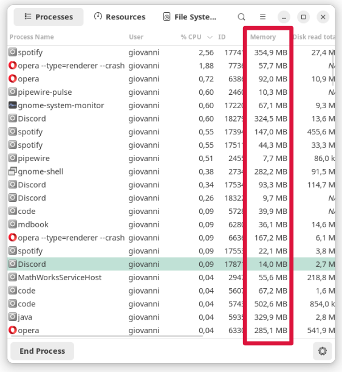</p>

In realtà alcune delle pagine all'interno dello spazio virtuale allocato, non sono veramente utilizzate.

→ tra i bit di controllo possiamo aggiungere un *validity bit*.

Quindi il SO può marcare le pagine **virtuali in uso** usando tale bit nella tabella delle pagine.

> il bit di validità so riferisce alle pagine virtuali → infatti ogni entry point della tabella delle pagine identifica una pagina virtuale.

Il bit di validità viene attivato nel momento in cui la pagina è **allocata** dal processo (es. tramite `malloc()`).

<p align='center'>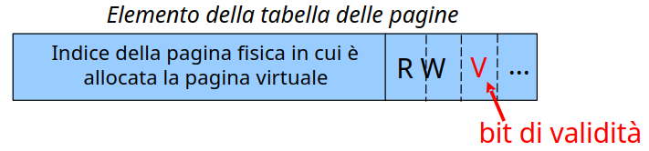</p>

Supponendo che all'interno della page table sono contenute tutte le possibili pagine che un processo può utilizzare. → copre l'intero spazio di indirizzamento.

Allora potremmo avere due casistiche nel momenti in cui un processo genera un indirizzo virtuale la cui parte che **identifica il numero** di pagina non è associato a nessun frame fisico.\
Le cause di questa situazione sono dovute al fatto che:

- la pagina potrebbe esser stata swappata V = 0;
- l'indirizzo virtuale non appartiene ad alcuna regione di memoria valida del processo.


<p align='center'>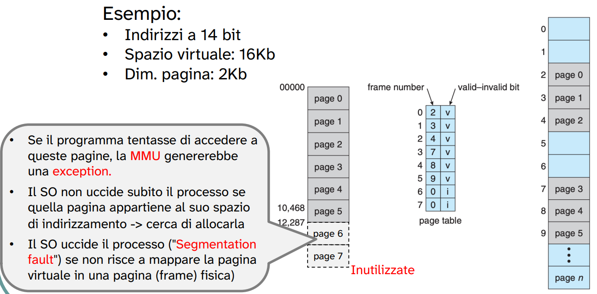</p>

La MMU genera quindi genera una **exception** (page fault).

- Il SO non termina subito il processo se la pagina appartiene al suo spazio di indirizzamento, infatti viene eseguita l'ISR per gestire il page fault che cerca di allocarla dalla memoria secondaria.
  - Il SO termina il processo solo le il risultato del page fault handler non mappa la pagina virtuale in una pagina fisica → perché non è stata trovata nella memoria secondaria.
  - Oppure se l'operazione che il processo tenta di fare su tale area non è valida secondo i permessi descritti su questa.

Cosa accede durante un **contex switch**

<p align='center'>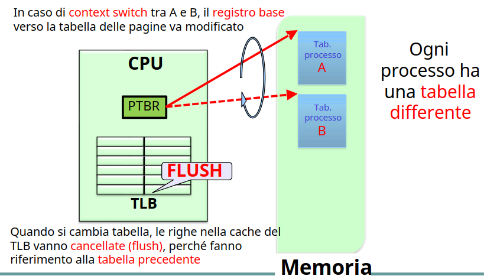</p>

- La TLB viene popolata a **run-time** → inizialmente saranno presenti solo page fault che porsano al SO a ricaricare le pagine in memoria principale.

Oltre al bit di validità è presente un ulteriore bit di controllo: il *dirty bit*.

Questo dirty bit è legato al fatto che la pagina **è stata scritta** durante la sua permanenza in memoria fisica.

Quando un processo **scrive** in una pagina fisica, la MMU setta automaticamente il dirty bit a \\(1\\).\
Questo bit indica che il contenuto della pagina **non coincide più** con la copia originale presente su disco. → tale informazione ha un implicazione durante lo **swap-out**.

- Se il dirty bit = 1, significa che la oagina contiene modifiche **che devono essere salvate nello swap**, altrimenti andrebbero perse.
- Se il dirty bit = 0, significa che la pagina **non è stata modificata** e che **esiste già una copia valida** della pagina su disco (es. nell'eseguibile del processo, è stata già salvata precedentemente).

Per il meccanismo di coerenza caching, si deve garantire la coerenza tra memoria grande e memoria piccola.

### Struttura della tabella delle pagine

Bisogna capire quale struttura sia più adatta a contenere la tabella delle pagine al fine di risolvere diverse problematiche:

**Problemi**: le tabelle delle pagine:

- hanno grosse dimensioni
- sono numerose (una per ogni processo)
- sono "sparse" (poche pagine valide)

**Soluzioni**: per ogni problema

- Paginazione gerarchica → evita il problema della **grandezza**
- Tabella delle pagine basata su hash → evita il problema della **numerosità**
- Tabella delle pagine invertita → non si usa più (ideale per vecchi sistemi operativi)\
  → per evitare il problema della **sparsità**

#### Paginazione gerarchica

Suddivisione della tabella delle pagine in parti più piccole, secondo una **organizzazione **gerarchica****.

- La MMU divide l'indirizzo di pagina in più parti (\\(p_1,p_2)\\), tante quanti sono i livelli di gerarchia.
- Nella tabella di primo libello, trova l'indirizzo della tabella di secondo livello, e così via.
  
---

>Nota: la MMU **impiega più tempo per attraversare la tabella gerarchica** (aumentano i tempi di accesso).

Vediamo il motivo di questo tempo aggiuntivo per attraversare la memoria: (2 livelli di gerarchia)

indirizzo virtuale: \\((p_1, p_2, offset)\\).

Il flusso sarebbe:

1) La MMU accede alla tabella di primo livello e usando \\(p_1\\) (**accesso a memoria**) ottiene l'indirizzo base della tabella di secondo livello.
2) La MMU accede alla tabella di secondo livello e usando \\(p_2\\) (**accesso a memoria**) ottiene il numero di frame corrispondente.
3) Infine, la MMU accede alla memoria principale nel frame trovaro e utilizza \\(offset\\) (**accesso a memoria**) per recuperare la casella desiderata.

Il motivo dell'aumento del tempo per attraversare la tabella è che la MMU ha bisogno di fare molti **più accessi a memoria fisica** per tradurre un **singolo** **indirizzo** **virtuale**.

Nel caso di paginazione semplice (ad un livello) il numero di accessi totali per operare la traduzione di un indirizzo virtuale è pari a 2.

1) Accesso alla page table
2) accesso alla memoria fisica

---

<p align='center'>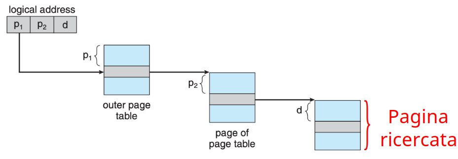</p>

- Con l'utilizzo di questa struttura si è risolto il problema della grandezza di una tabella delle pagine.

<p align='center'>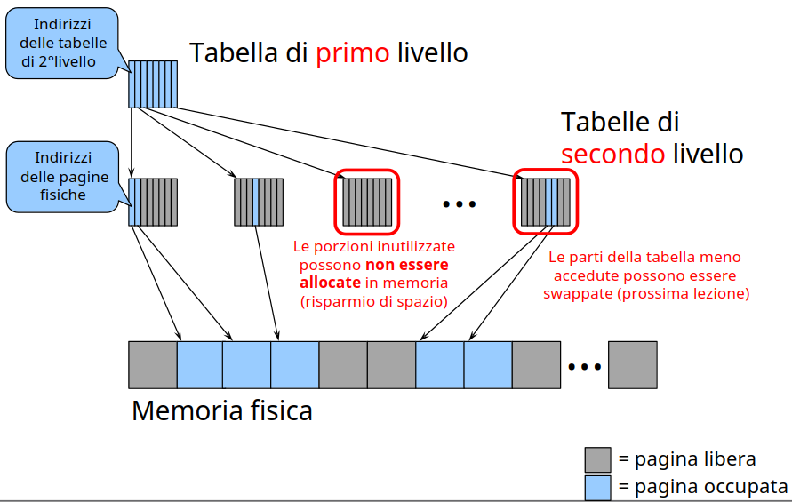</p>

- Linux utilizza 4 livelli gerarchici per la tabella delle pagine di ogni processo.
- Questa struttura serve **per evitare di allocare una struttura grande quanto tutto lo spazio indirizzabile dal processo**.\
  → sono presenti delle porzioni (tabelle intermedie) per cui è possibile evitare l'allocazione perché vuote

Le singole tabelle sono più piccole rispetto alla tabella non gerarchica.

ESEMPIO DI PAGINAZIONE A DUE LIVELLI:

Nella paginazione gerarchica, il "numero di pagina" nell'indirizzo virtuale viene **a sua volta suddiviso in più parti** (tante quante sono i livelli di gerarchia).

<p align='center'>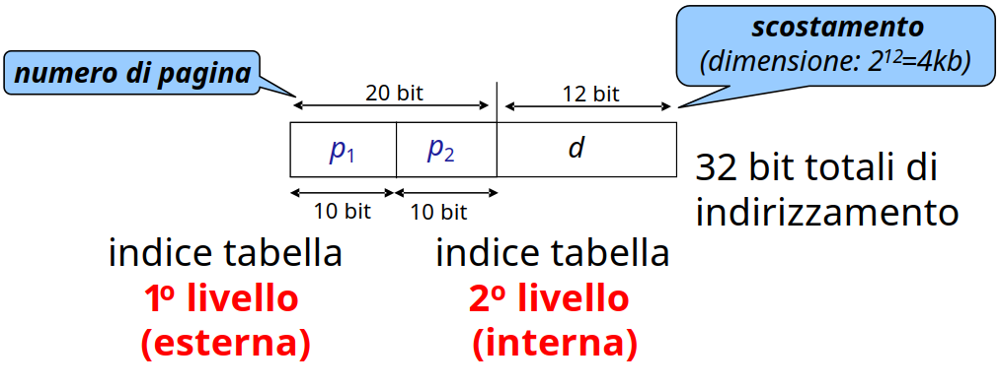</p>

### Tabelle delle pagine basate su hash

Le righe della tabella delle pagine sono organizzate utilizzando una **lista concatenata (linked list)**.

- Si memorizzano esclusivamente le righe per le pagine valide.
- Otteniamo quindi un ulteriore **risparmio di memoria**, ma ciò **rallenta la ricerca** (occorre scandire la linked list, ricerca basata sul contenuto).

Per ottimizzare i tempi di ricerca, si dividono le righe su **tante liste concatenate** di **piccole dimensioni**.

- Una funzione di hash è applicata al numero della pagina virtuale.
- Gli elementi (entry) con lo **stesso valore della funzione di hash** sono **collocati** nella **stessa** **lista** **concatenata**.

<p align='center'>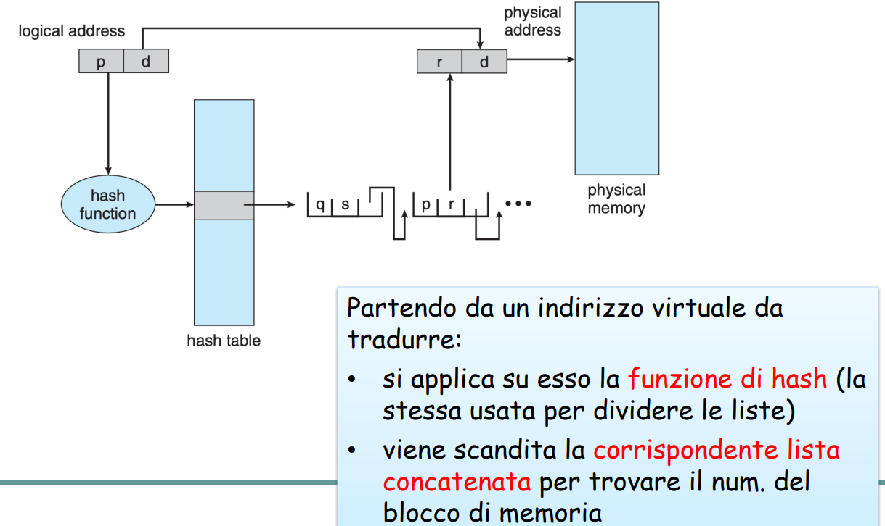</p>

- Dopo l'applicazione della funzione di hash sul numero di pagina, che si trovava nell'indirizzo virtuale, si individua una delle \\(M\\) pagine (liste concatenate).
- Dove \\(M < N\\) perché la funzione di hash procude delle collisioni (\\(N\\) è il numero di pagine totali).
- Dopo aver individuato la lista concatenata si cerca all'interno di questa il numero di pagina che identifica la pagina fisica in cui è mappata la pagina virtuale.

Ovviamente in questo approccio la lunghezza delle liste concatenate è contenuto rispetto al caso in cui abbiamo solo una lista concatenata di tutte le pagine associate ad un processo.

### Tabella delle pagine invertita

Negli schemi precedenti esiste **una tabella distinta per ogni processo**.

In questo approccio, **tabella delle pagine invertita**, si hanno queste caratteristiche:

- **Una** sola tabella delle pagine **comune a tutti i processi**.
- Questa tabella ha un elemento per **ogni pagina fisica**.
- Ogni elemento contiene l'indirizzo **virtuale** della pagina memorizzata **in quella locazione fisica**, con informazioni sul processo detentore della pagina.

<p align='center'>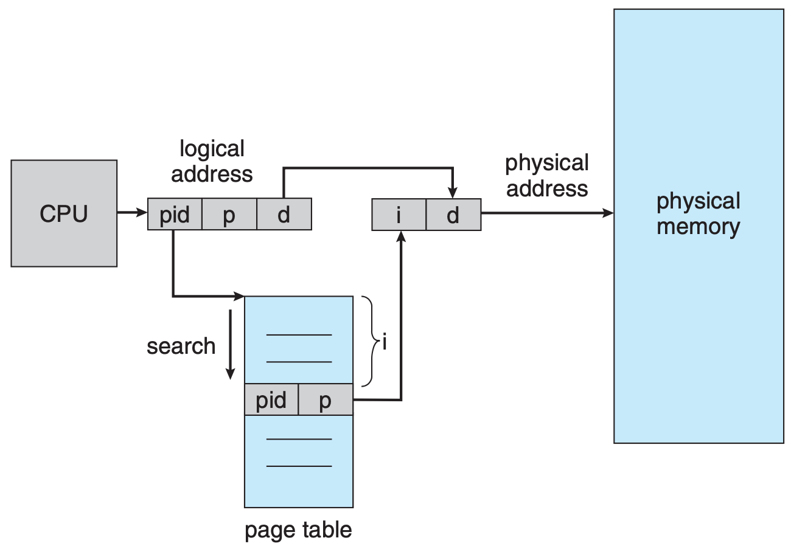</p>

Una sola è la tabella delle pagine → globale.

Il numero di righe è pari al numero di pagine fisiche (invece che virtuali).

- Ogni entry della tabella contiene il PID, del processo che possiede la pagina fisica, e l'indirizzo virtuale di tale pagina.
- Una volta trovata la riga corrispondente si valuta l'offset rispetto l'indirizzo di base della tabella delle pagine invertita.\
  Tale offset corrisponde alla prima parte dell'indirizzo fisico della pagina in memoria fisica.

  Infatti l'ultima operazione è quella di inserire l'offset nella parte dell'indirizzo virtuale in cui è presente il numero di pagina e il PID.

In questo approccio risparmiamo la numerosità delle pagine, oltre al fatto che queste non sono più sparse nella memoria fisica. → si può sfruttare il principio di località.

### Segmentazione paginata

Utilizzata in Linux.

<p align='center'>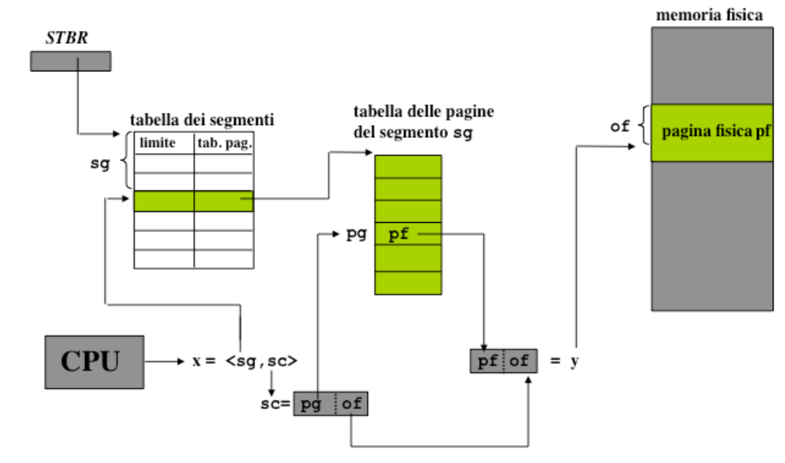</p>

In questa soluzione si utilizza principalmente una paginazione con il supporto hardware.

Ma a livello software si sfruttano tutti i vantaggi della segmentazione:

- condivisione dei segmenti
- granularità fine per l'assegnazione dei permessi → protezione delle aree di memoria
- dimensione variabile dei segmenti

Questa tabella dei segmenti viene risolta in software, mentre la tabella delle pagine viene risolta in hardware sempre dall'MMU.

La **tabella dei segmenti** è unica **per ogni processo**.\
La **tabella delle pagine** è unica per **ogni segmento del processo**.

Quindi per ogni segmento avremo una tabella delle pagine in cui sono mappate le pagine virtuali corrispondenti a tale segmento in pagine fisiche.

Quando il processore utilizza un indirizzo virtuale `x = <sg, sc>`, `sg` identifica un segmento all'interno della tabella dei segmenti.\
Una volta ottenuto l'indirizzo base della tabella delle pagine per il segmento identificato precedentemente, viene utilizzata l'altra parte dell'indirizzo virtuale `sc` per identificare la pagine fisica.

→ si utilizza `sc` come offset rispetto l'indirizzo base della tabella delle pagine.

A questo punto, ottenuta l'indirizzo base della pagina fisica, si somma a questo l'offset `of` per ottenere l'indirizzo fisico a cui il processo fa riferimento.

Ovviamente durante tutto questo processo si devono verificare le condizione che non causino inconsistenze tra i processi, come le condizione di limite con `STBL` e `PTLR`.

>Quindi nella tabella dei segmenti individuo l'*entry point* che fa riferimento alla tabella delle pagine per quel segmento.

