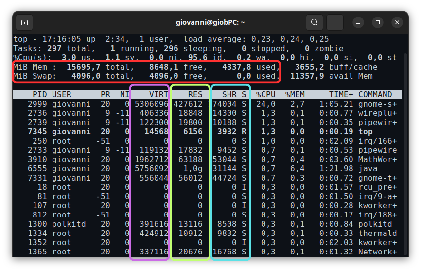
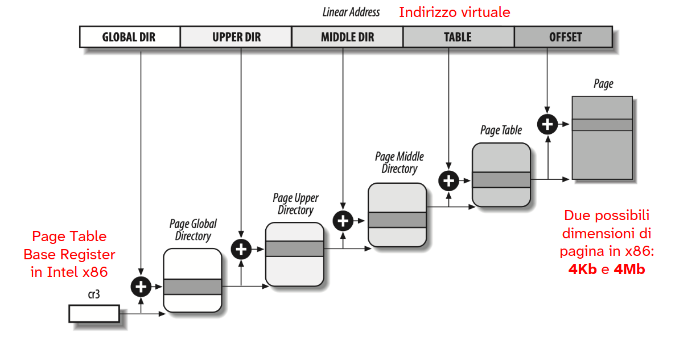
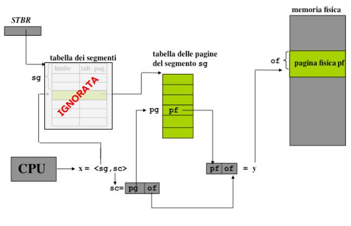
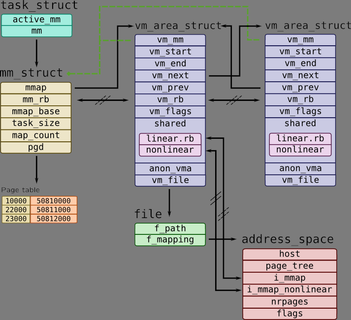
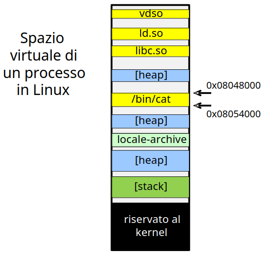
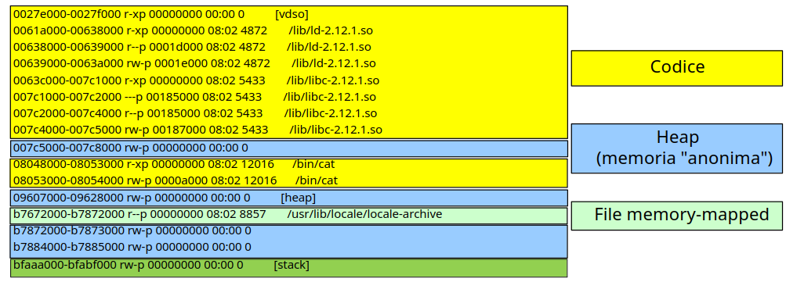
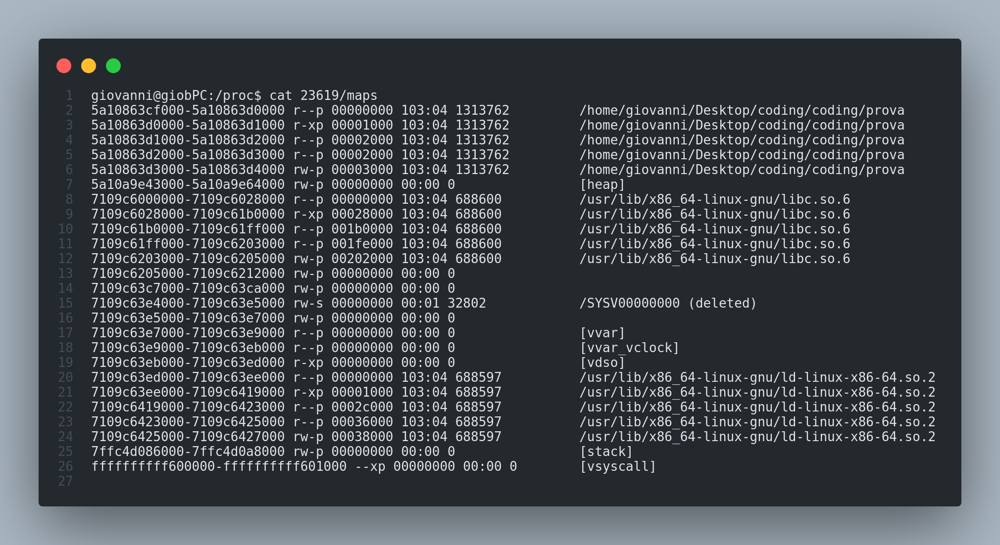
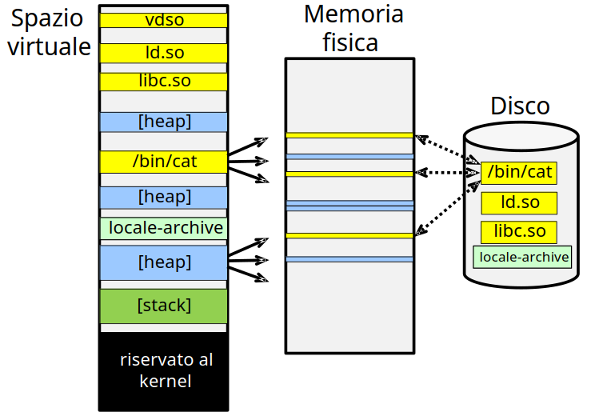

# Gestione della memoria in Linux

Con l'uso di `top` possiamo avere info sull'utilizzo di memoria fisica utilizzata e la dimensione degli spazi di indirizzamento di ogni processo.

- <b>Memoria RAM e SWAP del sistema, il loro utilizzo e la quantità libera</b>

- <b>Spazio di indirizzamento utilizzato dal processo</b>

- <b>Memoria "residente", ovvero lo spazio occupato in RAM dal processo</b>

- <b>Pagine condivise dai processi (es. codice librerie)</b>

Linux utilizza una gestione della memoria del tipo **paginata** e **segmentata**.

- Paginazione: la memoria è suddivisa in piccole unità chiamate *pagine* che possono essere mappate in memoria fisica.
- Segmentazione: è una tecnica più vecchia, ma non più utilizzata in modo prevalente nelle versioni moderne, ma offre diversi vantaggi rispetto la paginazione che si intendono sfruttare.

Una delle caratteristiche di Linux è la sua **portabilità**, ossia capacità di girare su più architetture diverse. Tale gestione della memoria infatti è fatta per essere compatibile con diverse piattaforme hardware, rendendo il sistema operativo glessibile e adattabile a veri tipi di dispositivi

Infatti tale gestione della memoria è supportata anche per sistemi con grandi quantità di memoria (NUMA) e multi-processore (SMP).

Linux sfrutta la paginazione gerarchica per mantenere le tabelle delle pagine. Questa gerarchia solitamente è su 4 livelli, infatti ogni indirizzo virtuale (o lineare) è suddiviso logicamente in campi ognuno dei quali identificano un offset per la tabella della pagine di un livello.

ESEMPIO DI TRADUZIONE DI UN INDIRIZZO VIRTUALE:

Ogni pagina ha una dimensione fissata che può esser modificata all'atto della compilazione del kernel.

Tipicamente, le due dimensioni possibili in `x86` sono `4KB` e `4MB`. Per Linux di default ogni pagina ha una dimensione di `4KB`.

Per riferirci alla prima tabella delle pagine che si trova al livello più basso sfruttiamo l'indirizzo virtuale mantenuto all'interno del *controll register*, che per `x86` è il register 3.

Questo registro viene popolato all'atto del **context switch**, ogni processo ha associata la propria gerarchia di tabelle di pagine. Essendo una caratteristica direttamente legata al processo, tale indirizzo è contenuto all'interno del descrittore, che in Linux è chiamato `task_struct`.

## Spazio di indirizzamento virtuale

Le nuove versioni di Linux **non si avvalgono del processore per la segmentazione**, ovvero non utilizzano il **meccanismo di segmentazione** fisico implementato dentro la **MMU**.

Per motivi di:

- portabilità
- efficienza del context switch e traduzione degli indirizzi

<!-- @todo capisci perché non è portabile -->

Viene quindi utilizzata una paginzazione segmentata in cui la segmentazione è implementata via software. In modo da sfruttare i vantaggi di questa.

La memoria è organizzata in **Virtual Memory Areas** (***VMA***) che consiste nell'unità di virtualizzazione della memoria.

Ogni VMA rappresenta un **blocco contiguo** di **memoria** **virtuale** e corrisponde ad un segmento.

Quindi possiamo avere VMA, **ovvero pagine virtuali contigue**, contenenti codice, stack, librerie, ... .

Ogni VMA è **tipizzata** per il **contenuto**, come avviene per i segmenti. Inoltre per ognuna possiamo gestire i permessi, per tipologia di pagina.

Quindi possiamo avere una **maggiore granularità** per gestire l'accesso ai blocchi contigue rispetto alla paginazione in cui la granularità era più fine.

Ciò mi permette di proteggere e condividere porzioni dello spazio di indirizzamento in base al suo contenuto.

## Struttura di una VMA

Una VMA è gestida dal kernel mediante una struttura dati che contiene tutte le informazioni necessarie. Il puntatore a tale struttura è contenuto all'interno del descrittore del processo.

- `mm_struct` è la struttura del kernel di Linux che rappresenta la **gestione della memoria virtuale di un processo**.
- Ogni `vm_area_struct` rappresenta una Virtual Memory Area. Ognuna ha un insieme di permessi e la posizione nello spazio di memoria virtuale.
- Ogni `vm_area_struct` è associata ad un blocco contiguo di memoria .contenente dati di una specifica categoria. 
- Inoltre ogni struttura per le VMA punta alla successiva.

Le pagine `anonymous` sono quelle che non sono associate a nessun file esterno, ovvero in memoria di massa. Quindi all'atto della terminazione del processo, il contenuto di tali aree viene perso.

Invece le pagine abbinate ad un file sul disco sono dette `memory-mapped`

- `vm_file` si riferisce al file presente in memoria di massa, quindi non è contenuto nelle VMA anonime.
- All'interno della `mm_struct`, che rappresenta l'intera memoria virtuale, è presente anche il puntatore alla **page table** che il processo in questione: `gpd`.

ESEMPIO DI SPAZIO VIRTUALE DI UN PROCESSO IN LINUX

- Ogni VMA ha un range e una tipologia che identifica il contenuto.
- Gli indirizzi che vengono utilizzati sono indirizzi lineari o virtuali.
- C'è sempre la presenza, per ogni memoria virtuale di un processo, una **porzione riservata al kernel**.

Possiamo visualizzare la disposizione delle VMA all'interno della memoria virtuale utilizzando le informazioni contenute all'interno dello pseudo-filesystem `proc`.

Utilizzando infatti `cat /proc/<PID>/maps` otteniamo una cosa del genere:

- In questo caso non sono presenti VMA condivise tra processi.
- Tutti gli indirizzi presenti sono sempre virtuali.

Con VMA condivise tra processi:

Vediamo come possono essere mappate tali pagine virtuali in pagine fisiche in memoria fisica:

Come possiamo vedere le pagine virtuali della VMA `/bin/cat` nella memoria fisica non sono allocate in maniera contigua.

Inoltre tali pagine sono `memory-mapped`, quindi è presente una loro copia in memoria di massa.

Lo stesso non si può dire per le pagine fisiche che corrispondono allo **heap** del processo.

<!-- @todo continua... slide 149 -->

// TODO: continua.