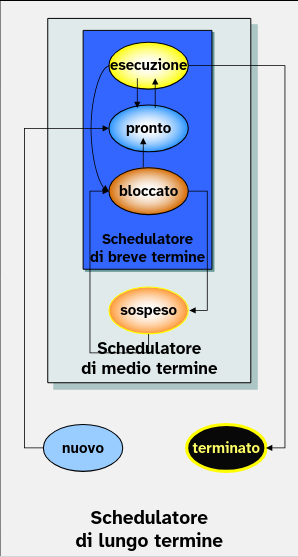
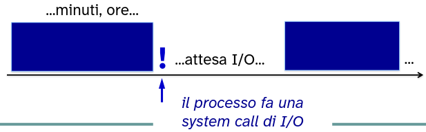
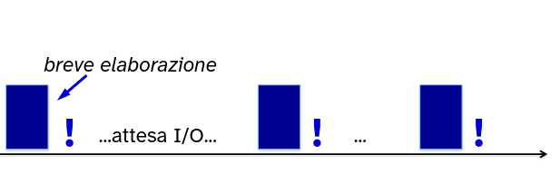

# Scheduler

Con il termine *short term scheduler* si intende quella funzione del nucleo che ha il compito di gestire l'allocazione della CPU ai processi che si trovano nella coda dei processi pronti.

In generale, lo *sheduler* è quella parte del SO preposta all'assegnazione di risorse a favore dei processi richiedenti.

La selezione tra i processi richiedenti (coda dei relativi PCB) nella coda può avvenire mediante differenti criteri, a seconda **dell'algoritmo di scheduling** che implementa uno schedulatore.

Questo è un compito fondamentale per tutti i sistemi multiprogrammati in cui c'è la necessità di un efficiente gestione delle risorse condivise disponibili per tutti i processi attivi e che eseguono in modo concorrente.

Inoltre gli sheduler sono i componenti più caratterizzanti del sistema operativo, infatti da questa si possono identificare le caratteristiche e gli obiettivi per cui è stato progettato.

Dal punto di vista dell'esecuzione dei processi abbiamo diversi scheduler ognuno che si occupa di svolgere un particolare compito:

- *long term scheduling* o di job
- *medium term scheduling* o di swap
- *short term scheduling* o della CPU

## Scheduling a lungo termine

Con **sheduling a lungo termine** si intende quella funzione del sistema operativo che, in un sistema di tipo batch, sceglie tra tutti i programmi caricati in memoria di massa per essere eseguiti, quelli da trasferire in memoria centrale e da inserire nella coda dei processi pronti.

Quindi controlla il **grado di multiprogrammazione** del sistema.

Le sue scelte, in genere, vengono fatte in modo da equilibrare la presenza in memoria centrale di processi caratterizzati da prevalenza di operazioni di elaborazione (CPU bound) e di processi caratterizzati da prevalenza di operazioni di ingresso e uscita (I/O bound).

In modo da distribuire il carico in modo ottimale su tutte le risorse disponibili.

Troppi processi I/O bound → la coda dei processi pronti è sempre quasi vuota

Troppi processi CPU bound → i dispositivi I/O sarebbero poco utilizzati

I possibili criteri su cui si può basare la scelta dello scheduler a lungo termine sono:

- FIFO
- Priorità
- Tempo di esecuzione stimato
- Requisiti di I/O → processi I/O bound
- Tempo presunto di CPU → processi CPU-bound

## Scheduling a medio termine

Lo **scheduling a medio termine** rappresenta invece quella funzione del sistema operativo che ha il compito di trasferire temporaneamente processi dalla memoria centrale alla memoria di massa (*swap-out*) e viceversa (*swap-in*).

Questa funzione è necessaria, in caso di RAM prossima alla saturazione, di liberare parte della memoria centrale necessaria ad altri processi già presenti o per rendere possibile il caricamento di nuovi processi.

Il suo obiettivo è quello di **migliorare** **l'efficienza** nell'utilizzo della risorsa **memoria**.

Se questa gestione dei trasferimenti di processi verso e da la memoria di massa non è fatta in modo efficiente si verificherebbero molte operazioni di I/O per spostare i processi tra le memorie.

- ad esempio nel caso in cui due processi si trovino a collaborare e quindi l'esecuzione dell'uno dipende dall'esecuzione dell'altro;
- supponiamo di avere implementato due processi che operano su una memoria condivisa secondo il paradigma produttori consumatori
- se il produttore venisse sempre swappato in memoria di massa, allora questo poi dovrà esser reintrodotto in memoria centrale per permette al consumatore di consumare la risorsa.

---

Entrambe le funzioni di long term scheduling e medium term scheduling vengono eseguite dal sistema operativo con una frequenza nettamente inferiore a quella della short term scheduling.

Quindi possono risultare meno costose in termini di tempo di esecuzione e quindi non inficiare molto sulle performance del sistema.

Invece la funzione di short term sheduling è eseguita molto frequentemente, ad ogni context switch, in modo da rendere l'esecuzione di più processi fluida, dando l'impressione che siano eseguiti in parallelo all'utente.

Quindi deve essere una funzione su cui porre l'attenzione per la ottimizzazione, poiché inficia molto sulle performance generali del sistema.

Possiamo dire che tra gli scheduler è quello più caratterizzante del SO.

## Processi CPU bound e I/O bound

- Processi **CPU-bound**
  - poche chiamate di sistema
  - tendono ad occupare la CPU per lunghi periodi (se il SO non li interrompe)
  - tipico delle applicazioni batch, calcolo numerico

- Processi **I/O-bound**
  - fanno frequenti chiamate di sistema
  - usano brevemente la CPU, per poi mettersi subito in attesa di I/O
  - tipico dei programmi **interattivi** (es. browser, editor di testo, ...)

## Scheduler a breve termine

Lo scheduler a breve termine, conosciuto anche con il nome di **dispatcher**, è lo scheduler che viene attvato più frequentemente nel sistema.

Ha il compito di **scegliere a quale tra i processi pronti** assegnare la CPU.

Lo scheduler a breve termine viene invocato all'occorrenza di un evento che comporta la sospensione del processo in esecuzione.

Tali eventi sono per esempio:

- interruzioni del Clock (timer)
- interruzioni di I/O
- system call
- segnali (ad esempio semafori su cui erano sospesi per la cooperazione)

L'obiettivo dell'algoritmo del **Dispatcher** è quello di allocare il processore in maniera tale da ottimizzare uno o più aspetti del comportamento del sistema.

I criteri più utilizzati sono:

- User-oriented
  
  Si riferiscono ai comportamenti del sistema così come **percepiti dall'utente o da un processo**.

  → Ad esempio il tempo di risposta.
- System-oriented
  
  L'obiettivo è quello di **utilizzare in modo efficiente il processore**.

  Quindi massimizzare l'utilizzo della risorsa processore.

  → Ad esempio migliorare il throughput di esecuzione.

Ovviamente il comportamento del sistema comprende diverse caratteristiche possibili che possono essere ottimizzate.

Ma molte di queste fanno in conflitto.

Infatti enfatizzando le caratteristiche del sistema operativo che portano a massimizzare il thoughput del processore si attenuano le caratteristiche che si riferiscono alla percezione dell'utente o dei processi utente, come ad esempio il tempo di risposta.

Quindi non esiste un algoritmo universale a cui aspirare per ottenere il meglio in tutti i campo possibili. Ma esistono i migliori algoritmi rispetto agli obiettivi di progetto scelti per la realizzazione del SO.

### Parametri User-oriented

- **Tempo di turnaround**: **intervallo** di **tempo** che trascorre dall'istante in cui un processo è ammesso nel sistema all'istante della sua terminazione.

  Tiene conto del **tempo effettivo di esecuzione** e **del tempo speso in attesa delle risorse** (CPU inclusa).
- **Tempo di risposta**: indica il tempo che trascorre dall'istante della ammissione nel sistema (quindi quando entra nella coda dei processi pronti per la prima volta) all'istante in cui fornisce la prima risposta.
- **Deadlines**: nel caso in cui si possa specificare per ogni processo il termine di completamento (deadline), l'algoritmo dello scheduler a breve termine deve seguire una metrica che porta a **massimizzare la percentuale scadenze raggiunte**.
- **Tempo di servizio**: è il tempo di esecuzione "puro" del processo, cioè quanto tempo serve al processo per terminare se avesse la CPU tutta per sé, senza interruzioni o attese. 
- **Slowdown** è il rapporto tra il *tempo di turnaround* e il *tempo di servizio*.
  
  Misura quanto un processo è stato rallentato dal sistema rispetto al tempo che avrebbe impiegato se fosse stato eseguito da solo, senza attese.

  Un valore pari ad `1` indica che il processo ha avuto esecuzione immediata (nessuna attesa).

### Parametri System-oriented

- **Throughput**: misura la **produttività** di un sistema in termini di **numero di processi terminati per unità di tempo**.
  
  Questo parametro **dipende** fortemente dalla **lunghezza media di un processo** ma è anche **influenzato** dalla particolare **politica adottata per la schedulazione**.
- **Utilizzo della CPU**: rappresenta la percentuale di tempo per cui il processore risulta occupato.
  
  L'obiettivo è di massimizzare la percentuale d'uso della CPU nell'unità di tempo.
- **Fairness**: misura quanto i processi attivi nel sistema, che quindi sono pronti ad eseguire o sono bloccati in attesa di un evento asincroni, sono **trattati equamente in termini di schedulazione**.
  
  Questo parametro esclude qualsiasi concetto di priorità dei processi all'interno del sistema.

  → evita che ci siano situazioni di starvation per un processo.

## Esiste un algoritmo perfetto?

- Naturalmente NO!

Ovviamente i parametri descritti che riguardano l'User-oriented e il System-oriented sono interdipendenti tra loro ma alcuni sono nettamente in contrasto.

Ad esempio ottenere una politica *fair* non mi garantisce una massimizzazione dell'*utilizzo della CPU* o il *deadlines*.

Mentre ottenere una politica che va verso la minimizzazione del *turnaround time* porta anche un miglioramento del *tempo di risposta*.

> Il progetto e l'implementazione di una politica di scheduling implica sempre un compromesso tra vari requisiti constrastanti.
>
> La scelta dovrà essere fatta tenendo conto "per cosa dovrà essere utilizzato il sistema".

## Utilizzo delle priorità

Lo scheduler può scegliere i processi in base alla loro priorità.

Le priorità assegnate ai processi possono essere:

- **Statiche**, se non si modificano durante il periodo di vita del processo nel sistema.
- **Dinamiche**, se durante il loro ciclo di vita i processi possono modificare la loro priorità in base ad alcuni parametri come: tempo di CPU o tempo di I/O.

I processi sono tipicamente raggruppati in **classi di priorità**

- L'algoritmo di scheduling dovrà scegliere un processo pronto che appartiene alla classe di priorità più alta.

## Starvation

L'utilizzo di un algoritmo di scheduling a priorità può indurre situazioni di **attesa indefinita** di processi a priorità più bassa (**starvation**).

Per far fronte a queste situazioni si utilizzano schemi di priorità dinamiche.

Come ad esempio, utilizzare un aumento graduale della priorità dei processi che si trovano in attesa nel sistema da lungo tempo → **Aging**.

---

EPISODIO esemplificativo dei problemi di starvation:

L'IBM 7094, un computer progettato per applicazioni scientifiche e tecnologia su larga scala, ha avuto il più eclatante problema di starvation.

Questo computer è stato utilizzato dalla NASA e per operazioni militari ed è stato introdotto nel 1962 e ha terminato il suo servizio nel 1973.

Quando è terminato il servizio gli utenti trovarono un processo a bassa priorità che fu ammesso nel sistema nel 1976 non è mai terminato perché nella coda dei processi pronti si presentavano ogni volta processi a priorità maggiore.

In questi casi la soluzione è quella di implementare la tecnica di Aging che consiste nel aumentare gradualmente la priorità di un processo in attesa sulla coda dei processi pronti rispetto ad alcuni parametri, come il tempo di attesa per ottenere la risorsa CPU.

## Classificazione relativa al momento in cui interviene lo scheduling

Una prima classificazione fra gli algoritmi di scheduling è relativva alla scelta di quali siano gli eventi in seguito ai quali lo scheduler deve intervenire:

- Si indicano come algoritmi di scheduling senza diritto di *revoca* (*non preemptive*) tutti quelli che prevedono l'intervento dello scheduler esclusivamente quando il processi in esecuzione libera spontaneamente la CPU, o perché termina la propria esecuzione o perché si sospende in attesa del verificarsi di un dato evento asincrono.
- Invece, vengono indicati come algoritmi con il diritto di *revoca* (*preemptive*) quelli che prevedono l'intervento dello scheduler anche per decidere di revocare la CPU al processo in esecuzione al fine di allocarla ad un altro processo in attesa sulla coda dei processi pronti.
  
  Per esempio a causa dell'arrivo di un segnale di interruzione che indica lo scadere del quanto di tempo assegnato al processo, oppure perché entra in coda dei processi pronti un processo ritenuto "urgente".

  In entrambi i casi il processo in esecuzione viene forzato a rilasciare la risorsa CPU preventivamente e inserito nella coda dei processi pronti.

Gli algoritmi *non preeptive* sono sicuramente quelli più semplici e riducono il numero delle volte che lo scheduler deve intervenire e quindi il **numero di cambi di contesto** fra processi. → Richiedono un minor *overhead* di sistema.

Allo stesso tempo sono anche quelli che non offrono una flessibilità in termini di strategie di scheduling.
  

