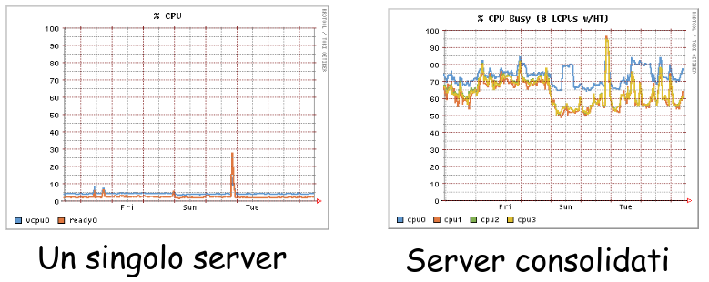
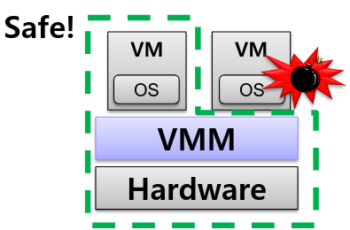
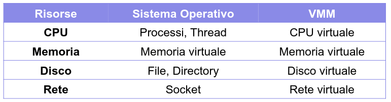
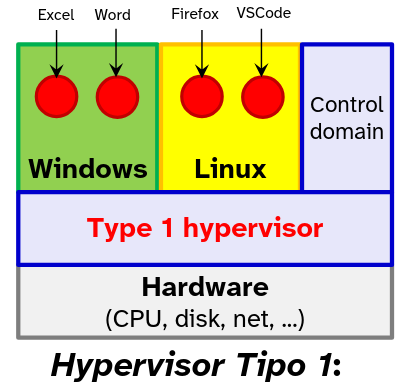
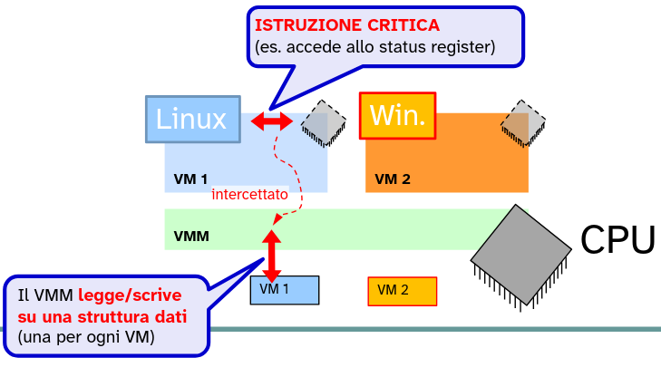
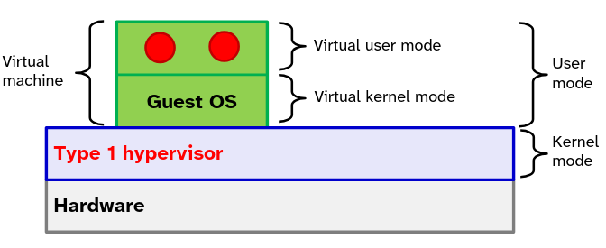
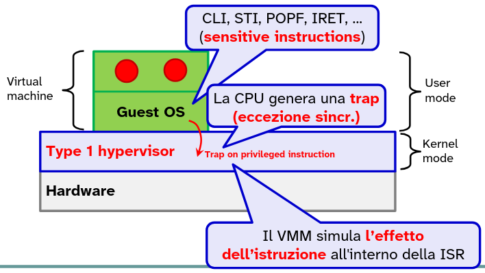
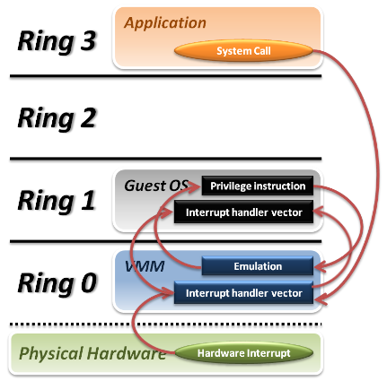

# Virtualizzazione

Una macchian **virtuale (VM)** è una emulazione (mediante tecniche sw/hw) di una macchina reale.

Ogni macchina virtuale esegue il proprio **sistema operativo** ed applicazioni.

Le VM sono gestite da una **virtual machine monitor (VMM)**, o **hypervisor**. Più macchine virtuali condividono le risorse fisiche della macchina su cui eseguono.

Su una stessa macchina reale possono coesistere diverse macchine virtuale attive che condividono le risorse di questa.

### Motivi che hanno portato all'utilizzo delle VM

- Performance
- Flessibilità
- Affidabilità
- Sicurezza

Per ottenere queste qualità sarebbe necessario isolare ogni applicazione in modo che una di queste vada in crash le altre non sarebbero influenzate.

Senza VM, il problema sarebbe che per ottenere questo isolamento usando solo hardware fisico, bisognerebbe comprare una macchina fisica per ogni singolo servizio.

Utilizzare tante macchine fisiche quanti sono i servizi oltre ad essere molto costoso è anche uno spreco di energia e spazio.

Utilizzando invece diverse VM, una per ogni servizio da eseguire, possiamo ottenere la caratteristica di isolamento e inoltre si riducono enormemente gli spazi e il costo necessario.

>Questa operazione è detta **consolidation**, ovvero raggruppare più macchine virtuali su un unico server fisico per ottimizzare l'uso delle risorse.

### Gestione di sistemi virtualizzati

Le macchine virtuali possono essere velocemente create, configurate, monitorate, migrate...

Attraverso strumenti software centralizzati.

### Efficienza

Avere più VM su una stessa macchina fisica (**workload consolidation**) permette di sfruttare appieno la capacità dell'hardware e di ridurre i consumi energetici.

### Flessibilità

Applicazioni **legacy**, basare su SO obsoleti e non più supportati, possono essere eseguite su macchine moderne.

Quindi questo eviterebbe il problema di continuare ad utilizzare macchine legacy unicamente per la loro compatibilità con l'applicazione che è in esecuzione su esse.

### Virtualizzazione e cloud computing

Il **cloud computing** permette lo outsourcing (spostare) di VM in centri di calcolo privati o di terze parti (**pat-per-use**).

Quindi invece di eseguire le macchine virtuali sui propri server in azienda, il Cloud Computing permette di spostare la loro esecuzione in centri di calcolo. → Non si paga più per l'hardware ma per l'utilizzo di risorse.

Questo riduce il costo della manutenzione e gestione dei server fisici per le aziende.

### Affidabilità e sicurezza

Le macchine virtuali permettono di isolare meglio le applicazioni, questo mi garantisce affidabilità e sicurezza.

- Un'applicazione compromessa o difettosa opera solo sulla VM isolata, e non può interferire con le altre VM su cui sono eseguiti altri servizi.
- Il VMM è l'unico componente **privilegiato** che può gestire l'hardware fisico e le macchine virtuali.

## Confronto tra VMM e SO

Il VMM, come il SO, fornisce una **astrazione** della macchina fisica su cui esegue

Il SO è già di per se un virtualizzatore dell'hardware (di risorse):

- concetto di processo
- concetto di file e directory attraverso il FS
- concetto di memoria virtuale
- socket
- ... 

"Container (Fine slide)"

L'astrazione offerta dal SO non è in senso stretto, perché quello che fa effettivamente un virtual machine monitor è quello di emulare completamente l'intera architettura virtuale su un'architettura fisica del tutto diversa.

Posso emulare un'architettura `arm` su una intel `x86` senza problemi, per il tipo di astrazione offerta da un VMM.

## Architetture principali di una hypervisor

- TIPO 1
- TIPO 2

1) Il VMM esegue su un "hardware nudo" (**bare-metal virtualizzation** o **server virtualizzation**).
   
   In questa architettura, il software di virtualizzazione è il padrone dell'hardware assoluto.

   Questo tipo di hypervisor viene molto utilizzato nei data center.

   L'architettura di tipo 1 ha migliori prestazioni perché non c'è un ulteriore layer (livello di indirezione) che divide il VMM dall'hardware, a differenza di ciò che accade nell'architettura di tipo 2

   

2) Il VMM esegue su un SO tradizionale (es. Windows), viene detta **hosted hypervisor**.
   
   Per comunicare con l'hardware il sistema operativo **guest** deve passare per l'hypervisor che a sua volta deve passare per il sistema operativo **host**.

   L'hypervisor è considerato per il SO host come un qualsiasi altro processo in esecuzione.

   Questo utilizzo facilita l'integrazione tra sistemi operativi, ad esempio, posso copiare file facilmente dal desktop dell'host dentro la macchina virtuale guest.

   Ha come svantaggio le performance perché ogni richiesta della VM deve attraversare due strati: l'Hypervisor e poi il sistema operativo host. 

   Consiste nell'architettura che utilizziamo con VMware Workstation/Fusion, Oracle VM VirtualBox.

In generale un hypervisor deve garantire di virtualizzare: 

- la CPU
- la memoria
- l'I/O

## Virtualizzazione della CPU

Le prime tecniche di virtualizzazione della CPU consistono nel far credere al kernel della macchina virtuale guest che il **processore virtuale** su cui opera **sia fisico**.

L'hypervisor deve quindi implementare un mapping 1:1 tra il processore da emulare e quello fisico su cui effettivamente viene eseguito il kernel guest.

Tutto quello che viene eseguito in kernel mode nel guest in realtà non è un vero e proprio kernel mode; in realtà è in user mode rispetto al sistema operativo host.

Quindi se per il sistema operativo host la macchina virtuale non è altro che un semplice processo, deve essere l'hypervisot ad astrarre completamente un macchina fisica per il kernel guest.

L'hypervisor deve quindi intercettare delle "istruzioni critiche" (**sensitive instructions**)

L'hypervisor deve intercettare le istruzioni critiche che necessitano di un grado di privilegio superiore che la VM non ha. C'è la necessità di emulare questa istruzione.

### De-privileging

Primo meccanismo che deve essere implementato all'interno degli hypervisor.

Tale concetto consiste nel "degradare" o togliere i privilegi al SO ospite, spostandolo a un livello di esecuzione inferiore rispetto a quello a cui è abituato a girare, ovvero spostarlo in user mode.

- La VMM (hypervisor) gira nel vero **kernel** **mode**. È l'unico che ha il controllo diretto e privilegiato dell'hardware fisico
- Il guest SO viene spostato in **user mode** completamente. Quindi quanto il guest SO pensa di operare in kernel mode in realtà di trova ancora in user mode, e chiamiamo questo livello di privilegio **virtual kernel mode**

Ovvero:

- VMM → kernel mode
- VM → user mode, dentro cui:
  - → guest SO è in virtual kernel mode
  - → i processi del guest SO sono in virtual user mode

Per permettere al guest SO di operare in kernel mode, un primo meccanismo che si può sfruttare è quello delle trap: nel momento in cui il guest esegue delle istruzioni privilegiate/critiche, allora la CPU virtuale genera una **trap**.

Questo meccanismo è detto: **TRAP-AND-EMULATE**.

Questa trap viene intercettata dall'hypervisor, elabora il tipo di istruzione che ha generato quella trap ed emula l'istruzione privilegiata associata.

Tutte le istruzioni sensitive non possono eseguire direttamente, ma devono passare per l'hypervisor, e vengono a scatenare una trap → passa il controllo (de-privilegin) all'hypervisor che emula/simula l'effetto dell'istruzione.

Nel caso di CPU intel questa cosa avviene in maniera diversa, perché in queste CPU esistono diversi livelli di privilegio, classificati in Ring.

4 livelli di privilegio, dove Ring 3 ha il più basso livello di privilegio mentre in Ring 0 la VMM.

Cosa accade quando il guest SO vuole eseguire una instruzione sensitive:

- L'applicazione che gira nella VM esegue una system call, questo causa una trap della CPU virtuale che viene gestita dalla VMM. La VMM saltà al guest host per far esegure l'interrupt handler e poi la ISR associata alla trap generata.
- L'interrupt hardware invece sono gestite dalla VMM che eseguono l'ISR e successivamente si salta all'esecuzione dell'ISR del guest SO.
- Invece le istruzioni privilegiate nel guest SO causano il generarsi di una trap che viene intercettata dalla VMM che la gestisce ed emula l'effetto desiderato dal guest SO.

---

Poniamo in esempio che il guest SO voglia eseguire una `CLI`.

Il VMM simula la `CLI` ponendo a `0` lo ***Interrupt Flag*** all'interno di una struttura dati dedicata alla VM.

- Lo *Interrupt Flag* nel **registro fisico** della CPU è inalterato
- Le interrupt fisiche sono ancora ricevute dallo VMM

La VMM emula l'effetto della chiamata di sistema, infatti da quel momento in poi la VMM continuerà a ricevere delle interruzioni dalla CPU fisica, ma non le inoltra al guest SO.

### Problemi con l'architettura `x86`

L'architettura `x86` tradizionale **non è** **"virtualizzabile"** con solo il trap-and-emulate.

Il motivo è che molte delle istruzioni sensibili **non generano alcuna trap**

Quindi non è più sufficiente il meccanismo di trap-and-emulate.

Se il guest tenta di eseguire una istruzione sensitive, la CPU **ignora l'istruzione**; tali istruzioni sono dette **"sensibili ma non privilegiate"**.

Questo è stato risolto grazie ad un supporto hardware, cioè sono state introdotte delle istruzioni specifiche per la virtualizzazione.

Ma prima di ciò non era possibile virtualizzare tale architettura.

<!-- @todo metti il teorema in un quadretto carino -->

- Teorema di Popek e Goldberg
  
  Una macchina può essere virtualizzata se ogni istruzione sensitive è privilegiata.

  Le istruzioni privilegiate sono quelle che scatenano una *trap* quando eseguite in user mode.

  Invece un'istruzione è definita sensitive quanto interagisce direttamente con la configurazione o lo stato dell'hardware sottostante.

### Tecniche della virtualizzazione delle CPU

- **Full virtualizzation**, senza supporto hardware
- **Para-virtualizzation**
  - il guest SO è sviluppato appositamente per cooperare con il VMM
- **Full virtualizzation**, con **supporto hardware**
  - migliori prestazioni e VMM più semplice.

<!-- mancano 13 minuti alla registrazione dell'ultima lezione!!!!!!!!!!!! -->