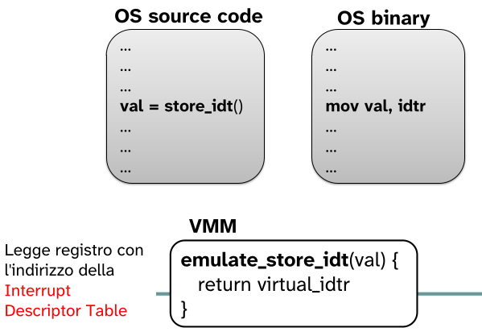
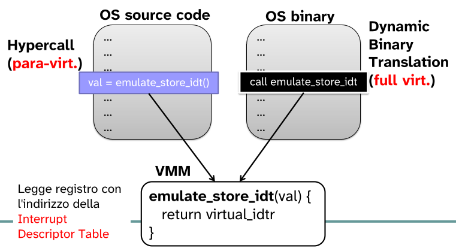
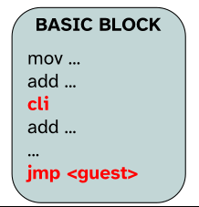
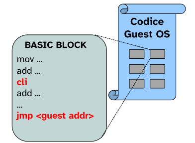
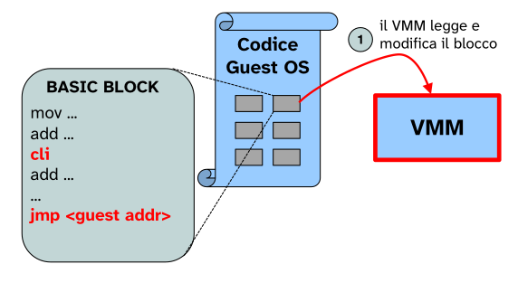
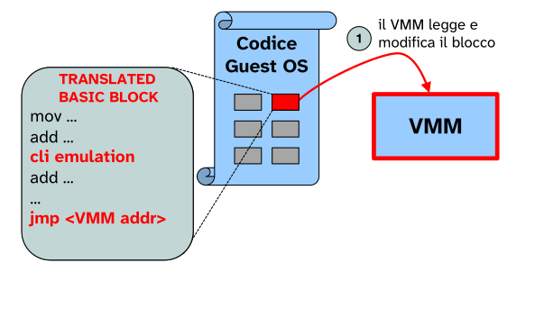
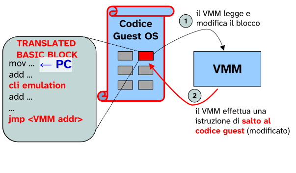
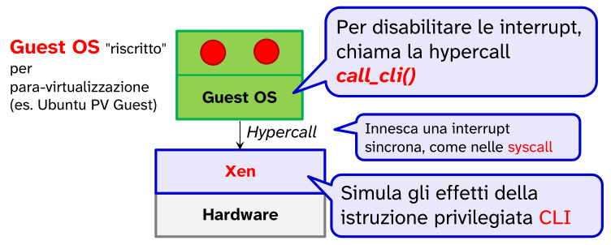

# Virtualizzazione

Una macchina **virtuale (VM)** è una emulazione (mediante tecniche sw/hw) di una macchina reale.

Ogni macchina virtuale esegue il proprio **sistema operativo** ed applicazioni.

Le VM sono gestite da una **virtual machine monitor (VMM)**, o **hypervisor**. Più macchine virtuali condividono le risorse fisiche della macchina su cui eseguono.

Su una stessa macchina reale possono coesistere diverse macchine virtuale attive che condividono le risorse di questa.

### Motivi che hanno portato all'utilizzo delle VM

- Performance
- Flessibilità
- Affidabilità
- Sicurezza

Per ottenere queste qualità sarebbe necessario isolare ogni applicazione in modo che se una di queste vada in crash le altre non sarebbero influenzate.

Senza VM, il problema sarebbe che per ottenere questo isolamento usando solo hardware fisico, bisognerebbe comprare una macchina fisica per ogni singolo servizio.

Utilizzare tante macchine fisiche quanti sono i servizi è, oltre ad essere molto costoso, anche uno spreco di energia e spazio.

Utilizzando invece diverse VM, una per ogni servizio da eseguire, possiamo ottenere la caratteristica di isolamento e inoltre si riducono enormemente gli spazi e il costo necessario.

>Questa operazione è detta **consolidation**, ovvero raggruppare più macchine virtuali su un unico server fisico per ottimizzare l'uso delle risorse.

### Gestione di sistemi virtualizzati

Le macchine virtuali possono essere velocemente create, configurate, monitorate, migrate...

Attraverso strumenti software centralizzati.

### Efficienza

Avere più VM su una stessa macchina fisica (**workload consolidation**) permette di sfruttare appieno la capacità dell'hardware e di ridurre i consumi energetici.

### Flessibilità

Applicazioni **legacy**, basare su SO obsoleti e non più supportati, possono essere eseguite su macchine moderne.

Quindi questo eviterebbe il problema di continuare ad utilizzare macchine legacy unicamente per la loro compatibilità con l'applicazione che è in esecuzione su esse.

### Virtualizzazione e cloud computing

Il **cloud computing** permette lo outsourcing (spostare) di VM in centri di calcolo privati o di terze parti (**pay-per-use**).

Quindi invece di eseguire le macchine virtuali sui propri server in azienda, il Cloud Computing permette di spostare la loro esecuzione in centri di calcolo. → Non si paga più per l'hardware ma per l'utilizzo di risorse.

Questo riduce il costo della manutenzione e gestione dei server fisici per le aziende.

### Affidabilità e sicurezza

Le macchine virtuali permettono di isolare meglio le applicazioni, questo mi garantisce affidabilità e sicurezza.

- Un'applicazione compromessa o difettosa opera solo sulla VM isolata, e non può interferire con le altre VM su cui sono eseguiti altri servizi.
- Il VMM è l'unico componente **privilegiato** che può gestire l'hardware fisico e le macchine virtuali.

## Confronto tra VMM e SO

Il VMM, come il SO, fornisce una **astrazione** della macchina fisica su cui esegue

Il SO è già di per se un virtualizzatore dell'hardware (di risorse):

- concetto di processo
- concetto di file e directory attraverso il FS
- concetto di memoria virtuale
- socket
- ... 

"Container (Fine slide)"

L'astrazione offerta dal SO non è in senso stretto, perché quello che fa effettivamente un virtual machine monitor è di emulare completamente l'intera architettura virtuale su un'architettura fisica del tutto diversa.

Posso emulare un'architettura `arm` su una intel `x86` senza problemi, per il tipo di astrazione offerta da un VMM.

## Architetture principali di una hypervisor

- TIPO 1 → **bare-metal virtualization** o **server virtualization**
- TIPO 2 → **hosted hypervisor**

1) Il VMM esegue su un "hardware nudo" (**bare-metal virtualization** o **server virtualization**).
   
   In questa architettura, il software di virtualizzazione è il padrone dell'hardware assoluto.

   Questo tipo di hypervisor viene molto utilizzato nei data center.

   L'architettura di tipo 1 ha migliori prestazioni perché non c'è un ulteriore layer (livello di indirezione) che divide il VMM dall'hardware, a differenza di ciò che accade nell'architettura di tipo 2

   

2) Il VMM esegue su un SO tradizionale (es. Windows), viene detta **hosted hypervisor**.
   
   Per comunicare con l'hardware il sistema operativo **guest** deve passare per l'hypervisor che a sua volta deve passare per il sistema operativo **host**.

   L'hypervisor è considerato, per il SO host, come un qualsiasi altro processo in esecuzione.

   Questo utilizzo facilita l'integrazione tra sistemi operativi, ad esempio, posso copiare file facilmente dal desktop dell'host dentro la macchina virtuale guest.

   Ha come svantaggio le performance perché ogni richiesta della VM deve attraversare due strati: l'Hypervisor e poi il sistema operativo host. 

   Consiste nell'architettura che utilizziamo con VMware Workstation/Fusion, Oracle VM VirtualBox.

In generale un hypervisor deve garantire di virtualizzare: 

- la CPU
- la memoria
- l'I/O

## Virtualizzazione della CPU

Le prime tecniche di virtualizzazione della CPU consistono nel far credere al kernel della macchina virtuale guest che il **processore virtuale** su cui opera **sia fisico**.

L'hypervisor deve quindi implementare un mapping 1:1 tra il processore da emulare e quello fisico su cui effettivamente viene eseguito il kernel guest.

Tutto quello che viene eseguito in kernel mode nel guest in realtà non è un vero e proprio kernel mode; in realtà è in user mode rispetto al sistema operativo host.

Quindi se per il sistema operativo host la macchina virtuale non è altro che un semplice processo, deve essere l'hypervisot ad astrarre completamente un macchina fisica per il kernel guest.

L'hypervisor deve quindi intercettare delle "istruzioni critiche" (**sensitive instructions**)

L'hypervisor deve intercettare le istruzioni critiche che necessitano di un grado di privilegio superiore che la VM non ha. C'è la necessità di emulare questa istruzione.

### De-privileging

Primo meccanismo che deve essere implementato all'interno degli hypervisor.

Tale concetto consiste nel "degradare" o togliere i privilegi al SO ospite, spostandolo a un livello di esecuzione inferiore rispetto a quello a cui è abituato a girare, ovvero spostarlo in user mode.

- La VMM (hypervisor) gira nel vero **kernel** **mode**. È l'unico che ha il controllo diretto e privilegiato dell'hardware fisico
- Il guest SO viene spostato in **user mode** completamente. Quindi quanto il guest SO pensa di operare in kernel mode in realtà di trova ancora in user mode, e chiamiamo questo livello di privilegio **virtual kernel mode**

Ovvero:

- VMM → kernel mode
- VM → user mode, dentro cui:
  - → guest SO è in virtual kernel mode
  - → i processi del guest SO sono in virtual user mode

Per permettere al guest SO di operare in kernel mode, un primo meccanismo che si può sfruttare è quello delle trap: nel momento in cui il guest esegue delle istruzioni privilegiate/critiche, allora la CPU fisica genera una **trap**.

Questo meccanismo è detto: **TRAP-AND-EMULATE**.

Questa trap viene intercettata dall'hypervisor, elabora il tipo di istruzione che ha generato quella trap ed emula l'istruzione privilegiata associata.

Tutte le istruzioni sensitive non possono eseguire direttamente, ma devono passare per l'hypervisor, devono scatenare una trap → passa il controllo (de-privileging) all'hypervisor che emula/simula l'effetto dell'istruzione.

Nel caso di CPU intel questa cosa avviene in maniera diversa, perché in queste CPU esistono diversi livelli di privilegio, classificati in Ring.

4 livelli di privilegio, dove Ring 3 ha il più basso livello di privilegio mentre in Ring 0 la VMM.

Cosa accade quando il guest SO vuole eseguire una istruzione sensitive:

- L'applicazione che gira nella VM esegue una system call, questo causa una trap della CPU virtuale che viene gestita dalla VMM. La VMM salta al guest host per far eseguire l'interrupt handler e poi la ISR associata alla trap generata.
- L'interrupt hardware invece sono gestite dalla VMM che eseguono l'ISR e successivamente si salta all'esecuzione dell'ISR del guest SO.
- Invece le istruzioni privilegiate nel guest SO causano il generarsi di una trap che viene intercettata dalla VMM che la gestisce ed emula l'effetto desiderato dal guest SO.

---

Poniamo in esempio che il guest SO voglia eseguire una `CLI`.

Il VMM simula la `CLI` ponendo a `0` lo ***Interrupt Flag*** all'interno di una struttura dati dedicata alla VM.

- Lo *Interrupt Flag* nel **registro fisico** della CPU è inalterato
- Le interrupt fisiche sono ancora ricevute dallo VMM

La VMM emula l'effetto della chiamata di sistema, infatti da quel momento in poi la VMM continuerà a ricevere delle interruzioni dalla CPU fisica, ma non le inoltra al guest SO.

### Problemi con l'architettura `x86`

L'architettura `x86` tradizionale **non è** **"virtualizzabile"** con solo il trap-and-emulate.

Il motivo è che molte delle istruzioni sensibili **non generano alcuna trap**

Quindi non è più sufficiente il meccanismo di trap-and-emulate.

Se il guest tenta di eseguire una istruzione sensitive, la CPU **ignora l'istruzione**; tali istruzioni sono dette **"sensibili ma non privilegiate"**.

Questo è stato risolto grazie ad un supporto hardware, cioè sono state introdotte delle istruzioni specifiche per la virtualizzazione.

Ma prima di ciò non era possibile virtualizzare tale architettura.

<!-- @todo metti il teorema in un quadretto carino -->

- Teorema di Popek e Goldberg
  
  Una macchina può essere virtualizzata se ogni istruzione sensitive è privilegiata.

  Le istruzioni privilegiate sono quelle che scatenano una *trap* quando eseguite in user mode.

  Invece un'istruzione è definita sensitive quanto interagisce direttamente con la configurazione o lo stato dell'hardware sottostante.

### Tecniche della virtualizzazione delle CPU

- **Full virtualization**, senza supporto hardware
  
  Utilizza tecniche software complesse come la **Dynamic Binary Traslation**. Il VMM legge il binario del Guest SO e lo "riscrive" al volo per renderlo sicuro, senza che il guest SO se ne accorga.
- **Para-virtualization**
  
  il guest SO è sviluppato appositamente per cooperare con il VMM.
  
  Si abbandona l'idea di ingannare il guest SO, è consapevole di essere su una macchina virtuale. Il SO ospite viene riscritto per essere consapevole di girare su una macchina virtuale, quindi invece di provare ad eseguire istruzioni hardware direttamente si interfaccia con la VMM (cooperazione).
- **Full virtualization**, con **supporto hardware**
  
  migliori prestazioni e VMM più semplice.

  La CPU stessa ha nuove modalità che permettono al VMM di intercettare le operazioni critiche senza dover riscrivere il codice software. 

---

ESEMPIO: confronto tra **para-virtualization** e **full** **virtualization**

Il problema da risolvere è lo stesso: il guest SO vuole leggere un registro critico, quello contenente l'indirizzo della **Interrupt Descriptor table**.

Queste due soluzioni ci permettono di farlo ma con approcci differenti:

- **Dynamic** **Binary** **Traslation**
  
  Agisce sul **codice binario**.

  Il sorgente del sistema operativo non viene toccato, quindi si può utilizzare un qualsiasi sistema operativo, anche Windows.

  Il VMM analizza il flusso di istruzioni mentre vengono eseguite, intercettando quelle sensitive.

  Infatti quando vede `mov val, idtr`, la intercetta e la sostituisce dinamicamente con una chiamata alla sua funzione che emula l'effetto di quella istruzione.

- **Hypercall**
  
  Si agisce sul **codice sorgente**. Gli sviluppatori del sistema operativo modificano il codice: cancellando istruzioni problematiche e inserendo una chiamata esplicita alla VMM, chiamata **Hypercall**.

  È una soluzione molto efficiente, ma richiede di poter modificare il codice sorgente del SO e ricompilarlo. (impossibile con Windows)

Quindi consideriamo di trovarci in questa situazione:

- Codice sorgente
- Codice binario che viene eseguito
- funzione del VMM che emula il comportamento dell'istruzione in esame

Per l'approccio che utilizza la para-virtualization il sorgente deve essere modificato per poter girare su una VM. La modifica consiste nella chiamata alla funzione dal VMM che emula quel comportamento, ovvero `emulate_store_idt()` (Hypercall).

Per l'approccio che utilizza la full virtualization il sorgente rimane invariato, e a tempo di esecuzione abbiamo due principali tecniche che dipendono dalla presenza o meno del supporto hardware.

- Meccanismo software (Dynamic Binary Traslation): la VMM sostituisce dinamicamente le istruzioni. Il VMM legge il **codice binario** prima che venga eseguito, individua le istruzioni critiche e le riscrive sostituendole con il codice di emulazione → `emulate_store_idt()`.
- Meccanismo hardware (Intel VT-x / Trap-and-Emulate): in questo caso il codice binario in memoria non viene necessariamente sostituito/riscritto. È la CPU fisica che, quando incontra l'istruzione critica mentre gira la VM (in *non-root mode*), ferma tutto e genera un evento hardware (**VMExit**). Il controllo passa al VMM che esegue l'emulazione e poi restituisce il controllo.

#### Full virtualization, no supporto hw

Nel caso di una CPU fisica che non supporta la virtualizzazione, in cui non tutte le istruzioni sensitive generano una trap, l'hypervisor di **VMware** introdusse tecniche efficienti di full-virtualization per Intel `x86`.

Queste tecniche sono ad esempio la **Dynamic Binary Traslation**.

Il codice binario del guest veniva riscritto dinamicamente dall'hypervisor prima di essere eseguito: sostituendo le istruzioni sensibili con un codice di emulazione

Coprendo il gap della non virtualizzabilità di `x86`.

Oggi con il supporto hardware VMware si è adattata perché è molto più performante.

#### Dynamic Binary Traslation

All'avvio della VM, il VMM analizza a blocchi il codice eseguito dal guest SO.

Ogni blocco, detto **Basic Block**, è una breve **sequenza di istruzioni sequenziali** che terminano con una **istruzione di salto**.

L'Hypervisor quindi va a scandire questi blocchi all'interno del binario del kernel e li analizza e riscrive eventuali istruzioni sensitive. 

Il salto finale viene sostituito con una chiamata all'hypervisor per mantenere la catena di traduzioni attiva:

- La CPU esegue il blocco tradotto (sicuro)
- Arriva all'ultima istruzione (salto modificato)
- Il controllo passa al VMM
- Il VMM controlla se il blocco a cui avrebbe saltato la CPU prima della modifica del salto sia già tradotto
  - Se **si**: fa saltare la CPU direttamente alla versione già tradotta e sicura
  - Se **no**: traduce il nuovo blocco, lo salva in memoria cache, e poi fa saltare la CPU lì

In poche parole, il salto finale viene modificato per garantire che la CPU non esegua mai codice originale, ma rimbalzi sempre attraverso il VMM per ottenere il prossimo pezzo di codice tradotto e sicuro.

Vediamo come accade tutto ciò:

- Codice grezzo che non è stato ancora tradotto dal VMM

- Il VMM legge il basic block e lo modifica

- Dopo la modifica, nel basic block, viene sostituita l'istruzione sensitive e viene modificato il salto finale per poter permettere al VMM di analizzare il basic block successivo

- Il controllo viene ripristinato al guest SO così che possa eseguire il codice tradotto e sicuro
- Una volta terminata l'esecuzione del blocco l'istruzione di salto riporta il controllo al VMM per continuare con il meccanismo di Dynamic Binary Translation

#### Para-virtualizzazione

Con questo approccio c'è la necessità di riscrivere il codice sorgente del guest SO in modo che questo cooperi con il VMM.

Il guest SO è conscio del fatto di esser eseguito su di una macchina virtuale (VM).

- Le istruzioni sensitive nel guest SO sono sostituite da **hypercalls** che fanno riferimento a funzioni del VMM che emulano il comportamento delle istruzioni originarie.

> A differenza della full virtualization, si modifica il **codice** **sorgente** **del** **guest** **SO**, non il codice binario.
>
> La modifica è fatta dal **programmatore** e non dal VMM, quindi i sistemi che possono girare su Hypervisor, che sfruttano questa tecnica di virtualizzazione della CPU, devono essere costruiti ad hoc.

Il guest SO così modificato **non può eseguire sull'hardware fisico**: può eseguire solo in combinazione con il **VMM**.

Inoltre questo approccio non è utilizzabile per sistemi **legacy** oppure **proprietari**, come Windows.

#### Supporto hardware per la full-virtualization della CPU

Le CPU Intel VT introducono:

- due modalità di esecuzione: **VMX root** e **VMX non-root**;
- **VMCS** (VM Control Structure).

Queste soluzioni sono implementate nell'hardware per evitare tutto l'overhead dovuto alla traduzione dinamica del codice binario e per permettere a qualsiasi guest SO di poter eseguire su una VM.

Hanno come vantaggio:

- semplificano il codice del VMM, buona parte della virtualizzazione è fatta in hardware;
- evita il **ring de-privileging** del guest SO;
- maggiore **efficienza del cambio di contesto** tra VM e VMM;
- garantisce il meccanismo di trap per tutte le istruzioni critiche

Quindi le principali novità sono:

- Modalità di esecuzione (VMX)
  - **VMX Root Mode**: dove gira il VMM. Qui il software ha pieno controllo dell'hardware, esattamente come il kernel di un sistema operativo tradizionale.
  - **VMX Non-Root Mode**: dove gira il Guest SO. In questa modalità, il sistema operativo ospite può girare al suo livello di privilegio "naturale" senza dover essere de-privilegiato. Quindi viene eseguito con il massimo dei privilegi ma in VMX non-root mode.
- Passaggio tra Root mode de Non-Root mode
  
  Il passaggio tra queste due modalità è gestito direttamente dall'hardware tramite eventi specifici:

  - **VM Entry**: il passaggio dal VMM al Guest SO. Avviene quando il VMM lancia o riprende l'esecuzione di una VM.
  - **VM Exit**: il passaggio inverso, dal Guest SO al VMM. Avviene automaticamente quando il Guest SO tenta di eseguire un'istruzione sensitive (Perché nonostante ha tutti i privilegi, si trova in VMX Non-Root mode). 
    
    L'hardware intercetta l'istruzione e restituisce il controllo al VMM affichè possa gestirla.
- **VMCS (Virtual Machine Control Structure)**
  
  Per gestire questi passaggi in modo efficiente, intel ha introdotto una struttura dati hardware chiamata **VMCS**. La VMCS agisce come una "scheda cliente" per ogni VM e contiene:

  - **Guest state**: lo stato della CPU quando gira la VM. Viene caricato durante la *VM Entry* e salvato durante la *VM Exit*.
  - **Host state**: lo stato della CPU quando gira il VMM. Viene caricato durante la *VM Exit*.
  - **Control Data**: istruzioni per la CPU fisica su quali eventi devono causare un *VM Exit*

Eventi che possono causare **VM Exit**:

- **Istruzioni sensitive**
  - CPUID
  - RDMSR. WRMSR
  - INVLPG
  - RDPMC, RDTSC
  - HTL, MWAIT, PAUSE
  - VMCALL: nuova istruzione per invocare il VMM
- **Accessi a stato sensitive**
  - MOV DRx: accessi ai debug register
  - MOV CRx: accessi ai control register
  - Task switch: accessi al CR3 (puntatore alla tabella delle pagine)
- **Eccezioni ed eventi asincroni**
  - Page fault, debug exceptions, interrupts, etc.

 

