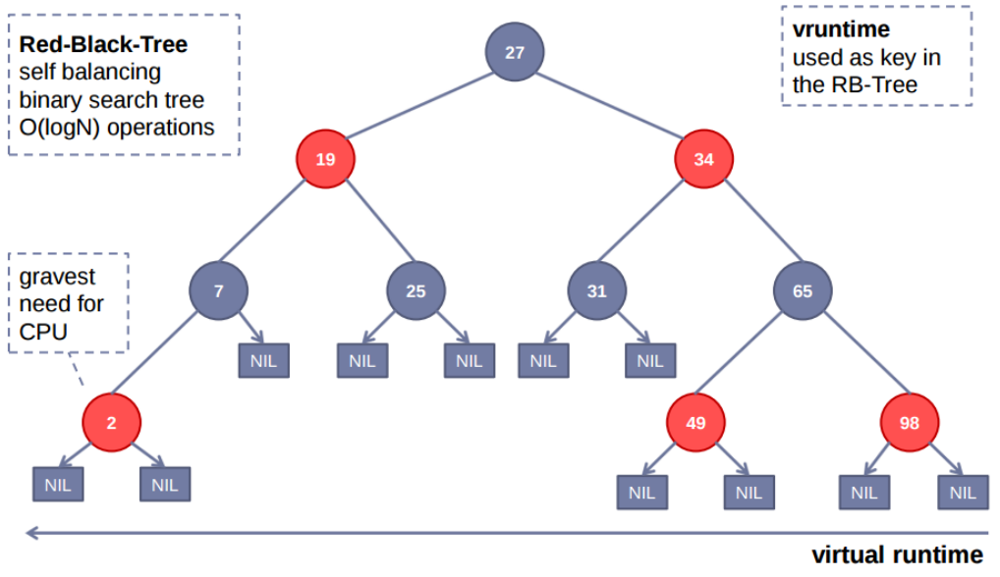

# Completely Fair Scheduler (CFS)

La scelta del quanto di tempo (**time slice**) funziona in modo diverso rispetto ai tradizionali scheduler basati su round-robin o MLFQ. Non viene assegnato un valore fisso a priori, ma è **calcolato dinamicamente** in base a quanti task sono pronti per l'esecuzione e al loro peso (*priorità*).

Nel calcolo del time slice è necessatio considerare: **targeted latency**, **peso del task**.

## Targeted Latency

CFS definisce una finestra temporale chiamata `targeted latency`, che rappresenta il tempo in cui tutti i task pronti **devono avere possibilità di eseguire almeno una volta**.

#### ESEMPIO:

Se il targeted latency è di 20ms e ci sono 4 task, ognuno riceverà un quanto di tempo di circa 5ms

---

## Calcolo del timeslice dinamico

Il **timeslice** di ciascun task viene calcolato come:

$$\text{timeslice} = \frac{\text{targeted latency} \cdot \text{peso del task} }{\text{somma dei pesi di tutti i task}}$$

 - **Peso del task**: deriva dalla priorità del task.
  
Questo permette a task con priorità più alta di avere più tempo CPU.

Quindi il timeslice **non è fisso**, ma cambia dinamicamente ogni volta che lo scheduler deve scegliere il task successivo -> poiché dipende dal numero di task pronti e dal loro peso relativo.

Ogni volta che un nuovo task entra nella coda dei processi pronti, il timeslice dei task esistenti può essere **ricalcolato**, per mantenere la **fairness**.

### Vantaggi:

- Garantisce una distribuzione equa della CPU pesata sulla priorità associata ad ogni processo;
- Evita la *starvation*;
- Favorisce naturalmente i task **interattivi** perché si utilizza un clock virtuale nella decisione del task che sarà schedulato ogni volta.

# vruntime

IL `vruntime` in `CFS` non determina direttamente la durata del **timeslice**, ma serve come **metrica** per decidere quale task deve essere schedulato per primo.

## Funzione del `vruntime`:

1) <u>Misura il tempo CPU consumato dal task</u>:

ogni task ha un proprio **clock virtuale**, detto `vruntime`, che aumenta proporzionalmente al tempo di CPU che il task ha utilizzato, **ponderato per il pese (priorità) del task**. Cosa significa? Il **tasso di incremento** del `vruntime` dipende dalla priorità del task; più bassa è la priorità di un task, più lentamente aumenta il suo `vruntime`. 

2) <u>Selezione del prossimo task</u>: 

I task pronti vengono memorizzati in una struttura dati chiamata **Red-Black Tree** ordinato per `vruntime`. I task con il più basso `vruntime` vengono schedulati per primi dallo scheduler e la ricerca del minimo su questa struttura è molto fantaggiosa perché nel caso peggiore la complessità è `O(log(n))`.

Utilizzando tale struttura dati siamo sicuri che il nodo *foglia* più a sinistra è quello che ha accumulato più debito, ovvero con un `vruntime` minore rispetto gli altri.

1) <u>Fairness</u>:

In combinazione con il calcolo del **time slice**, il `vruntime` garantisce che ogni task **ottenga** una quota di CPU proporzionale alla suo **priorità**; quindi fa in modo che ogni task riceva il proprio quanto (dipendente dalla priorità) nella finestra temporale definita dal `targeted latency`, definendo l'ordine di esecuzione.

#### ESTREMA SINTESI:
- il timeslice determina quanto tempo il task può usare una CPU durante una finestra temporale (`targeted latency`);
- il `vruntime` determina quale task deve essere eseguito per primo.
