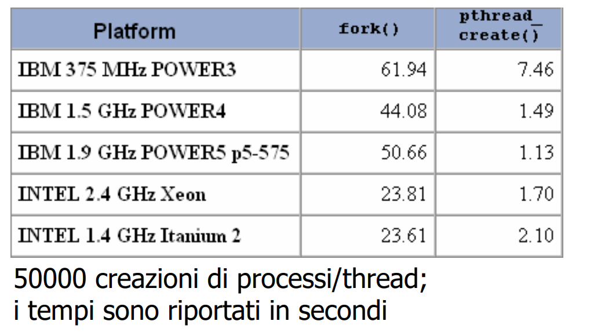
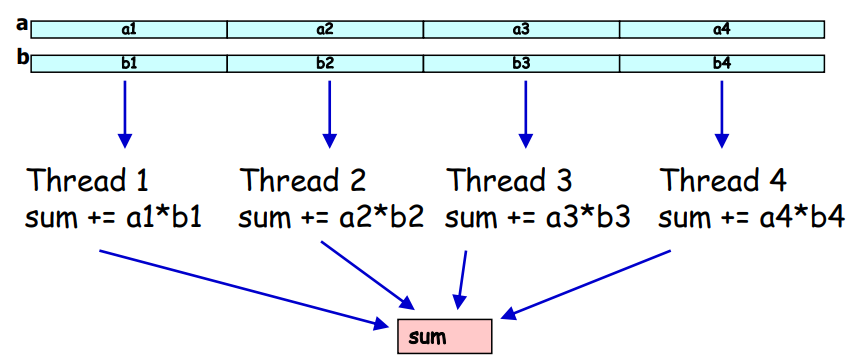
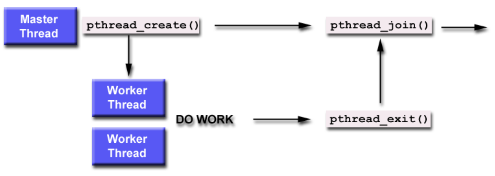
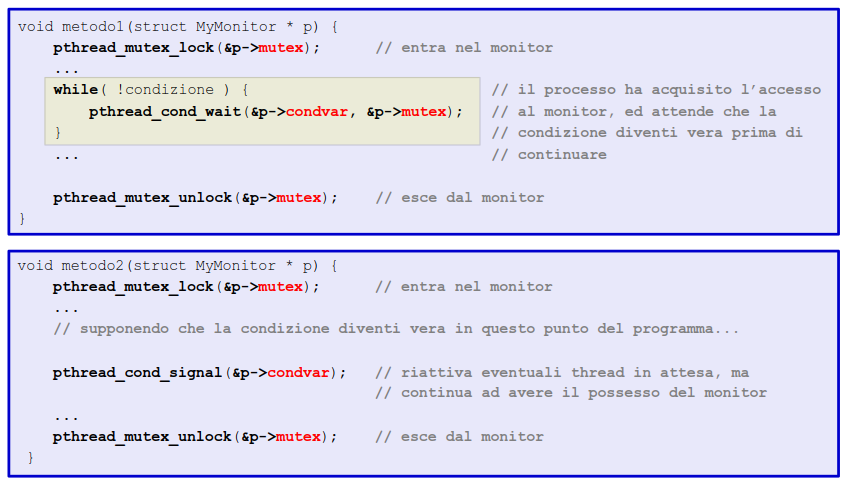
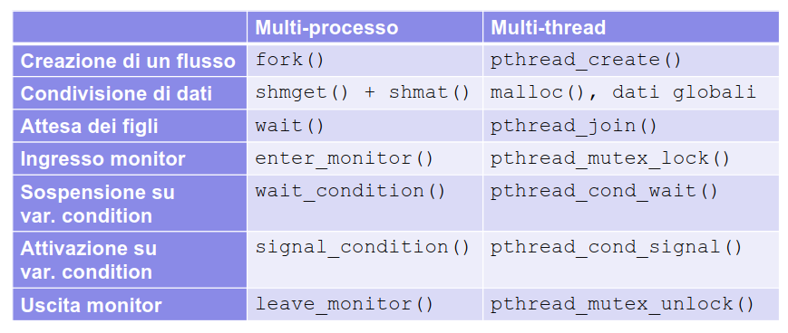

<script src="../javascript.js"></script>


# pthread

**thread** possono essere definiti come un flusso di esecuzione all'interno di un processo (*leggero*).

Possiamo utilizzarli importando la libreria `pthread.h`.

Sarebbe una libreria user level che implemente le API POSIX per la gestione dei thread.

Essere **POSIX compliant** (conforme a POSIX) significa che la libreria fornisce un insieme di funzioni standard che seguono le specifiche POSIX (Portable Operating System Interface), un insieme di norme che definiscono come i sistemi operativi devono gestire vari aspetti del software.

(**importante per la portabilità**)

Questa è una grande differenza rispetto i meccanismi che abbiamo visto fin'ora che sono **System V compliant**:

- `shm`;
- `sem`;
- `msq`.

Non tutti i sistemi moderni, infatti, supportano System V al contrario di POSIX.

Per poter utilizzare questa libreria **dinamica**, dobbiamo comunicarlo al compilatore mediante un flag `-pthread` o `-lpthread` nel momento in cui compiliamo il codice.

<!-- @todo scrivi il motivo per cui dobbiamo inserire questo flag -->

Infatti i PThread sono definiti da una libreria in C composta dal file di intestazione `pthread.h` e una libreria dinamica. Il flag di compilazione `-pthread` deve essere utilizzato per compilare correttamente il codice che utilizza PThread.

### Motivi per cui si utilizzano pthread

Il motivo principale è dovuto all'**overhead**, infatti si ha un guadagno di prestazioni nell'utilizzare gli pthread al posto di nuovi processi.

I thread sono più leggeri rispetto ai processi, principalmente per due motivi:

- **condivisione dello spazio di indirizzamento**: i thread all'interno dello stesso processo condividono lo stesso spazio di indirizzamento della memoria, mentre i processi hanno spazi di indirizzamento separati.
  
  Questo significa che la creazione di un nuovo thread non richiede l'allocazione di un intero spazio di indirizzamento, come avviene per i processi;
- **Minor overhead per la gestione**: i thread non necessitano della creazione di un **Process Control Block** completo come per i processi. Ogni thread ha una struttura dati associata che contiene solo informazioni relative al suo stato.

Quando viene creato un nuovo thread, il sistema operativo deve solo allocare risorse per il thread stesso (come lo stack e il contesto di esecuzione), ma **non crea un nuovo spazio di indirizzamento separato** come nel caso di un processo. Inoltre, i thread possono comunicare facilmente tra loro perché operano nello stesso spazio di indirizzamento se fanno parte dello stesso processo (ogni thread può vedere l'intero spazio di indirizzamento).

Proprio perché si trovano nello stesso contesto non dobbiamo creare aree di memoria dedicate

- (**gestite dal kernel**, mediante le system call → cambio di contesto, overhead)

per la comunicazione tra thread, possiamo sfruttare lo stesso spazio di indirizzamento: in particolare lo heap.

<p align='center'></p>

- Una `fork()`, in particolare un `clone()`, impiega molto più tempo per creare un processo rispetto a `pthread_create()`

ESEMPIO DI PRODOTTO SCALARE:

- si vuole calcolare il prodotto scalare di due vettori di numeri reali
- i vettori possono essere condivisi tra più thread
- ogni thread calcola il prodotto scalare tra una parte dei due vettori, ed aggiorna una variabile condivisa contenente il risultato.

<p align='center'></p>

- possiamo calcolare il tempo che impiega un'applicazione multiprocess e un'applicazione multithread.

## API di programmazione

- **Gestione dei thread**: creazione, distribuzione e join di thread
- **Gestione dei Mutex**: creazione, distribuzione, lock e unlock di variabili di mutua esclusione (mutex) per la gestione di sezioni critiche.
- **Gestione delle Condition Variables**: creazione, distribuzione, wait e signal su condition variables definite dal programmatore.

### Creazione di un thread

```c
int pthread_create(pthread_t *restrict thread,
                   const pthread_attr_t *restrict attr,
                   void *(*start_routine)(void *),
                   void *restrict arg);
```

Questa funzione crea un nuovo thread nel processo chiamante. Tale thread inizia ad eseguire dall'*entry point* passatogli per parametro `start_routine()`; dove `arg` è l'argomento passato per parametro alla funzione `start_routine()`.

NOTA: il nome di un funzione, come per gli array, definisce l'entry point/puntatore alla prima istruzione della funzione.

L'entry point della funzione che passiamo per parametro deve avere un **prototipo specifico**:

```c
void* start_routine(void*);
```

Importante notare che è possibile passare solo un argomento per parametro alla funzione `start_routine()`, quindi nel caso dovessimo passare più di un argomento è necessario creare una `struct` che li contenga tutti.

`pthread_t *thread` è un puntatore che riceverà l'identificatore del nuovo thread creato. `pthread_t` è un tipo di dato che rappresenta l'ID del thread e nella funzione è un parametro di input/output.

`const pthread_attr_t *attr` è un puntatore alla struttura di tipo `pthread_attr_t` che definisce gli **attributi del thread**, come la sua priorità, politica di schedulazione, la dimensione dello stack, ecc.

- Nel caso si voglia utilizzare gli attributi predefiniti di un thread si inserisce come parametro `NULL`

> `restrict` in C è un suggerimento al compilatore che un determinato puntatore è l'unico modo per accedere alla memoria puntata a cui esso punta, all'interno del blocco di codice in cui è dichiarato.\
> → Permette di ottimizzare meglio l'accesso alla memoria in quanto garantisce che i puntatori non vengano utilizzati per fare riferimento allo stesso oggetto in modo concorrente.

### Terminazione di un pthread

Un thread può **terminare** per diversi motivi:

- termina l'esecuzione della `start_routine()` uscendo fuori dallo scope di tale funzione;
- il thread chiama la funzione `pthread_exit()`;
- il thread è concellato da un altro thread con `pthread_cancel()`;
- L'intero processo termina.

Nel caso si ammette l'utilizzo di `pthread_cancel()` perdiamo il potere del **thread master** sulla vita dei thread creati.

Inoltre, è importante che non si verifichi mai la situazione in cui un thread termina perché il processo è terminato.\
Nel modello POSIX i thread vivono dentro un processo → se il **thread** **master** termina, **termina l'intero processo**.

Per questo c'è la necessità di dover utilizzare la funzione `pthread_exit()` anche nel thread master.\
Tale funzione termina solo il thread corrente ma lascia vivi gli altri thread del processo finché non terminano da soli.

`pthread_exit(void* retval)`

- usata per terminare un thread esplicitamente;
- se usata nel programma principale, gli altri thread continueranno ad eseguire;
- è buona norma utilizzarla in tutti i thread;
- `retval`: indica lo stato di uscita del thread.

ESEMPIO PER `pthread_exit()`:

```c
#include <pthread.h>
#include <stdio.h>
#include <stdlib.h>

#define MAX_NUM_THREADS 4

void* print_hello(void* p){ // void* start_routine(void*);
  printf("%d: hello world\n", *((int*)p));
  pthread_exit(NULL);
}

int main(){
  pthread_t threads[MAX_NUM_THREADS];

  int ret;

  for(int i = 0; i < MAX_NUM_THREADS; i++){
    ret = pthread_create(&threads[i], NULL, print_hello, (void *)(&i));
    if (ret != 0){
      printf("ERRORE: return code from pthread_create is %d\n", ret);
      exit(-1);
    }
  }

  pthread_exit(NULL); // terminazione del thread padre
}
```

output:

```bash
valore raggiunto dal counter → 200000
```

Nel caso togliessi il lock e l'unlock prima e dopo la modifica del buffer singolo otterrei un risultato del tipo:

```bash
valore raggiunto dal counter → 115111
```

Molto diverso rispetto a quello che mi sarei dovuto aspettare.

Questo è un buon utilizzo di `pthread_exit()` da parte dei thread creati e dal thread master.

Non possiamo dire la stessa cosa per il parametro passato che viene utilizzato come argomento nella `print_hello()`.\
Infatti, tale parametro appartiene allo stack del thread padre, non è copiata per valore ma per riferimento, quindi nel momento in cui il padre la modifica cambia il valore anche nel contesto dei thread figli.

L'output sul terminale:

```bash
2: hello world
4: hello world
3: hello world
3: hello world
5: hello world
```

Si ha **race condition** e, generalmente, non è buona norma passare per argomento un `arg` che sia legato allo **stack del thread master**; nella maggior parte dei casi utilizziamo lo heap per creare aree di memoria che andranno condivise.

>In ogni caso potrebbe presentarsi race condition → è necessario gestire la mutua esclusione su tali variabili.

Inoltre potrebbe capitare delle anomalie nel momento in cui il padre termina il for, prima che i thread abbiano avuto la possibilità di utilizzare l'indirizzo in loro possesso che è legato allo stack del thread master.\
→ La variabile `i` esce dallo scope, quindi non fa più parte dello spazio di indirizzamento lecito del processo.

Infatti l'indirizzo virtuale di memoria prima occupato dalla variabile `i` potrebbe esser utilizzato dal thread master per allocare nuove variabile che non hanno nulla a che fare con i thread in esecuzione.

---

Nello stesso esempio se utilizzassimo:

```c
void* print_hello(void* p){
  printf("%d: hello world (%p)\n",p, &p);
  ...
}
int main(){
...
...
pthread_create(&threads[i], NULL, print_hello, (void*)i);
...
}
```

Otteniamo un effetto soddisfacente a livello visivo, ma logicamente sarebbe sbagliato perché stiamo facendo il casting di un intero in un tipo `void*` che il thread potrebbe usare, deferenziandolo, e ottenere `segmentation fault`.

→ otteniamo infatti dei **warning** da parte del compilatore che ci avvisa di questo cast illecito.

Risultato con `%d` nella `printf`:

```bash
0: hello world (0x776ef97feeb8)
1: hello world (0x776ef8ffdeb8)
3: hello world (0x776ef7ffbeb8)
2: hello world (0x776ef87fceb8)
```

Risultato con `%p` sostituito ad `%d`, perché `p` è un puntatore:

```bash
(nil): hello world (0x7d0ba11feeb8)
0x2: hello world (0x7d0ba01fceb8)
0x1: hello world (0x7d0ba09fdeb8)
0x3: hello world (0x7d0b9f9fbeb8)
```

Ovviamente l'indirizzo tra parentesi riguarda quello della variabile locale in cui è contenuto il puntatore nella funzione `print_hello()`.

Supponiamo che il thread utilizzasse `p` erroneamente come un puntatore, potrebbe farlo proprio perché è `void*` allora otteniamo:

```c
void* print_hello(void* p){
  printf("%d: hello world (%p)\n", p, &p);
  int c = *((int*)p);
  pthread_exit(NULL);
}
```

```bash
(nil): hello world (0x790a875feea8)
0x1: hello world (0x790a86dfdea8)
Segmentation fault (core dumped)
```

---

L'utilizzo corretto, più **safe**, per il passaggio dei parametri è utilizzare l'area di memoria **HEAP**.

```c,hl_lines=4
#include <pthread.h>
#include <stdio.h>
#include <stdlib.h>

#define MAX_NUM_THREADS 4

void* print_hello(void* p){ // void* start_routine(void*);
  printf("%d: hello world\n", *((int*)p)); //
  free(p);                                 //
  pthread_exit(NULL);
}

int main(){
  pthread_t threads[MAX_NUM_THREADS];

  int ret;

  for(int i = 0; i < MAX_NUM_THREADS; i++){
    int* ptr_i = (int*)malloc(sizeof(int));   //
    *ptr_i = i;                               //
    ret = pthread_create(&threads[i], NULL, print_hello, (void *)ptr_i);
    if (ret != 0){
      printf("ERRORE: return code from pthread_create is %d\n", ret);
      exit(-1);
    }
  }

  pthread_exit(NULL); // terminazione del thread padre
}
```

Ovviamente quando allochiamo nello heap è ad onere del programmatore l'allocazione e la deallocazione di aree di memoria.

Quindi è da fare attenzione a dove inseriamo la chiamata `free()` per evitare che questa venga eseguita troppo presto, due volte sullo stesso puntatore o non venga eseguita proprio.


### Passaggio di parametri

La `pthread_create()` può passare un singolo argomento di tipo `void*` alla `start_routine`.

Per passare più **di un argomento** al thread, occorre definire una `struct`:

```c
struct dati{
  int parametro1;
  char parametro2
}
```

Nel padre, occorre **allocare sullo heap** (`malloc()`) un istanza della struct, e **passarne il puntatore** al thread figlio.

```c
struct dati *d = (struct dati*) malloc(sizeof(struct dati));

d->parametro1 = 10;
d->parametro2 = 'c';
pthread_create(&id, NULL, start_routine, (void*)d);
```

- Il puntatore alla `struct dati` viene convertito in un puntatore a `void` perché ogni puntatore può subire questo casting, quindi ogni tipo di variabile può esser passata per argomento.
- `void*` è un tipo di puntatore generico.

Per usare successivamente all'interno del thread correttamente la struttura dati passata per riferimento `void*` è necessario un **casting inverso**.

All'interno della funzione `star_routine()`

```c
struct dati* dati = (struct dati*) p
```

Come visto è importante utilizzare l'area heap per condividere dati fra thread.

→ Invece è scorretto utilizzare l'area stack. (esempio e ragionamento precedente)

I motivi principali come già detti sono:

- le variabili allocate nello stack del thread master sono soggette al ciclo di vita e allo scope del thread master;
- tali variabili sono soggette anche alla modifica da parte del thread master stesso, e potrebbero impattare susl comportamento dei thread creati.

### Join

- L'operazione di **join** permette di sincronizzare un thread master con uno o più thread figli.
- La chiamata `pthread_join(threadID, status)` blocca il chiamante finché il thread identificato da `threadID` non termini.

<p align='center'></p>

Quindi per permettere al padre di attendere la terminazione del thread figlio, questo deve chiamare la funzione:

```c
pthread_join(id, NULL);
```

- `id` è di tipo `pthread_t` e specifica un thread figlio che ha creato;
- `NULL` specifica che il padre non intede ricevere dati di uscita dal thread figlio.

---

Per poter utilizzare la funzione `pthread_join` su un figlio è necessario che questo sia stato dichiarato **"joinable"** all'atto della sua creazione.

Di default ogni pthread è joinable, ma volendo esplicitarlo dobbiamo utilizzare i `pthread_attr_t` all'atto della sua creazione.

```c
pthread_attr_t attr;
pthread_attr_init(&attr);
pthread_attr_setdetachstate(&attr, PTHREAD_CREATE_JOINABLE);
...
pthread_create(&id, attr, start_routine, (void*) data);
...
...
pthread_join(id, NULL);
```

`attr` non è altro che una variabile che tiene conto di diversi attributi e caratteristiche che possiamo imporre ad un thread:

- Detach state
- Dimensione dello stack
- Politica di scheduling
- Priorità
- etc.

---

Nel caso il thread padre volesse ricevere dei dati nel momento in cui il thread figlio termina deve inserire un puntatore alla struttura o variabile in cui il figlio ha inserito tali dati.

Supponiamo che la struttura sia: 

```c
struct status{
  ...
};
```

Allora il thread figlio, identificato con `id`, farà nel momento in cui termina:

```c
struct status* dati_uscita = (struct status*) malloc(sizeof(struct status));
...// riempie la struttura 
pthread_exit(dati_uscita);
```

Il thread master per ricevere tali dati farà:

```c
struct status dati;
pthread_join(id, &dati);
...// lettura dei dati
```

### Creazione e distribuzione di Mutex

La libreria PThread ci mette a disposizione l'implementazione di un **mutex** o **lock** per gestire la mutua esclusione tra risorse condivise tra thread.

- `pthread_mutex_t`
  - Una struttura dati "opaca" (il programmatore non deve conoscerne il contenuto)
  - Rappresenta un **oggetto-mutex**
- `pthread_mutex_init(pthread_mutex_t * mutex, pthread_attr_t * attr)`
  - Crea un nuovo mutex e lo inizializza come "sbloccato" (unlocked)
  - `mutex` è il puntatore di tipo `pthread_mutex_t`
  - `attr` è il puntatore di tipo `pthread_attr_t` utilizzato per impostare degli attributi del mutex (possiamo inserire `NULL` se vogliamo un mutex di default)
- `pthread_mutex_destroy (pthread_mutex_t * mutex)`
  - Disattiva il mutex identificato dal valore della variabile passata per parametro.
- `pthread_mutex_lock(pthread_mutex_t * mutex)`
  - Serve ad un thread per acquisire una risorsa in mutua esclusione rispetto gli altri thread. Quindi serve per delineare la sezione critica.
  - Se è già stato acquisito da un altro thread, il chiamante si **blocca in attesa** di un **unlock**
- `pthread_mutex_unlock(pthread_mutex_t * mutex)`
  - Invocato da un thread per **rilasciare la sezione critica**, e per consentire quindi l'accesso ad un altro thread precedentemente bloccato a questa.
- `pthread_mutex_trylock(pthread_mutex_t * mutex)`
  - Analoga alla lock, ma non bloccante. Se il mutex è già acquisito, ritorna immediatamente con codice di errore `EBUSY`
  - Altrimenti lo acquisisce e ritorna come risultato `0`
  - Possiamo dire che è una versione non bloccante della `pthread_mutex_lock`

---

ESEMPIO CONTATORE CONDIVISTO

```c
#include <pthread.h>
#include <stdio.h>
#include <stdlib.h>

#define NUM_THREADS 2
// definisco la struttura counter
struct counter{
  int valore;
  pthread_mutex_t mutex;

};

void* in_counter(void* p){
  struct counter* pc = (struct counter*)p;
  for (int i = 0; i < 100000; i++){
    pthread_mutex_lock(&(pc->mutex));
    pc->valore++;
    pthread_mutex_unlock(&(pc->mutex));
  }
  pthread_exit(NULL);
}

int main(){

  pthread_t threads[NUM_THREADS];

  struct counter* p = (struct counter*) malloc(sizeof(struct counter));
  // inizializzo il counter
  p->valore = 0; 
  // inizializzo il mutex
  pthread_mutex_init(&(p->mutex), NULL);

  // creo i thread che faranno gli incrementi
  for (int i = 0; i < NUM_THREADS; i++){
    pthread_create(&threads[i], NULL, in_counter, (void*)p);
  }
  // faccio la join così che il padre si blocchi 
  // in attesa della terminazione dei thread figli
  for (int i = 0; i < NUM_THREADS; i++){
    pthread_join(threads[i], NULL);
  }

  printf("valore raggiunto dal counter → %d\n", p->valore);

  return 0;
}
```

---

### Condition Variables (CV)

La gestione della cooperazione e sincronizzazione tra thread avviene mediante **condition variables (CV)**.

Queste variabili vanno sempre utilizzate in abbinamento con un **mutex**, realizzando un costrutto Monitor di tipo **signal-and-continue**.\
É necessario che siano utilizzate in contemporanea ad un mutex proprio perché molte procedure che operano con le condition variables hanno la necessità di un mutex.

#### Creazione e distruzione di CV

- `pthread_cond_t`
  - Struttura dati "opaca"
  - Rappresenta un oggetto-varcondition
- `pthread_cond_init(pthread_cond_t* cond, pthread_condattr_t * attr)`
  - Inizializza la condition variable per l'uso
  - `cond` è il puntatore alla condition variable da inizializzare
  - `attr` è una struttura dati passata per riferimento che specifica le caratteristiche della condition variable
- `pthread_cond_destroy(pthread_cond_t cond)`
  - Disattiva la CV che non serve più identificata da `cond`

#### Gestione delle condition variables: wait e signal

- `pthread_cond_wait(pthread_cond_t * cond, pthread_mutex_t * mutex)`
  - Deve essere utilizzata dentro un **monitor**, quindi richiede in ingresso anche un mutex
  - Per eseguirla correttamente lo stesso thread deve aver già chiamato `pthread_mutex_lock(&mutex)`
  - Il thread chiamante viene sospeso e messo nella coda di attesa della condition variable\
    Il mutex viene rilasciato automaticamente
  - Quando il thread viene riattivato, il mutex viene riacquisito sempre all'interno della `pthread_cond_wait`
- `pthread_cond_signal(pthread_cond_t * cond)`
  - Viene risvegliato un thread in attesa sulla condition variable identificata per il riferimento passato per parametro
  - La semantica utilizzata è quella di un monitor **signal-and-wait**, quindi quando un thread chiamata tale funzione non viene sospeso ma continua la sua esecuzione all'interno del monitor\
  → motivo per cui troviamo questa asimmetria nei prototipi delle funzioni `pthread_cond_wait()` e `pthread_cond_signal()`; la seconda non ha bisogno del riferimento al monitor dato che non lo rilascia durante la sua esecuzione
- `pthread_cond_broadcast(pthread_cond_t * cond)`
  - Essendo una semantica **signal-and-continue** possiamo utilizzare anche questa funzione 
  - Attiva tutti i thread sospesi sulla condition variable passata per riferimento
  - I thread risvegliti accederanno uno alla volta al monitor

Per gestire le condizioni di sincronizzazione che determinano se un thread ha bisogno di sospendersi su una condition variable o meno, dobbiamo utilizzare un costrutto `while`.\
→ Perché la semantica è **signal-and-continue**, quindi nei momento in cui un thread sospeso viene riattivato ed entra nel monitor non abbiamo la sicurezza che la condizione di sincronizzazione sia valida ancora.

### Monitor con PThreads

In PThreads, un monitor può essere ottenuto combinando **un mutex** e una o più **condition variables**

- Tipicamente per permettere a tutti i thread di operare con lo stesso monitor e stesse CV, questi si inseriscono all'interno di una `struct`.
- La `struct` conterrà, oltre la risorsa che condivideranno i thread, anche il monitor, definito da un mutex e una o più condition variables.
- Tale struttura per essere condivisa in modo corretto andrà allocata all'interno dello **heap**.

```c
struct dati_condivisi{
  ... // es., un buffer e le variabili di stato
  ... // ad esso associato

  pthread_mutex_t mutex;
  pthread_cond_t cv1;
  pthread_cond_t cv2;
  ... // altre condition variables
};
```

→ ESEMPIO DI SINCRONIZZAZIONE TRA THREAD

<p align='center'></p>

La gestione della sincronizzazione e mutua esclusione è analoga a quella vista per programmi multi-processo, a cambiare sono le performance e il modo in cui vengono condivise le risorse in questione.

<p align='center'></p>

<!-- 15:55 -->
