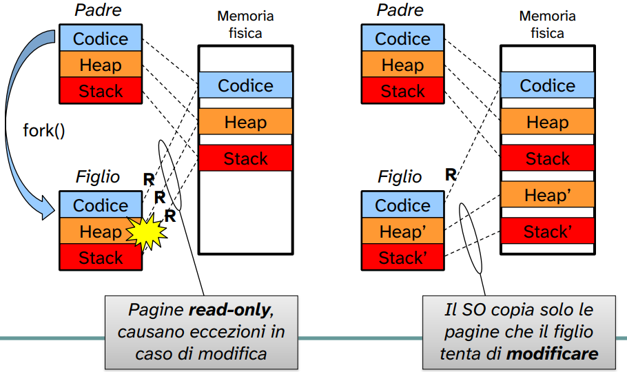

# System Call `exec`

## Introduzione

L’unico modo in cui un programma può essere eseguito da Unix è che un processo esistente invochi una **chiamata di sistema `exec`** (ad eccezione del processo `init`).

- Il **nuovo programma** viene eseguito **nel contesto del processo chiamante**, cioè **il PID non cambia**.  
- `exec` **non ritorna mai** al chiamante, **a meno che non si verifichi un errore**: in caso contrario, il controllo passa definitivamente al nuovo programma.  
- È una **system call di sostituzione del codice**: lo stesso processo inizia ad eseguire un nuovo programma.

---

## Effetti dell’`exec`

Dopo la chiamata a `exec`, il processo:

- mantiene la **stessa process structure (`task_struct`)**;
- ottiene **nuove aree** per:
  - codice,
  - dati globali,
  - stack,
  - heap;
- riferisce una **nuova text structure**;
- mantiene la **u-area** (ad eccezione del program counter, che punterà al nuovo main, e delle informazioni legate al codice come registri generali, SP, ...) e lo **stack del kernel**.

---

## Varianti della `exec`

Esistono **diverse versioni** della system call `exec`, che differiscono per come specificano il programma da eseguire e i suoi argomenti:

| Versione | Descrizione | Parametri |
|----------|-------------|-----------|
| `execl()` | Percorso completo dell’eseguibile; parametri tramite lista | `int execl(char *path, char *arg0, ..., char *argn, (char *)0);` |
| `execlp()` | Nome dell’eseguibile (cercato nelle directory di sistema secondo il `PATH`); parametri tramite lista | `int execlp(char *nomefile, char *arg0, ..., char *argn, (char *)0);` |
| `execv()` | Percorso completo dell’eseguibile; parametri tramite array | `int execv(const char *path, char *const argv[]);` |
| `execvp()` | Nome dell’eseguibile (ricerca nel `PATH`); parametri tramite array | `int execvp(const char *nomefile, char *const argv[]);` |

Esistono anche ulteriori varianti come: `execvpe()`, `execle()`.

In queste varianti è specificato trami un array il nuovo **enviroment**: `envp` sarà l'array contenente coppie chiave valore che indicano quali saranno le variabili di ambiente a cui si riferirà il processo.

---

## `fork` e `exec` insieme

Spesso le due system call vengono utilizzate insieme.  
Tipico schema:

```c
if ((result = fork()) == 0) {
    // Codice del processo figlio
    if (execlp("program", ...) < 0) {
        perror("exec fallita");
        exit(1);
    }
} else if (result < 0) {
    perror("fork fallita");
}
// Il padre continua da qui
```

L’uso combinato permette di creare un nuovo processo (`fork`) e poi sostituire la sua immagine con un nuovo programma (`exec`).

---

## Program Loading: `exec()`

La `exec` è anche nota come **“sostituzione di codice”**.

> È **lo stesso processo**, ma **esegue un programma differente**.

## Possibili implementazioni

1. **Sovrascrittura** del segmento di memoria corrente con i nuovi valori (`exec()`).  
2. **Allocazione** di nuovi segmenti di memoria (codice, dati, stack, heap, ...) e **deallocazione** dei vecchi segmenti (`fork()` + `exec()`).

Durante la `exec`, vengono aggiornate le strutture di processo (`PCB` – Process Control Block), ma l’identità del processo (PID, file aperti e in generale *file descriptor*, risorse kernel) resta invariata.

I *file descriptor* si salvano dalla `exec` perché sono memorizzati in un struttura contenuta nello spazio **kernel** (non toccato dalla `exec`).

→ Vedi implementazione di una shell su <code>GitHub</code>, la redirezione dello stram di input, output o error non vengono modificati dopo l'esecuzione dell'`exec`.

---

## Esempi di utilizzo

### Esempio 1 — `execlp` in un processo figlio

```c
#include <sys/types.h>
#include <sys/wait.h>
#include <unistd.h>
#define BUFFSIZE 8192

int main(void) {
    int n, status;
    pid_t pid;
    char buf[BUFFSIZE], commandname[20];

    write(STDOUT_FILENO, "\ninput command:  ", 17);
    n = read(STDIN_FILENO, buf, BUFFSIZE);
    buf[n - 1] = 0;
    sscanf(buf, "%s", commandname);

    if ((pid = fork()) < 0)
        perror("fork error");
    else if (pid == 0)
        if (execlp(commandname, buf, (char *)0) < 0) {
            perror("execlp error");
            exit(1);
        }

    if ((pid = waitpid(pid, &status, 0)) < 0)
        perror("wait error");

    write(STDOUT_FILENO, "\nDone!\n", 7);
    exit(0);
}
```

- `buf` serve per leggere il comando digitato dall'utente;
- `commandname` conterrà il nome del comando estratto;
- `pid` conterrà il valore ritornato da `fork()`.

Successivamente è presente una _sys-call_ del linguaggio C, `write()`, che permette di scrivere dati su un **file descriptor**. 

Un file descriptor è un numero intero che il sistema operativo assegna a ogni file o risorsa aperta da un processo.<br>
Ogni volta che un processo viene eseguito per la prima volta gli vengono assegnati automaticamente **3 file descriptor**:

| File descriptor | Risorsa standard |
|----------|----------|
| 0 | `STDIN_FILENO` |
| 1 | `STDOUT_FILENO` |
| 2 | `STDERR_FILENO` |

Una volta scritto legge da tastiera mediante una `read()` il comando scritto dall'utente e sostituisce l'ultimo elemento per terminare la stringa con un `\n` o `\0`.

`sscanf(buf, "%s", commandname)` copia dal buffer il nome del comando nella variabile `commandname`. Funziona come `fscanf()` ma invece che lavorare su file, lavora su una stringa salvata in memoria; ovvimente nel momento in cui incontra uno spazio si ferma la lettura dalla stringa.


---

### Esempio 2 — Copia di file con `exec`

```c
#include <stdio.h>
#include <stdlib.h>
#include <unistd.h>
#include <sys/types.h>
#include <sys/wait.h>

int main(int argc, char *argv[]) {
    int i, pid;

    pid = fork();

    if (pid == -1) {
        perror("fork fallita");
        exit(1);
    }

    if (pid == 0) {
        printf("Sono il processo figlio, con PID %d\n", getpid());
        printf("Attendo 3 secondi\n");
        for (i = 0; i < 3; i++) {
            sleep(1);
            printf(".\n");
        }
        execl("/usr/bin/cp", "cp", argv[1], argv[2], 0);
        perror("Se arrivo qui, qualcosa è andato storto...\n");
        kill(getppid(), SIGKILL);
        exit(1);
    } else {
        printf("Sono il processo padre, con PID %d\n", getpid());
        for (i = 0; i < 6; i++) {
            sleep(1);
            printf("*\n");
        }
        printf("Il processo padre termina\n");
        exit(0);
    }
}
```

**Esecuzione:**

```bash
$ ./exec-copy nomefileA nomefileB
Sono il processo figlio, con PID 931
Attendo 3 secondi
Sono il processo padre, con PID 930
.
*
.
*
.
*
*
*
*
Il processo padre termina
```

**Signal.h:**

Un **segnale** è un meccanismo asincrono o sincrono usato dal sistema operativo per comunicare con un processo o tra processi. Tutti i segnali standard sono definiti nella libreria:
``` 
#include <signal.h>
```

Questa libreria associa ogni segnale ad una **costante** come `SIGKILL`,`SIGSTOP`, ecc.<br>
Come usarli:
```
kill(pid,SIGTERM); // invia SIGTERM al processo specificato da pid
raise(SIGINT);     // invia SIGINT al processo corrente

signal(SIGINT, handler) // definisce una funzione che gestisce SIGINT
// gli unici segnali che non possono essere intercettati da signal() sono:
//SIGKILL;
//SIGSTOP.
```

Ogni segnale è associato ad un **numero** che può variare tra diversi sistemi, ma i nomi sono _standard POSIX_.

---

## Considerazioni su `fork` + `exec`

- Nel **99% dei casi**, dopo una `fork()` segue una `exec()`.
- La copia della memoria tra padre e figlio effettuata da `fork()` è spesso **sprecata**, poiché il figlio la sostituirà subito con un nuovo programma tramite `exec()`.
- Questo introduce **overhead**.

### Soluzioni alternative

- **`vfork()`**  
  - Crea un processo figlio **senza copiare** l’immagine del padre.  
  - Il figlio deve **subito invocare `exec()`**.  
  - Spesso chiamata *lightweight fork*.

- **Copy-on-Write (COW)**  
  - Il figlio condivide inizialmente la memoria del padre in modalità **read-only**.  
  - Solo al primo tentativo di modifica, il kernel copia le pagine di memoria.
 <br>
  


---

## Perché due primitive diverse?

Separare `fork()` e `exec()` dà al programmatore la possibilità di:

- gestire il processo figlio **prima di eseguire il nuovo programma** (ad esempio liberare memoria, chiudere file, reindirizzare I/O, ecc.);
- mantenere un controllo più flessibile sul comportamento del sistema.

```c
int pid = fork();   // crea il figlio
if (pid == 0) {     // codice eseguito nel figlio
    // operazioni preliminari
    execl("program", arg0, arg1, arg2, ...);
}
```

---

## Uso nelle Shell Unix

La **shell** (interprete dei comandi):

1. legge la linea di comando;
2. estrae la prima parola (nome del programma);
3. cerca il programma (usando il `PATH`);
4. lo esegue tramite `fork()` e `exec()`, passando gli argomenti restanti;
5. attende la terminazione del figlio (`wait()`), poi mostra di nuovo il prompt.

### Schema tipico

```c
while (1) {
    // Legge comando e argomenti
    int pid = fork();
    if (pid == 0) {
        exec("programma", arg0, arg1, arg2, ...);
    } else {
        // Il padre attende
        wait(pid);
    }
}
```

---

## Riassunto

- `exec` **sostituisce** il codice in esecuzione di un processo con un nuovo programma.  
- **Non crea** un nuovo processo: mantiene PID e risorse kernel.  
- Viene usata **insieme a `fork`** per avviare nuovi programmi.  
- È una delle **system call fondamentali di Unix**, insieme a `fork`, `wait`, ed `exit`.
