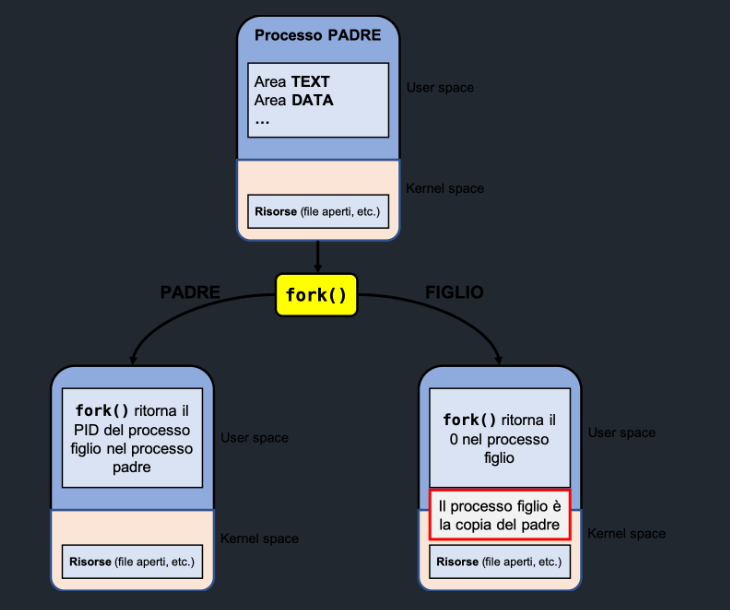
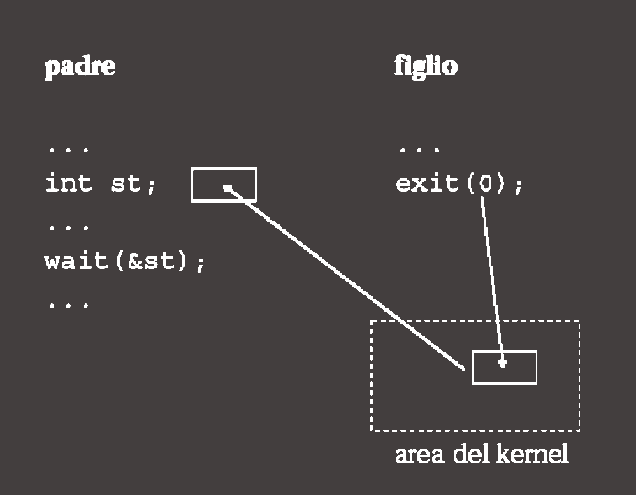
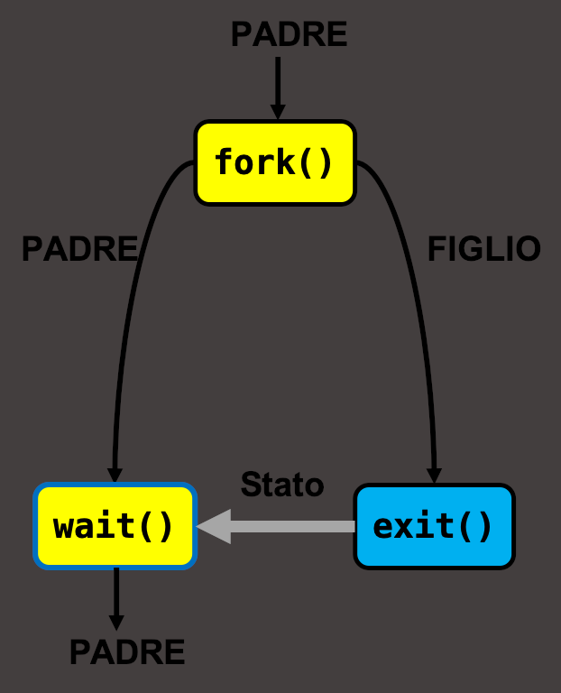

# fork(): creazione di un processo

La creazione di nuovi processi è gestita dalla chiamata di sistema: 

```c
pid_t fork(void);
```

La `fork()` crea una copia **esatta** (duplicazione) del processo chiamante. 

Il nuovo processo viene chimato figlio (*child*), mentre il processo chiamante è detto padre (*father*).

Le aree dati globali, stack, heap e U-area sono copiate da padre e figlio, e i processi **eseguono in spazi di indirizzamento completamente separati**.

Pertanto:

- il figlio eredita gli stessi valori delle variabili, i descrittori delle risorse aperte e anche il *program counter (PC)*;
- le modifiche che successivamente apporteranno il processo padre o il figlio non sono visibili all'altro
  
  → lavorano su spazi di indirizzamento diversi. Quindi a livello di memoria si trovano in due pagine diverse.

L'unica parte che i due processi condivideranno è l'area testo (contenente il codice del programma).

Siccome viene copiato anche il **PC**, sia il processo padre che il processo figlio riprenderanno l'esecuzione dal punto in cui è stata eseguira la `fork()`.

---

In dettaglio cosa sono stack, heap, area dati gobale e U-area (Lezioni Sistemi1 per altri info su U-area).

- **area dati globale**:
  
  corrisponde alla parte dello spazio di indirizzamento di un processo che contiene variabili globali e statiche del programma.

  Questa è un'area distinta dallo stack e dall'heap e contiene tutte quelle variabili che sono visibili da tutte le funzioni del programma e che esistono per tutta la durata del programma.

- **stack**:
  
  corrisponde all'area di memoria in cui sono memorizzate tutte le variabili locali delle funzioni di cui si conosce a priori la dimensione.

  Lo stack contiene solo dati **legati all'esecuzione di funzioni**. Tali dati nel momento in cui l'esecuzione fuoriesce dallo scope in cui questi sono validi, vengono deallocati.
- **heap**:
  
  corrisponde all'area di memoria dinamica, ovvero un'area in cui vengono memorizzati dati a *run-time*. Quindi dati per cui non si conosce a priori la dimensione effettiva.

  Quindi è una memoria più flessibile ma più lenta proprio per questa flessibilità.
- **U-area**:
  
  zona di memoria nel **kernel**, associata ad ogni processo, che contiene le informazioni necessarie al kernel per gestire quel processo mentre si trovava in modalità kernel.

  Contiene quindi:
  - **contesto del processo in modalità kernel**
    - registri salvati
    - stack del kernel del processo
    - puntatori a PCB
  - **informazioni sul processo**
    - **UID**, **GID** e permessi
    - current working directory
    - tabelle dei descrittori
  - **stato del processo durante system call**
    - parametri delle syscall
    - valori di ritorno
    - error number (`errno`)
  - **puntatori alle pagine del processo**

Durante una `fork()` il descrittore di un processo (`PCB`) è anche esso copiato, ma questa non è una copia 1:1: solo alcune parti sono copiate, altre possono esser inizializzate **ex novo**.

Sono copiati dal `PCB` del padre al `PCB` del figlio:
- **Registri CPU**
  - PC (program counter)
  - SP (stack pointer)
  - flag
  - registri generali

  → questo permette al figlio di riprendere **l'esecuzione all'istruzione** `fork()` che avrà come valore di ritorno `0`.

- **Info su spazi di indirizzamento**

  - mappa delle pagine
  - protezioni 
  - segmenti (text, data, heap, stack)

  → questi **non vengono copiati fisicamente subito**, ma marcati come **copy-on-write**.

  Ovvero solo nel momento in cui il processo figlio tenta di scrivere qualcosa in questi spazi di indirizzamento, allora verrano copiati.

- **Tabella dei descrittori di file**
  
  Viene copiata, ma quello che contiene sono dei **puntatori**.

  Quindi tutte le risorse del padre sono condivise con il figlio.

Ciò che invece è nuovo nel `PCB` del figlio sono:

- **PID**
- **stato del processo**
- **kernel stack del processo**
- **statistiche temporali** che vengono azzerate

---

La `fork()` restituisce un **valore intero** che viene utilizzato per discriminare se si è nel contesto di esecuzione del processo padre o del processo figlio.

- Se la `fork()` ha successo, il PID del processo *figlio* viene restituito nel contesto di esecuzione del processo *padre*, mentre viene restituito `0` nel contesto di esecuzione del processo *figlio*.
- Se la `fork()` fallisce, ad esempio, perché non c'è abbastanza memoria RAM da allocare per il processo da creare, viene restituito il valore `-1`.


<p align="center">
  
</p>

Ecco un primo utilizzo corretto della `fork()`:

```c
pid = fork();
 
// Controllo che non è fallita la chiamata
if (pid == -1) { 
	fprintf(stderr, "fork failed\n"); 
	exit(1); 
} 

// Scrivo il codice inerente al processo figlio
if (pid == 0) { 
	printf(“This is the child\n"); 
	// Aggiungere altro
	exit(0); 
} 

// Scrivo il codice inerente al processo padre
if (pid > 0) { 
	printf(“This is parent. The child is %d\n", pid); 
	// Aggiungere altro
	exit(0); 
}
```

## Attesa terminazione di un processo: `wait()`

Per poter consentire ad un processo padre di raccogliere l'eventuale stato di terminazione dei processi figli è possibile utilizzare la system call `wait()`.

```c
pid_t wait(int *wstatus);
```
<!-- @fix aggiusta i colori, devi rendere le scritte bianche altrimenti non si legge nulla -->

La system call **sospende l'esecuzione del processo chiamante** fino a che uno dei suoi processi figli non termina.

→ `wait()` restituisce il  PID del processo figlio che è terminato. Se non esistono figli, o in caso di errore viene restituito l'intero `-1`.

Se il valore di `wstatus` non è `NULL`, la funzione `wait()` memorizza nel valore intero puntato da tale variabile le informazioni sullo stato del processo.

Questo valore è incomprensibile se non è analizzato utilizzando diverse macro, come ad esempio:

- `WIFEXITED(wstatus)` che restituisce il valore booleano `true` se il processo figlio è terminato normalmente, attraverso la chiamata ad `exit()` o dal `return` nel `main()`.
- `WEXITSTATUS(wstatus)` che restituisce un valore intero che rappresenta l'exit status code utilizzato con la chiamata a `exit(int exit_status)`.

---

É importante sapere che un processo deve sempre avre un processo padre. 

Ogni processo ne ha uno, e risalendo la geranchia troviamo che il processo da cui si sono originati tutti gli altri processi è quello con PID pari ad `1`.

Ovvero è il processo `init`.

Quindi possiamo distinguere **due** situazioni tra processo padre e figlio, tenendo a mente che il processo `init` non termina mai.

- Può accadere il caso in cui il processo figlio termini e quindi resti in attesa che il processo padre raccolga il suo stato di terminazione. In questa attesa il processo figlio è detto **zombie**.
  
  → in qeusta situazione il kernel rilascia tutte le risorse del figlio tranne il suo stato di terminazione.
- Oppure può succedere che il processo padre, per via di errori o volontariamente, termini prima della terminazione dei processi figli. A questo punto i processi figli terminati saranno definiti **orfani**.

In questa situazione, essendo che nessun processo può non avere un processo padre, il kernel assegna al PPID il valore `1`. Il proceso è diventato figlio del processo `init`.

---

## `exit()`

Un processo termina con la system call `exit()`.

```c
void exit(int status);
```

Quando la `exit()` viene invocata, uno stato di uscita con valore **intero** **viene passato dal processo al kernel**.

Tale valore è disponibile al processo padre attraverso la system call `wait()`.

Un processo che termina normalmente restituisce uno stato di attesa pari a `0`.

In particolare, lo stato di terminazione di un processo è un intero di **16 bit**.  Nel **byte** meno significativo (**LSB**) vengono indicate le informazioni relative a come il figlio è terminato, e più precisamente:

- `0`: volontariamente;
- `≠0`: involontariamente (il valore esprime il **segnale** ricevuto ed eventuali **flag**).

Nel caso in cui il figlio termini volontariamente, il **byte** più significativo (MSB) contiene  lo stato di terminazione (ovvero il valore del parametro attuale passato alla `exit()` o il valore di `return`, troncato a **8 bit**).

<p align="center">
  
  
</p>
